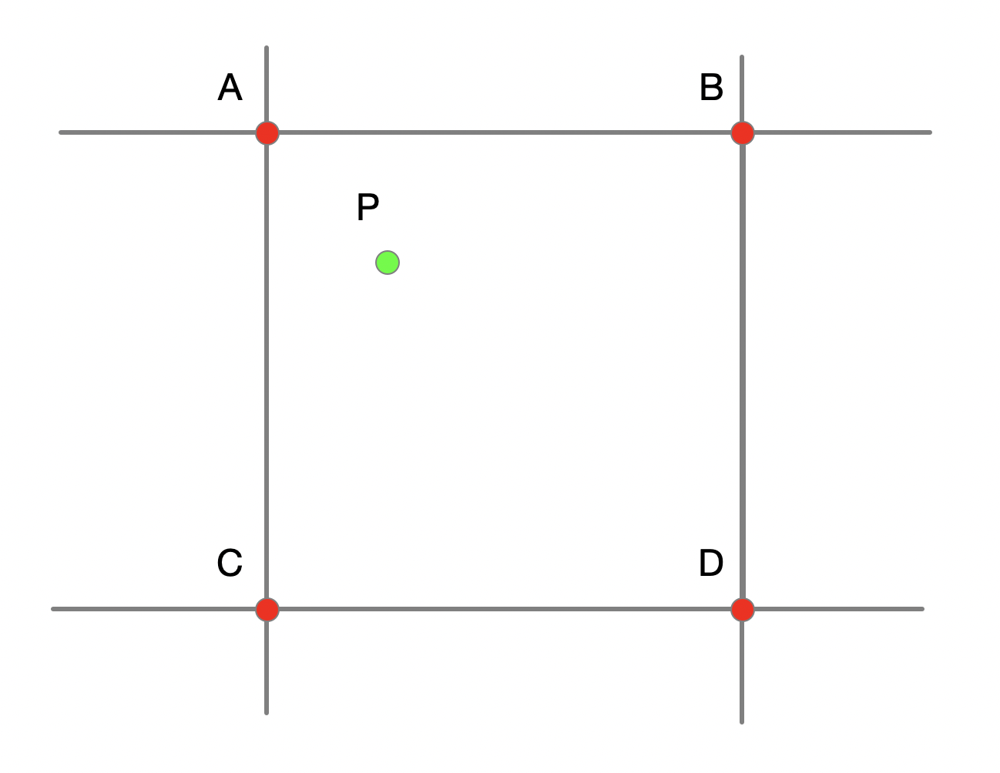
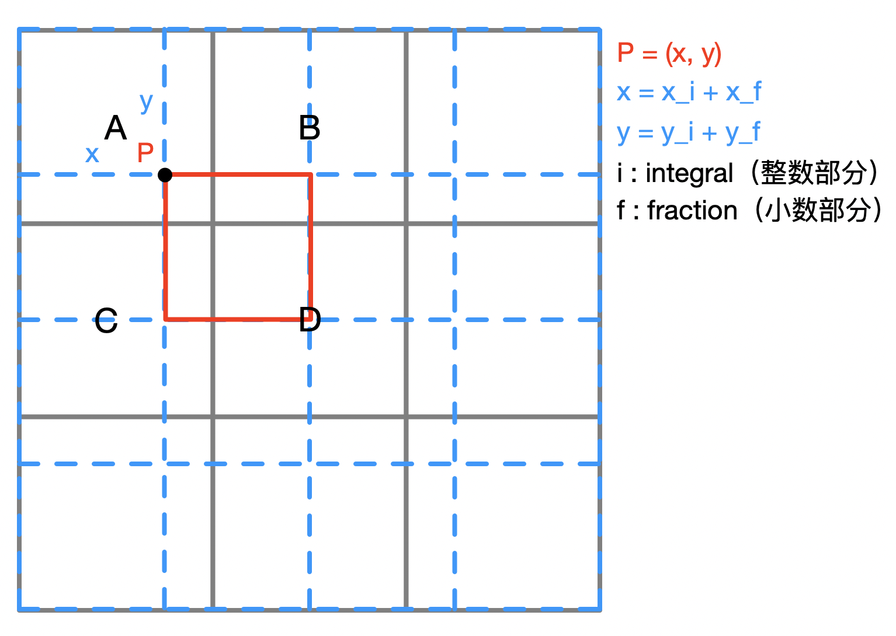
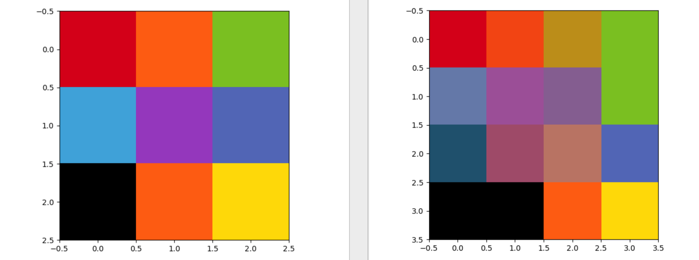
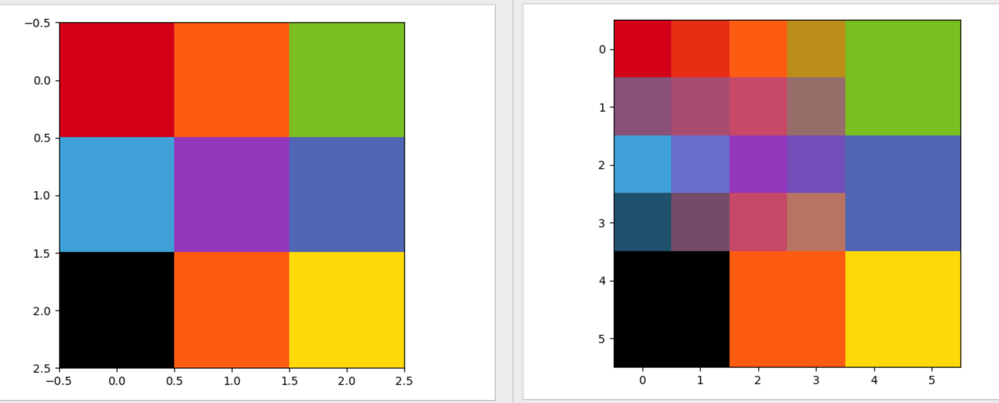
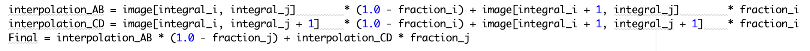
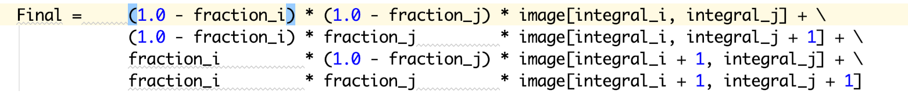

### 运行算法的平台
&emsp;&emsp;MacBook Pro 2017 15-inch
### 对该算法的理解
&emsp;&emsp;在学习该算法时，我一直对网上许多博客的示意图抱有疑问。我浏览的所有对算法进行解释的博客，都将像素抽象成点，如下图所示：

&emsp;&emsp;我个人认为这样并不是很好理解，尤其在使用尺寸很小的图片测试算法时。因此我个人认为使用下面这个图例可能会更容易理解这个算法。图例如下图所示：

图为 3\*3 图放大为 4\*4 图
&emsp;&emsp;P 点代表了红色框对应的像素点在图片放大后对应原图的位置。这里可以很清楚的看到，原图中 像素点 A 对红色框对应的像素点的贡献为```像素点 A 的值 * (1 - x_f) * (1 - y_f)```，B，C，D 对 P 的贡献同样可以很直观的看到。
### 关于该算法的一些问题
#### 1. 对 3*3 色块图的处理
&emsp;&emsp;当使用双线性插值将 3\*3 的图片放大到原图片的 $\frac{4}{3}$ 时（4*4），结果如下图（左图为原图，右图为对比图，下同）

&emsp;&emsp;当进行 6\*6 放大时，效果如下图所示：

&emsp;&emsp;我个人对此是抱有疑问的，虽然根据公式推算的时候，结果确实如上图所示，这与我预期的结果不一致（预期结果为最邻近算法 2 倍放大的结果）。可能是算法本身的原因，也可能是我的代码有问题。但对与普通图片的处理比最临近插值要好很多，比较图如下所示：
*均将原图放大为原来的 5 倍 (5 * origin_size)*

#### 2. 两种写法的效率
1. 先对目标像素对应的原像素的上下分别计算，最后对两个结果进行计算，代码如下

```python
interpolation_AB = image[integral_i, integral_j]        * (1.0 - fraction_i) + image[integral_i + 1, integral_j]        * fraction_i
            interpolation_CD = image[integral_i, integral_j + 1]    * (1.0 - fraction_i) + image[integral_i + 1, integral_j + 1]    * fraction_i
            Final = interpolation_AB * (1.0 - fraction_j) + interpolation_CD * fraction_j
```
对 144*144 的图像进行 * 10 放大，效率为：21.15291166305542s
2. 直接计算

```python
            Final =     (1.0 - fraction_i) * (1.0 - fraction_j) * image[integral_i, integral_j] + \
                        (1.0 - fraction_i) * fraction_j         * image[integral_i, integral_j + 1] + \
                        fraction_i         * (1.0 - fraction_j) * image[integral_i + 1, integral_j] + \
                        fraction_i         * fraction_j         * image[integral_i + 1, integral_j + 1]                
```
对 144*144 的图像进行 * 10 放大，效率为：16.938804149627686s
