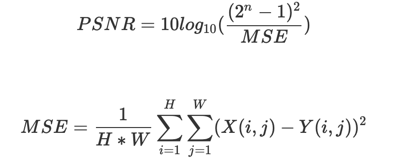

### 1. PSNR (Peak Signal-to-Noise Ratio) 峰值信噪比
#### 1. 致谢
感谢 草飘灵sky（QQ 2550688560）对该公式理解给予的指导以及资料提供！
#### 2. 啰嗦的介绍（可跳过）
&emsp;&emsp;评价图像处理结果是图像处理非常重要的一环，因此我认为有必要弄清楚评价所采用的数学模型的公式来源。由于本人没有学习过数字图像处理和相关的课程，因此没有自己弄清楚该公式的来源，网络中的博客也大多只是对该公式的实现，对公式来源没有做理解性的说明（感觉应该是公式太简单，没有必要说明 QAQ）。但作为一个从来没接触过数字图像处理的小白来说，理解性的说明还是有必要的。
#### 3. 个人理解
&emsp;&emsp;先贴出公式：

&emsp;&emsp;这里 MSE 就不做解释了，大多数博客都有提到，它是均方误差，这个不难理解。重点是最后 PSNR 的这个公式。先看对数括号内的比值。这里的$\frac{(2^n - 1)^2}{MSE}$，先看(2n-1)，这里对应的值表示一个图像的最大像素值，也就是幅值。这里公式整体实际上是在求信噪比。信噪比的定义如下（图源自百度百科）

简单来说就是输出信号功率与噪声功率的比值，但在该词条下的图像信噪比项，如下图所示：

其中“局部方差的最大值认为是信号方差，最小值是噪声方差，求出它们的比值”描述了上面这个比值的含义。这句话的后半部分“再转成dB数”则恰好对应了对数公式的来源。分贝的计算公式如下图所示（图片来自百度百科）

&emsp;&emsp;上述的图例均为我在得到了 草飘灵sky 指点之后，总结时查询的资料。这里我以不知道比值表示信噪比，不知道信噪比是什么以及不知道对数运算表示分贝转换的角度说一下我认为有必要列出的疑问以及 草飘灵sky 的指导。
1. 为什么使用对数运算？

2. 为什么在比值中要取最大值？

&emsp;&emsp;对于取最大值这里，结合 草飘灵sky 的回答，我个人理解的是：如果抛开名称上的“峰值”以及百度百科上的定义，我认为这里用最大值可能是为了比较明显的表现出图像处理的结果。
\
&emsp;&emsp;以上就是我对 PSNR 公式的理解，再次感谢 草飘灵sky ！
&emsp;&emsp;PSNR 的代码在本文件夹下的 PSNR.py 中。由于目前我还没有学习用深度学习的方法处理图片，这里就只对 PSNR 的实现进行校验。代码中使用 skimage 库中的 measure.compare_psnr() 方法对比自己实现的方法的结果。数据使用之前最邻近插值法和双线性插值法的结果。