### 前言
&emsp;&emsp;研读该论文是为了学习超分辨率的图像重建处理。SSMI（Structure Similarity Index）方法用于对图像处理前后作出评价。该方法解决了使用 PSNR（Peak Signal Noise Ratio）作为评价指标时，会出现评价结果与人眼感知结果不相符的情况。在这里我会对每个章节做一次总结，列出自己的理解（误解）。[论文地址在这里](https://ece.uwaterloo.ca/~z70wang/publications/ssim.pdf)。

### 文章中所用的符号
1. （）：对括号前的词语或短语进行解释
2. 【】：注明本人的理解（误解）

### 参考网址
1. [误差灵敏度](https://www.murata.com/en-global/support/faqs/products/sensor/inclinometer/char/0005)
2. [时间频率表示单位时间内重复事件的数量；空间频率表示空间内事件随空间的变化，与波长相关](https://www.quora.com/What-is-temporal-frequency)
3. [最小可觉差](https://www.baidu.com/link?url=DdFh-tPRM5WhFoNzruCzYYMLEKaMHc51LD2FoMnbhCJIQoKkcyUSYzp2g9ITvoTbYruCThl57YOxA407ZuKVX_Q2DnAQDqqwJEpZQZdlof0EOikhJRXoYNsmoKgcgl0Uqrjmxk6nNkdcbmwMga_W7q&wd=&eqid=abbef78b0012d29a000000065de73c56)
4. [保真度](https://baike.baidu.com/item/保真度/3516459?fr=aladdin)
5. [非负极性](https://zhidao.baidu.com/question/56478723.html)
6. [韦伯定律](https://baike.baidu.com/item/韦伯定律/11033274?fr=aladdin)

### 总结
#### Abstract
##### 1. 作者想解决什么问题？
&emsp;&emsp;在作者提出该方法（SSIM 指标 以及 MSSIM）之前，检测原图和失真图像差距的方法不能很好的符合人类感知。例如使用 MSE 检测的时候，对于 MSE 值相近的失真图像，人眼感知到的结果也有明显不同。
##### 2. 作者通过什么理论/模型来解决这个问题？
&emsp;&emsp;作者基于人类视觉系统适应于抽取场景的结构化信息，开发了一个结构相似度模型，并对比了受试者主观感受、客观模型以及该模型对 JPEG 和 JPEG2000 格式压缩的图像的评分。
##### 3. 作者给出的答案是什么？
&emsp;&emsp;作者在 Abstract 中并未给出答案，但在论文的实验部分能够看出，于之前提出的方法相比较，作者提出的模型在评估图像感知质量上取得了很好的效果。

#### introducing
##### 1. 作者为什么研究这个课题？
&emsp;&emsp;首先，数字图像处理会造成原图可视质量下降，需要有一种方法去评估、量化被处理图像与原图之间质量的差距。其次，之前提出的具有相似功能的模型需要原图完全可用，而实际应用中却需要脱离原图的质量评估方法。
##### 2. 目前这个课题进行到了什么阶段？
&emsp;&emsp;作者在这里提出，过去，人们基于 MSE 方法提出了大量感知质量评估模型，但由于这些模型基于 MSE 方法，因此它们都具有局限性。
##### 3. 作者使用的理论基于哪些假设？
&emsp;&emsp;这个在摘要中有提到，作者基于人类视觉系统适应于抽取场景的结构化信息，开发了一个结构相似度模型。

#### process
##### 1. 构建模型所使用的框架
&emsp;&emsp;作者在第二节中详细说明了框架包含的内容，总体包含了预处理、CSF（对比度敏感方程）、通道分解、误差归一化、误差池的框架。<font color=blue>【其中对通道分解，误差归一化，和误差池的理解不够】</font>
##### 2. 结果比较，以及结论
&emsp;&emsp;作者在第三节内容中使用新模型（MSSIM）对一组使用不同方法处理过的图像进行评估，这些图像的 MSE 值相等。作者通过该对比结果总结出：
第一，相同 MSE 值不同观感可以解释为图像之间的结构不同。
第二，灵敏度范式<font color=blue>【作者在误差池中提到模型使用了闵可夫斯基范式，除此之外我没有看到其他范式，因此我在这里理解为这个灵敏度范式使用的是闵可夫斯基范式】</font>不依赖于阈值心理物理，因此可以避免超阈值问题。
第三，新理论旨在比较两个图像信号的结构变化，因此不存在自然图像复杂度和解相关的问题。
##### 3. 公式推导
&emsp;&emsp;在假定图像信号不为负且离散的情况下，计算原图和被比较图像的信号平均强度：
其中对于亮度、对比度和结构比较方程，要具有以下条件：
1. 对称性：$S(x,y) = S(y,x)$；
2. 有界：$S(x,y) \le 1$；
3. 最大值唯一：$S(x,y) = 1$ 当且仅当 $x = y$（离散表示为，$x_i = y_i$，对于所有的 $i = 1,2,···,N$）

$$μ_χ = \frac{1}{N}\sum_{i=1}^{N}x_i$$
然后将两个图像的平均强度带入亮度比较方程，其定义如下：
$$l(x,y)=\frac{2μ_xμ_y + C_1}{μ_x^2 + μ_y^2 + C_1}$$
$C_1 = (K_1L)^2$ 避免了分母接近 $0$ 的情况，$L$ 表示像素值动态范围，$K_1$ 是远小于 1 的常数。由于人类对相对亮度变化敏感，对绝对亮度变化不敏感（韦伯定律）<font color=blue>【这里的绝对我理解为图像本身的亮度，它是固定的】</font>。因此我们引入一个参数 $R$ 表示图像相对于背景亮度变化的大小<font color=blue>【这里我理解为被试者在观测图像时，图像本身亮度大小和当时环境的亮度大小差】</font>。因此可以将失真信号重写为 $μ_y = (1 + R)μ_x$。带入公式得：
$$l(x,y)=\frac{2(1 + R) + C_1/μ_x^2}{1 + (1 + R)^2 + C_1/μ_x^2}$$
假定 $C_1$ 相对于 $μ_x^2$，小到可以忽略不计，那么等式变为只含有 $R$ 的函数：
$$l(x,y)=\frac{2(1 + R)}{1 + (1 + R)^2}$$
这与韦伯定律基本相符了<font color=blue>【这里我理解为作者想将等式变为只与相对背景亮度相关，与上述的韦伯定律一致】</font>
第二，求出原图和失真图像的标准差
$$σ_x = (\frac{1}{N-1}\sum_{i=1}^{N}(x_i-μ_x)^2)^\frac{1}{2}$$
接着，将 $σ_x$ 和 $σ_y$ 带入对比度比较方程 $c(x,y)$：
$$c(x,y) = \frac{2σ_xσ_y + C_2}{σ_x^2 + σ_y^2 + C_2}$$
这里的 $C_2=(K_2L)^2$，并且 $K_2$ 也远远小于 1。<font color=blue>【我不理解原文对这里关于灵敏度做出的解释：这个方程的一个重要的性质是，在相同对比度变化的总量下，$Δσ = σ_y - σ_x$，与低基本对比度相比，这个方法对高基本对比度 $σ_x$ 的敏感度低。这与 HVS 的对比度掩盖特征一致】。</font>
对于
$$μ_χ = \frac{1}{N}\sum_{i=1}^{N}x_i$$
我们移除 $\frac{1}{N}$ 得到离散形式下，$x-μ_x$ 在超平面对应的 $x$ 的投影被定义为
$$\sum_{i=1}^{N}x_i = 0$$
<font color=blue>【我不理解这里的超平面】</font>
根据上述超平面定义，可以给出两个单位向量  $\frac{x-μ_x}{σ_x}$ 和 $\frac{y-μ_y}{σ_y}$，并根据其内积给出结构相似度方程<font color=blue>【我不理解这里两个单位向量的来源，原文指出是标准化后的信号，但还是不理解，感觉是在求几倍标准差】</font>
$$s(x,y)=\frac{σ_{xy}+C_3}{σ_xσ_y+C_3}$$
$C_3$ 与之前的 $C_1$ 和 $C_2$ 定义一样，$σ_{xy}$ 定义如下：
$$σ_{xy}=\frac{1}{N-1}\sum_{i=1}^N(x_i - μ_x)(y_i-μ_y)$$
最后，合并上述的$l(x,y)$，$c(x,y)$，$s(x,y)$，给出最终的公式：
$$SSIM(x,y)=[l(x,y)]^α·[c(x,y)]^β·[s(x,y)]^γ$$
公式中的 $α>0,β>0,γ>0$ 用于调整三个部分的相对重要性。为了简化表达式，作者让上述三个参数均为 1，$C_3 = \frac{C_2}{2}$ 得到
$$SSIM = \frac{(2μ_xμ_y + C_1)(2σ_{xy} + C_2)}{(μ_x^2 + μ_y^2 + C_1)(σ_x^2 + σ_y^2 + C_2)}$$
由于实际应用中需要估计单个图像的总体质量。因此使用平均 SSIM（MSSIM），定义如下
$$MSSIM(X,Y)=\frac{1}{M}\sum_{j=1}^{M}SSIM(x_j, y_j)$$

#### Coding
参考网址：
1. https://cloud.tencent.com/developer/article/1438942
2. https://www.aiuai.cn/aifarm1245.html

&emsp;&emsp;我自己照着论文中的公式，用 python 写了一遍代码，源码如下：
```python
def SSIM(image1, image2):
    mu1 = image1.mean()
    mu2 = image2.mean()

    denominator = image1.shape[0] * image1.shape[1] - 1
    subtraction1 = image1 - mu1
    subtraction2 = image2 - mu2

    sigma1 = np.sqrt((1.0 / denominator) * np.sum(pow(subtraction1, 2)))
    sigma2 = np.sqrt((1.0 / denominator) * np.sum(pow(subtraction2, 2)))
    sigma12 = 1.0 / (denominator- 1) * np.sum(subtraction1 * subtraction2)

    # light compare function
    L = 255
    K1 = 0.01
    K2 = 0.03
    C1 = pow(K1 * L, 2);
    C2 = pow(K2 * L, 2);

    SSIM = ((2 * mu1 * mu2 + C1) * (2 * sigma12 + C2)) / ((mu1 ** 2 + mu2 ** 2 + C1)*(sigma1 ** 2 + sigma2 ** 2 + C2))

    return SSIM

def compute_SSIM(image1, image2):
    image1 = np.array(image1, dtype=np.uint8)
    image2 = np.array(image2, dtype=np.uint8)
    if (image1.shape != image2.shape):
        print("two images have different shape!")
        return

    ssim = 0.0
    r = image1.shape[2]
    if(r > 3):
        r = 3

    for i in range(r):
        ssim = ssim + SSIM(image1[:,:,i], image2[:,:,i])

    return ssim / r
```
但是测试结果与 skimage 中的 measure.compare_ssim() 函数在默认参数下的值相差 0.03 左右（这里用的两张测试图片分别是对原图进行最邻近插值和双线性插值进行 * 2 放大后的图片），但在引用原博客中的图片实验时，发现误差居然变成了 0.3。找到了一篇计算结果跟我一致（需要将源代码修改为与论文中公式一致，否则会有很小的偏差）的[博客](https://www.aiuai.cn/aifarm1245.html)，在这个博客里面找到了一篇写的很详细的[博客](https://cloud.tencent.com/developer/article/1438942)。从这个博客中得知，skimage 中的 ssim 方法，在未选择高斯滤波时，使用的是均值滤波（滑窗尺寸为 7*7）。我想使用该方法测试结果，但是发现源代码中的 crop() 函数会把 SSIM 值清空，返回 Non。crop() 函数源代码如下：
```python
def crop(ar, crop_width, copy=False, order='K'):
    from distutils.version import LooseVersion as Version
    old_numpy = Version(np.__version__) < Version('1.16')
    if old_numpy:
        from numpy.lib.arraypad import _validate_lengths
    else:
        from numpy.lib.arraypad import _as_pairs

    ar = np.array(ar, copy=False)
    if old_numpy:
        crops = _validate_lengths(ar, crop_width)
    else:
        crops = _as_pairs(crop_width, ar.ndim, as_index=True)

    slices = tuple(slice(a, ar.shape[i] - b) for i, (a, b) in enumerate(crops))

    if copy:
        cropped = np.array(ar[slices], order=order, copy=True)
    else:
        cropped = ar[slices]

    return cropped
```
原因是当传入的 crop_width 为 3 时，```slices = tuple(slice(a, ar.shape[i] - b) for i, (a, b) in enumerate(crops))```会将 ar.shape[2]进行修改，这直接导致原像素值的 RGB 通道丢失。因此，尝试自己写一个与 crop 函数相似的功能。考虑博客代码中使用的图像数据已经是被处理成 ndarray 类型的，因此使用下列代码替代  crop 函数：
```python
    S = S[pad:S.shape[0] - pad]
    S = S[:, pad:S.shape[1] - pad]
```
测试后，输出结果与 measure.compare_ssim() 函数结果相差 0.001，这里仍然不清楚 0.001 的数值差距，因此希望看到这篇文章的你，能够给予指点，谢谢！以下为自己根据上述总结实现的源代码：
```python
def SSIM(image1, image2):
    L = 255
    K1 = 0.01
    K2 = 0.03

    # 因为是均值滤波，如果是高斯滤波，则依照论文中应设置为 11
    win_size = 7
    image1 = image1.astype(np.float64)
    image2 = image2.astype(np.float64)

    # E(image1)  E(image2) 非高斯滤波滑窗尺寸为 7
    mu1 = uniform_filter(image1, size=win_size)
    mu2 = uniform_filter(image2, size=win_size)

    # E(image1^2) E(image2^2)
    mu11 = uniform_filter(image1 * image1, size=win_size)
    mu22 = uniform_filter(image2 * image2, size=win_size)

    # E(iamge1 * image2)
    mu12 = uniform_filter(image1 * image2, size=win_size)

    # 像素点总量 = 滑窗尺寸 * 图像维度
    NP = win_size ** image1.ndim

    # 采用无偏估计，分母 = 1 / （N-1）
    denominator = NP / (NP - 1.0)
    # sigma_1^2
    sigma1 = denominator * (mu11 - mu1 * mu1)
    # sigma_2^2
    sigma2 = denominator * (mu22 - mu2 ** 2)
    # sigma_12
    sigma12 = denominator * (mu12 - mu1 * mu2)

    # light compare function
    C1 = (K1 * L) ** 2;
    C2 = (K2 * L) ** 2;

    SSIM = ((2 * mu1 * mu2 + C1) * (2 * sigma12 + C2)) / \
           ((mu1 ** 2 + mu2 ** 2 + C1) * (sigma1 + sigma2 + C2))

    # 截去边缘部分，因为卷积得到的边缘部分的均值并不准确，是靠扩充边缘像素的方式得到的。
    pad = (win_size - 1) // 2

    SSIM = SSIM[pad:SSIM.shape[0] - pad]
    S = SSIM[:, pad:SSIM.shape[1] - pad]
    mssim = SSIM.mean()

    return mssim
```
这里没有实现带有高斯滤波和非无偏估计的代码，高斯滤波可以使用 scipy.ndimage 中的 gaussian_filter，替换原先的 uniform_filter 就可以了，但要将 win_size 设置为 11。如果想对比 SSIM 和 PSRN 方法对单个图像预测结果的差别，可以使用 measure.compare_psnr()。关于 PSNR 方法的实现我写在了[这里](https://github.com/Intro1997/ImageRebuild/tree/master/3_Evalution_Methods/PSNR)


### 翻译和理解
#### I. 引言（Introduction）
&emsp;&emsp;数字图像在处理过程中会造成可视程度下降的情况。因为图像是给人眼看的，且主观的评估图像处理质量是高成本的，因此需要一个能预测感知图像质量的可量化衡量标准。一个客观的图像质量指标（metric）能够动态检测或调整图像质量，优化算法和参数设置以及基准图像处理系统和算法。客观图像质量指标通过与失真（distorted）图像比较的原图（distortion-free image）可用性分类。多数方法都是全引用（假定原图已知）的<font color=blue>【注：这里的意思应该是这些方法需要原图和被处理原图一一对应】</font>，而实际应用中却需要非引用方法（原图不可用）<font color=blue>【注：这里指的应该是实际需要一种方法去估计被处理后的图片，而此时是没有原图可以参考的】</font>。第三种方法（减引用质量估计模型 reduce-reference quality assessment）是使用图片的一些特征作为附加信息帮助评估失真质量。本文重点关注全引用模型。
&emsp;&emsp;全引用模型中，最简单且应用最广泛的模型是 MSE 和 PSNR，因为它们有清晰的物理含义，易于计算和优化。在过去的三十年内，人们为开发利用了已知人类视觉系统特征的质量评估系统做出了巨大努力。大多数提出的感知质量评估模型都是基于 MSE 修改的。章节 II 会讨论几种误差敏感度（error-sensitivity）方法的困难和局限性。
#### II. 基于误差灵敏度的图像质量评估（Image Quality Assessment Based on Error Sensitivity）
&emsp;&emsp;被评估的图像信号可认为是误差信号和未失真的引用图像信号<font color=blue>【注：我认为这里可以理解为原图信号】</font>的总和。广泛采用的假设是，感知质量的损失与误差信号的可视度直接相关。这个概念最简单实现就是 MSE，它客观地量化了误差信号的强度。但是拥有相同的 MSE 值的失真图像可能有不同类型的误差，其中一个的误差可能看起来比另一个更明显。大多数在文献中提出的感知图像质量评估方法都尝试根据误差信号的可见度对其不同方面进行加权，例如根据人类的心理物理测量或根据动物的生理物理测量所确定的那样。这种方法由 Mannos 和 Sakrison 率先提出，并被其他研究者拓展。
<font color=blue>【注：这段话的意思我个人理解为，大部分方法使用误差信号（我在这里理解为原图和被处理后的图像的某种差值）去衡量感知损失，例如 MSE 方法。但单纯使用方法去衡量并不准确（会出现相同 MSE 值，不同感观的情况），因此在类似 MSE 的原方法中加入了一些其他方面的影响因子（如人类心理等等）】</font>

**A. 框架**

&emsp;&emsp;图例1表明了通用图像质量估计模型框架基于[误差灵敏度](https://www.murata.com/en-global/support/faqs/products/sensor/inclinometer/char/0005)。尽管在细节上不相同，但多数感知质量模型与上面的图例相似。下面是图例的几个阶段：

*```预处理```*
&emsp;&emsp;这个阶段为消除被比较图像的已知失真，执行了多个基本操作：首先适当缩放并对齐失真信号和参考信号，然后信号被转换到适合人类视觉系统的色彩空间；接着质量轻便评估标准可能需要通过点对点非线性的变换，将计算机内存中的数字像素值，转换为显示设备的像素亮度值；接着或许需要使用低通过滤器（low-pass filter）模拟眼部光学的点分布方程。最后参考图像和失真图像可能要为模拟明适应（light-adaptation，人从暗处来到强光下,最初感到强光耀眼,不能视物,只有稍待片刻,才能恢复视觉,这种现象叫明适应），使用非线性点操作作出变更。

*```CSF（contrast sensitivity function 对比敏感方程）```*
&emsp;&emsp;对比敏感方程描述了在视觉刺激下，人眼视觉系统对不同时间频率和空间频率的敏感程度。（[时间频率表示单位时间内重复事件的数量；空间频率表示空间内事件随空间的变化，与波长相关](https://www.quora.com/What-is-temporal-frequency)）。一些图像质量指标根据这个方程（通常使用估计 CSF 频率相应的线性过滤器）给信号加权。然而，许多最近的指标选择将 CSF 作为通道分解后的基本敏感性归一化因子（base-sensitivity normalization factor）。

*```通道分解（Channel Decomposition）```*
&emsp;&emsp;图像通常被分解成一些子带（subbands 在心理物理学（psychophysics）文献中通常被叫做“通道 channels”），这些子带具有在方向上或频率上可选的时空频率（spical and temporal frequency）和方向。尽管一些质量评估方法通过复杂的通道分解实现，这种通道分解被认为是与初级视觉皮层神经响应密切相关的，但许多指标还是使用更简单的变换，例如离散余弦变换或是可分离的小波变换。据报道，调整到多种时间频率的通道分解已用于视频质量评估。

*```误差归一化 Error Normalization```*
&emsp;&emsp;分解参考信号和失真信号之间的误差（或差值 （difference））是通过一个确定的掩盖模型（masking model）来计算和归一化的，这种掩盖模型考虑了出现一个图像成分（component）降低另一个图像成分的可见度的事实，前者在时空位置（spatial or temporal location），空间频率或方向上接近后者。 标准化机制通过一个空间变化的可见度阈值给通道中的误差信号加权。根据参考（图像）的能量和/或邻域内的失真系数（可能会包含来自相同或不同通道邻域内的系数）以及该通道<font color=blue>【当前通道】</font>的基本灵敏度，可以计算出每个点的可见度阈值。归一化过程意在将误差转换为[最小可觉差](https://www.baidu.com/link?url=DdFh-tPRM5WhFoNzruCzYYMLEKaMHc51LD2FoMnbhCJIQoKkcyUSYzp2g9ITvoTbYruCThl57YOxA407ZuKVX_Q2DnAQDqqwJEpZQZdlof0EOikhJRXoYNsmoKgcgl0Uqrjmxk6nNkdcbmwMga_W7q&wd=&eqid=abbef78b0012d29a000000065de73c56)。一些方法也考虑了对比响应饱和度的影响。
<font color=blue>【这里我理解的是：误差归一化的步骤是先通过某个掩盖模型计算原图和处理后图片的误差（差值），接着根据空间变化可见度阈值给误差加权，最后算出可见度阈值】</font>

*```误差池 Error Pooling```*
&emsp;&emsp;所有质量指标的最后阶段必须将图像在空间拓展上以及在跨通道上被标准化的误差信号合并成一个单值。大多数质量评估模型采用闵可夫斯基（Minkowski）范数来合并：
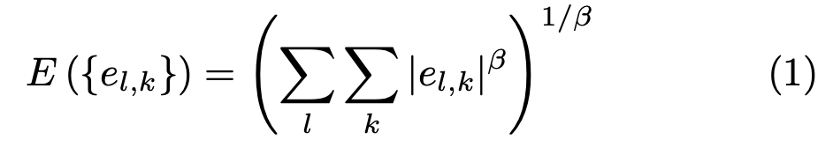
图中的 e<sub>l,k</sub> 表示第 l 个通道的第 k 个被标准化后的系数。β 表示常指数，范围通常在 1 到 4 之间。闵可夫斯基合并（Minkowski pooling）可以先在空间（k）执行，然后在频率（l）上执行，反之亦然，它们之间存在一些非线性关系，也可以使用不同的指数 β 执行。表明不同区域的相对重要性的空间映射也可能用于提供空间变化加权。
<font color=blue>【这里我不太明白空间映射和不同区域指的是什么】</font>

**B. 局限性**
&emsp;&emsp;误差敏感度模型的基本原则是，量化误差可见度可以最好地估计感知模型。
<font color=blue>【量化误差】</font>本质上是通过模拟人类视觉系统早期阶段的功能属性完成的，这些功能属性通过心理物理和生理实验表征。尽管这个方法已被广泛接受，但认识到它的局限性是很重要的。特别的，人类视觉系统是一个复杂的并且高度非线性的系统，但是多数模型的早期版本是基于线性或准线性因子实现的，这些因子通过受限和简单的刺激来表征。因此误差敏感方法必须依赖许多强有力的假设和概括。

*```质量定义问题 The Quality Definition Problem```*
&emsp;&emsp;大多数传统方法的基本问题是对图像质量的定义。特别是，还不清楚误差可视度是否应该被等同于质量损失，因为一些失真可能清晰可见，但并不令人反感。比较明显的例子是使用全局缩放因子乘以图像强度。29 号引用中也表明了图像[保真度](https://baike.baidu.com/item/保真度/3516459?fr=aladdin)和图像质量仅仅是中等相关度

*```超阈值问题 The Suprathreshold Problem```*
&emsp;&emsp;支撑了许多误差敏感度模型的生理物理实验是专门为估计刚好不可见刺激的阈值而专门设计的。然后，这些被测量的阈值会用于定义视觉误差灵敏度测量，比如对比度灵敏度方程和多种掩盖效果。然而，很少有心理物理学研究表明，这种近阈值模型是否可以像大多数图像处理情况那样，表征明显高于阈值等级的感知失真。可见度阈值能在超阈值范围内归一化不同通道的相对视觉失真吗？最近，为将超阈值物理学纳入分析图像失真，（研究者们）做出了努力。

*```自然图像的复杂问题 The Natural Image Complexity Problem.```*
&emsp;&emsp;多数心理物理实验是用像是点、条或者是正弦格栅这样相对简单的图样进行的。CSF（比较敏感方程，后文不再使用全称）就是使用整体正弦图像从阈值实验中获取的。掩盖现象通常是使用两个（或一些）不同图样的重叠来表征的。但是，所有的图样都比现实世界图像更简单，后者可被认为是大量简单图样的重叠。几个简单图样相互作用的模型能评估数十或数百个图样的相互作用吗？这种有限数量的简单刺激试验足以构建一个能够预测复杂结构自然图像视觉质量的模型吗？尽管这个问题的答案现在还不清楚，但最近建立的包含了简单和复杂图样的 Modelfest 数据库应该会促进未来的研究。

*```解相关问题 The Decorrelation Problem```*
&emsp;&emsp;当有人选择使用 Minkowski 指标作为空间池误差时，这个人就隐含假设了不同位置的误差在统计上是独立的。如果合并之前的处理消除了输入信号之间的依赖，则前面提到的方法是对的。然而，凭经验来看，像小波变换这样的线性通道分解方法并不符合这种情况。在自然图像中，通道内和通道间的小波变换系数之间存在强依赖。事实上，最先进的小波变换图像压缩技术正式利用了这个强依赖取得了成功。在心理物理学上，视觉掩盖模型通常被认为是系数之间的交互。统计上认为，一个设计良好的，为减少依赖而非适应掩盖实验数据对参数进行优化的非线性的增益控制模型，能很大程度上减少变换系数的依赖。在引用 45，46 展示了变换和掩盖模型的最佳设计可以减少统计和感知依赖性，这些模型能够对当前的质量评估算法的性能提升多少，还有待观察。

*```认知交互问题 The Cognitive Interaction Problem```*
&emsp;&emsp;认知理解和交互视觉处理（例如眼动 eye movement）会影响图像的感知质量，这个是众所周知的。比如，如果一个人类观察者在被告知了不同指示的情况下，那么他/她会对同一张图片作出不同的质量得分。有关图像内容，注意力机制和注视点机制的先前信息可能也会影响图像质量的评估。但是因为这些影响不容易量化和理解，所以大多数图像质量指标并不考虑它们。

#### III. 基于结构相似度的图像质量评估
&emsp;&emsp;自然图像结构是高度结构化的：自然图像的像素之间表现出强烈的依赖，尤其是当它们在空间上十分接近时，这些依赖携带着有关视觉场景中目标结构的重要信息。Minkowski 误差指标基于逐点（pointwise）信号差异，这些信号差异与基本信号结构是无关的。尽管大多数基于误差敏感度的质量衡量是使用线性变换来分解图像信号，但是正如之前章节所讨论过的那样，这些衡量不能消除强依赖。我们新方法的动机是找到比较直接的方法来比较参考信号和失真信号结构。

**A. 新理论 New Philosophy**
&emsp;&emsp;基于人类视觉系统高度适应于抽取视野范围内的结构信息的假设，引用[6]和[9]提出了为图像质量衡量设计的新框架。因此，结构化信息变化的测量能够为感知图像失真提供良好的近似。
&emsp;&emsp;通过比较误差敏感度理论能够更好的理解这个新理论。首先，误差敏感度方法通过估计感知误差量化图像质量下降，而新理论将结构信息中的感知变化视为图像质量下降。下图展现了一个激动人心的例子：
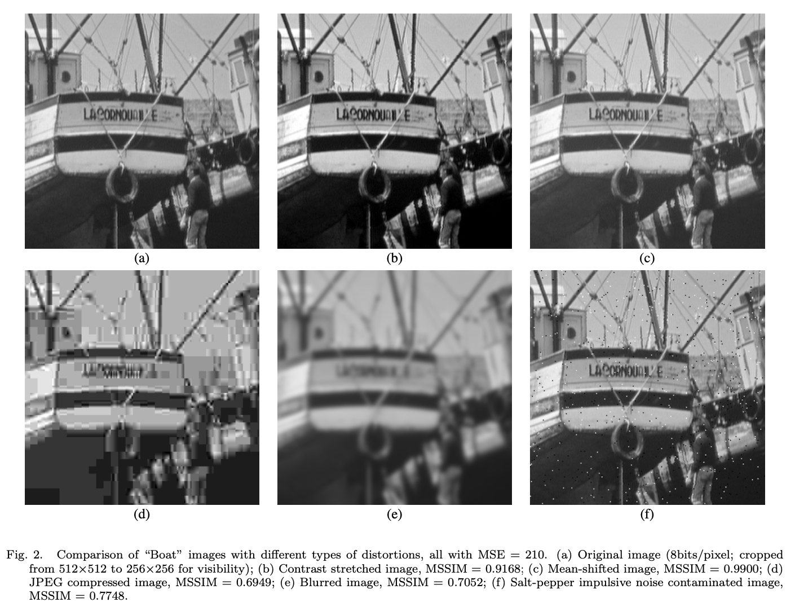
上图中，原先船的图片被处理成（alter）不同程度的失真，每个图片都经过调整以产生相对原图几乎相同的 MSE（均方误差，后文均用缩写）。尽管如此，可以看出这些图像的感知质量截然不同。对于误差敏感度理论来说，在原图和对比度增强图像的视觉差异如此明显的事实下，很难解释为什么对比度增强图像有如此高的质量。但使用新理论就很容易理解这种现象，因为近乎原图的所有结构信息都被保留了，从某种意义上说，可以通过简单的逐点反转线性亮度变换几乎完全恢复原先的结构信息（除了亮度或暗度饱和的区域）。另一方面，JPEG 压缩图像和模糊图像永久丢失了原图的一些结构化信息，因此它们的质量分数分数应该比对比度增强和均值偏移的图像更低。
&emsp;&emsp;第二，误差灵敏度范式是一个自下而上的方法，它模拟了早期阶段的 HVS（人类视觉系统，后文使用缩写，不再赘述）相关成分的函数。而新的范式是自上而下的方法，它模拟了 HVS 总体被假设的功能。一个方面，由于这个方法不依赖于阈值心理物理去量化感知失真，因此它避免了之前章节提到的超阈值问题。另一方面，由于探测被观测目标的结构，被认为是视觉观测完整过程的目的，包括高级处理和交互处理，因此它也在一定程度上减少了认知交互问题。
&emsp;&emsp;第三，由于新理论不尝试通过积累与心理物理理解简单图样（psychophysi- cally understood simple patterns）有关的误差来预测图像质量，因此也在一定程度上避免了自然图像复杂度和解相关的问题。与上述不同，新理论提出直接评估两个复杂结构信号之间的结构变化。

**B. 结构相似度指标 The Structural SIMilarity (SSIM) Index**
&emsp;&emsp;我们从图像形成的视角构建了一个结构化相似度质量测量的特定实例。引用 6 到 8 中完成了该方法早期的实例化，并且在简单的测试中获得了不错的（promising）结果。在这篇论文中，我们对这个算法进行了概括，并且提供更广泛的验证结果集。
&emsp;&emsp;被观察目标表面的亮度是照明和反射的产物，但是场景中物体的结构与照明是无关的。所以，为了探索一个图像的结构化信息，我们希望能分离照明的影响。我们将一个图像中的结构化信息定义为表示场景中物体结构的属性，与平均亮度和对比度无关。由于整个场景的亮度和对比度可能发生变化，因此我们使用局部亮度和对比度来定义。
&emsp;&emsp;下图（图例3）展示了被提出的质量评估系统的系统图例。
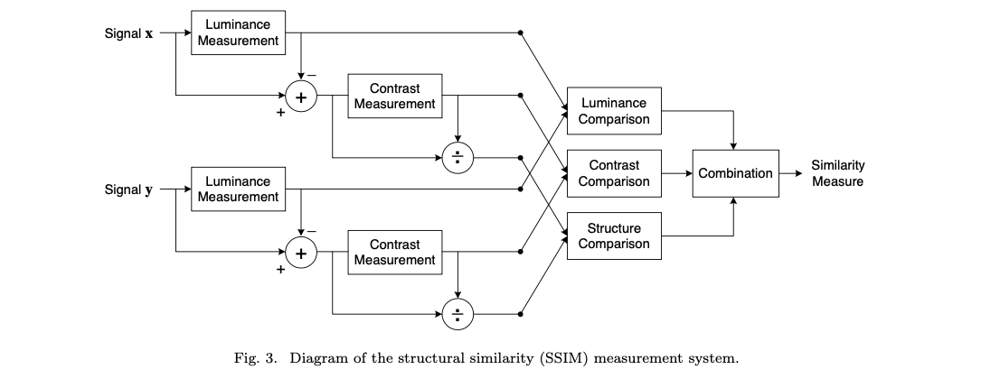
假定 x 和 y 是两个[非负极性](https://zhidao.baidu.com/question/56478723.html)（non-negative）的图像信号，它们彼此相互对齐（从每个图像提取的空间斑块（spatial patches））。如果我们认为其中一个信号有很高的质量，那么相似度测量能作为第二个信号质量的定量衡量。系统将相似度衡量任务分解成三组比较（three comparisons）：亮度，对比度和结构。首先，比较每个信号的亮度。假定信号是离散的，则作为平均强度来估计：
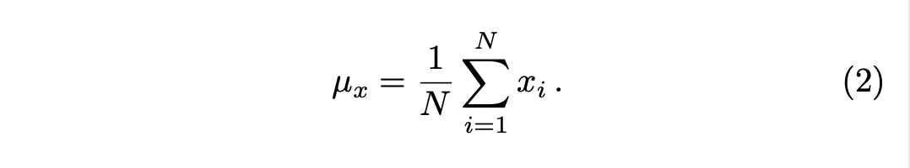
于是亮度比较方程 l(x,y) 是 μ<sub>x</sub> 和 μ<sub>y</sub> 的函数。

&emsp;&emsp;第二，我们从信号中去除平均强度。在离散的形式下，结果信号 x - μ<sub>x</sub> 在超平面对应的向量 x 的投影被定义为
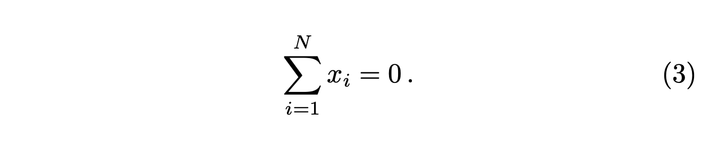
我们使用标准偏差（方差的平方根）作为信号对比的估计。无偏估计的离散形式如下：
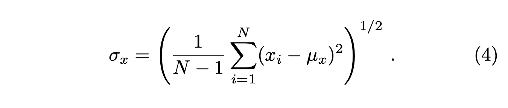
接着，对比度比较 c(x,y) 比较 σ<sub>x</sub> 和 σ<sub>y</sub>.

&emsp;&emsp;第三，因为信号通过自身标准偏差归一化，以便被比较的两个信号有单位标准偏差。对被归一化信号 $\frac{x-μ_x}{σ_x}$ 和 $\frac{y-μ_y}{σ_y}$ 执行结构比较函数 s(x,y) 。

&emsp;&emsp;最后，合并三个部分，生成最后的总体相似度测量公式：
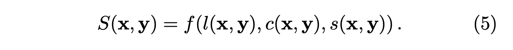
一个比较重要的地方是公式中的三个部分相对独立。比如，亮度和/或对比度的的变化不会影响到图像的结构。
&emsp;&emsp;为了完成公式五中相似度测量的定义，我们需要定义三个方程，l(x,y)，c(x,y)，s(x,y)，以及合并方程 f(·)。我们也想让相似度测量满足以下条件：
1. 对称性：S(x,y) = S(y,x)；
2. 有界：S(x,y) $\leq$ 1；
3. 最大值唯一：S(x,y) = 1 当且仅当 x = y（离散表示为，x<sub>i</sub> = y<sub>i</sub>，对于所有的 i = 1,2,···,N）
&emsp;&emsp;我们定义亮度比较函数如下：
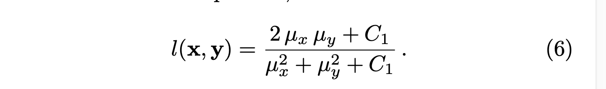
公式中的包含的常数 C<sub>1</sub> 是为了避免 μ<sub>x</sub><sup>2</sup> + μ<sub>y</sub><sup>2</sup> 非常接近 0 时产生的不稳定性。 我们特别选取 C<sub>1</sub> = (K<sub>1</sub>L)<sup>2</sup>（7），公式中的 L 表示像素值的动态范围（对于 8-bit 灰度图来说是 255），K 则是一个远远小于 1（K $\ll$ 1）的常数。很容易看出公式 6 遵循了上述列出的三个属性。

&emsp;&emsp;等式 6 与[韦伯定律](https://baike.baidu.com/item/韦伯定律/11033274?fr=aladdin)在定性上是一致的。韦伯定律被广范应用于 HVS 的光适应（也被叫做亮度掩盖）的建模。根据韦伯定律，在宽范围的亮度值上，刚好可见亮度变化 $ΔI$ 的大小与背景亮度 $I$ 近似成正比。换句话说，HVS 对相对亮度变化敏感，对绝对亮度变化不敏感。令 R 表示相对于背景亮度的亮度变化大小，我们将失真信号亮度重写为μ<sub>y</sub> = (1+R)μ<sub>x</sub>。将这个式子带入公式 6 得到：
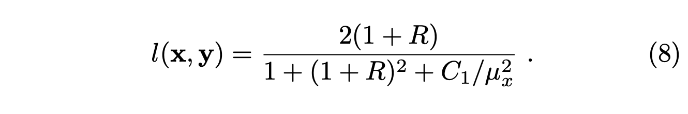
如果我们假定 C<sub>1</sub> 小到可以被忽略（相对于μ<sub>x</sub><sup>2</sup>），那么 l(x,y) 就是一个在定性上与韦伯定律一致的，只含有 R 的函数了。

&emsp;&emsp;对比度比较方程也有相似的形式：
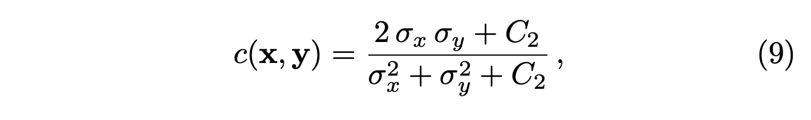
这里的 C<sub>2</sub> = (K<sub>2</sub>L)<sup>2</sup>，并且 K<sub>2</sub> $\ll$ 1。这个定义再次满足了之前列出的几个条件。这个方程的一个重要的性质是：在相同对比度变化的总量下，$Δσ = σ_y - σ_x$，与低基本对比度相比，这个方法对高基本对比度 $σ_x$ 的敏感度低。这与 HVS 的对比度掩盖特征一致。
&emsp;&emsp;在进行亮度减法和方差归一化后进行结构比较。特别的，我们将单位向量  $\frac{x-μ_x}{σ_x}$ 和 $\frac{y-μ_y}{σ_y}$ 与图像的结构相关联，它们的每一个都位于公式 3 定义的超平面中。它们之间的相关性（内积）是量化结构相似度简单有效的方法。注意，$\frac{x-μ_x}{σ_x}$ 和 $\frac{y-μ_y}{σ_y}$之间的相关性等于 x 和 y 之间的相关系数。因此，我们按照如下公式定义结构比较：
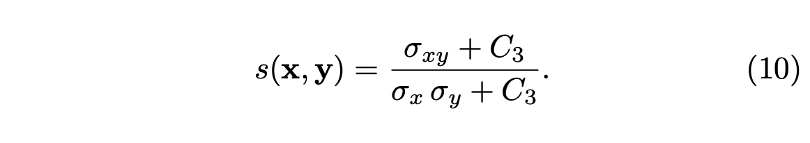
正如亮度和对比度测量的那样，我们需要为分子和分母引入一个小常量。离散形式下的 $σ_{xy}$ 可以估计为：
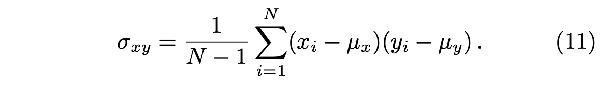
在几何上，相关系数对应于向量 $x-μ_x$ 和 $y-μ_y$ 之间角度的余弦值。注意 s(x,y) 能取到负值。
&emsp;&emsp;最后，我们合并公式 6，9 和 10，并且给最终的相似度测量测量命名为信号 x 和信号 y 之间的 Structural SIMilarity (SSIM) index：
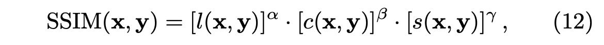
公式中的参数 α > 0，β > 0，γ > 0 是用于调整三个部分的相对重要性的。很容易去验证这个定义满足之前给出的三个条件。为了简化这个表达式，我们让这篇论文中的 α = β = γ = 1，$C_3 = \frac{C_2}{2}$。这样就得到了一个 SSIM index 的特定形式：
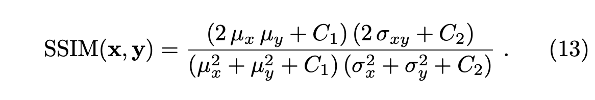
定义在引用 6，7 中的 “通用质量指标”（UQI universal quality index）对应于 $C_1 = C_2 = 0$ 的特殊情况：当 $(μ_x^2 + μ_y^2)$ 或 $(σ_x^2 + σ_y^2)$ 非常接近 0 的时候，会出现不稳定的结果。

&emsp;&emsp;SSIM 指标和更传统的质量指标之间的关系也许可以在图像成分的向量空间中用几何方式说明。这些图像成分可以是像素强度，也可以是其他被提取的像是变换线性系数的特征。图例 4 展示了围绕三个不同引用向量绘制的等失真轮廓（contour），每一个都表示了一个参考图像的局部内容。
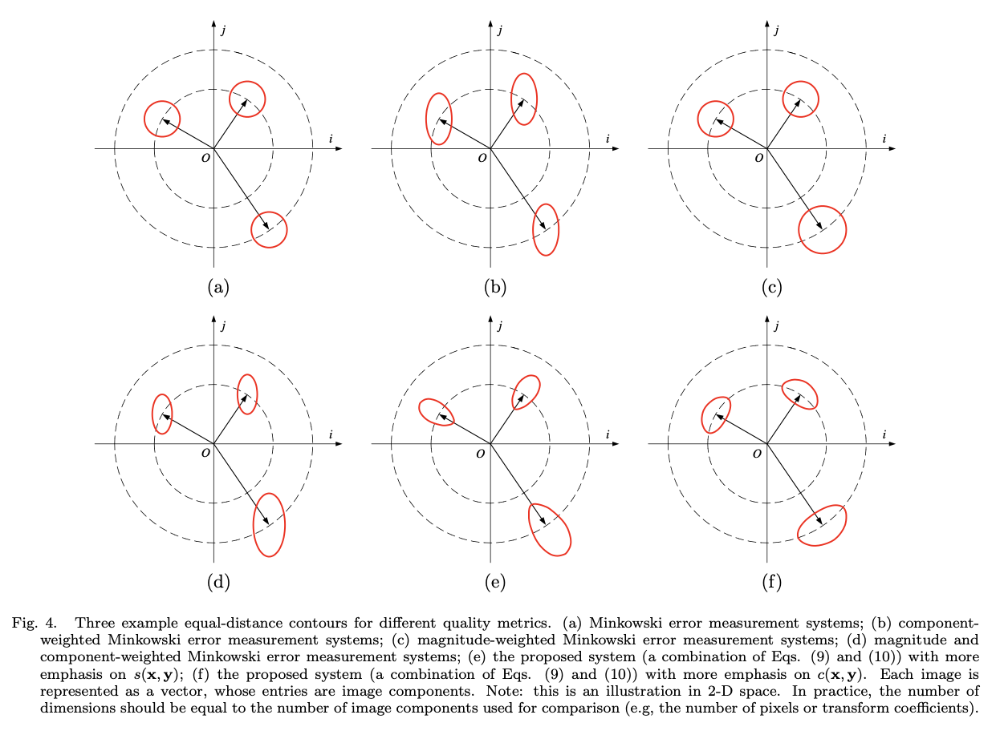
为了更好地说明，我们仅展示了二维空间，但是维度应当与被比较的图像成分数量相同。每个轮廓表示一组图像，这些图像相对于封闭的参考图像有着相同的失真。图例 4(a) 展示了一个简单 Minkowski 标准的结果。每个轮廓有着相同的大小和形状（在这里是圆形，因为我们假定指数是 2）。这个感知距离就是相应的欧式距离。图例 4(b) 展示了 Minkowski 标准，其中不同的图像通道被不同地加权。例如，这也可以是根据许多模型普遍使用的 CSF 加权，这里的轮廓是椭圆形的，但是大小都相同。这些轮廓看起来都是与轴对齐的，但是可以倾斜到任何方向。

&emsp;&emsp;许多近期的模型加入了对比度掩盖行为，如图例 4(c) 所示，它有根据信号幅度重新缩放等失真轮廓的效果。这个可能被视作是一种等失真标准：它不仅依赖于信号之间的差异，也依赖于信号本身。图例 4(d) 展示了对比度掩盖（幅度加权）和之后的指数加权的组合。从另一方面来看，我们提出的方法分别计算了两个独立量的比较：向量长度和它们的角度。因此，上图的轮廓将于极坐标轴对齐。图例 4(e) 和 4(f) 是展示了两个例子，它们使用了不同的指数。同样，也可以被看作是自适应失真标准，但是不像之前的方法，轮廓的尺寸都适应于基础信号。一些近期使用了 divisive normalization 描述了掩盖效果的模型也展示了信号独立轮廓方向（例如引用 45，46，48），尽管在图 4(e) 和 4(f) 中与极坐标轴精确对齐，这些方法并未被观测到。

**C. 使用 SSIM 指标的图像质量评估 Image Quality Assessment using SSIM index**
&emsp;&emsp;对于图像质量评估来说，局部应用 SSIM 指标比全局更有用。首先，图像的数据特征通常在空间上是高度不稳定的。第二，依赖或者不依赖于局部图像数据图像失真也可能是空间变化的。第三，在通常的可视距离下，人类观察者一次只能以高分辨率感知到图像中的部分区域（因为 HVS 的 foveationfeature 偏心特征）。并且最终，局部质量测量能够提供图像的空间变化质量映射，这将提供更多有关图像质量下降的信息，并最终对一些应用有用。在引用 6，7 中，局部数据 μ<sub>x</sub>，σ<sub>x</sub>，σ<sub>xy</sub> 是在整个图像中用 8*8 方格被计算出来的，该方格在整个图像中逐像素点移动。每移动一步，都要在局部方格中计算局部数据和 SSIM 指标。这种方法的问题是 SSIM 指标映射经常出现一些不良的“块状”瑕疵。在这篇论文中，我们使用了一个 11 * 11 的圆对称（circularsymmetric）高斯加权函数  w = {ω<sub>i</sub> | i = 1, 2, ... , N}，使用 1.5 标准样本差，并归一化成单位和（$\sum{N}{i=1}ω_i=1$）。对局部数据的估计 μ<sub>x</sub>，σ<sub>x</sub>，σ<sub>xy</sub> 按照下列公式进行相应的修改。
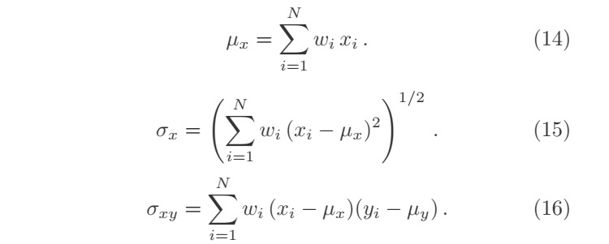
使用这样一个方格方法，质量映射表现出了局部各向异性的属性。整篇论文内容中，SSIM 测量使用了下面的参数设置：
$K_1 = 0.01，K_2 = 0.03$。这些值在某种程度上是任意的，但是我们在当前的实验中发现，SSIM 指标算法的性能对这些值的变化是不敏感的。实际应用中通常需要单个图像的总体质量测量。我们使用平均 SSIM（MSSIM）指标评估总体图像质量。
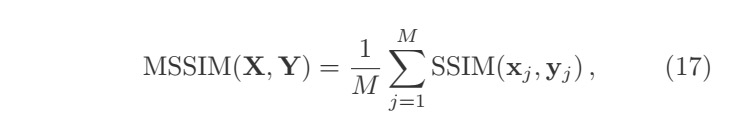
公式中的 X 和 Y 分别表示参考图像和失真图像，x<sub>j</sub> 和 y<sub>j</sub>表示第j个局部方格的图像内容；M 表示图像中的局部方格数量.根据应用，还可以计算出 SSIM 指标映射中不同采样的加权平均数。比如，关注区域（region-of-interest ）图像处理系统对图像的不同分割区域赋予不同权重。在另一个例子中观测到，不同图像的纹理用变化的深度吸引着人眼（例如引用 51 和 52）。平滑变化的中心凹加权模型能够用来定义权重。然而在这篇论文中，我们使用统一权重。一个 MATLAB 实现的 SSIM 指标算法已经在引用 53 中在线获得。

#### IV. 实验结果
&emsp;&emsp;许多使用了相同失真类型（例如 JPEG 压缩）的图像质量评估算法，在应用于从相同原图创建失真图像时，表现出一致的性能。然而，这些模型应用于一组来自不同原图的图像并且/或包含不同的失真类型时，它们的有效性会显著下降。因此，交叉图像和交叉失真测试对于评估图像质量标准的有效性至关重要。展示出完整的此类例子是不可能的，但是图例 2 为测试质量评估算法的交叉失真能力提供了令人鼓舞的起点。图片展示了 MSE 和 MSSIM 测量结果。在这个例子中，可以明显看出 MSE 的表现很差。在定性视觉外观一致性上，MSSIM 值表现的更好。

**A. Best-case/worst-case Validation 最佳/最差情况的有效性**
&emsp;&emsp;我们也为测试客观测量和感知质量之间的关系，开发出了更有效的方法。从一个失真图像开始，我们上升或下降 MSSIM 的梯度，同时限制 MSE 与初始失真图像的 MSE 相同。特别地，我们迭代下面的两个线性代数步骤：
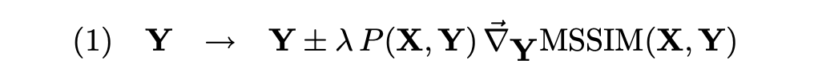
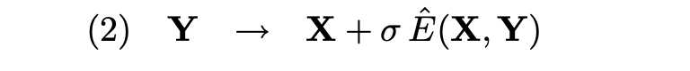
第二个公式中的 σ 表示被限制的 MSE 的平方根，第一个公式中的 λ 控制步骤数量，$\hat{E}(X,Y)$ 表示单位向量，定义如下：
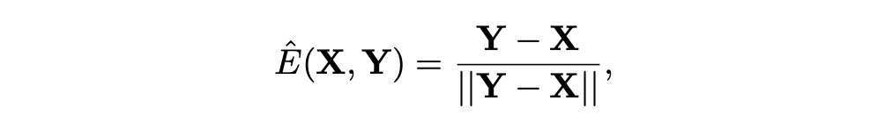
$P(X,Y)$ 是一个投影算子：
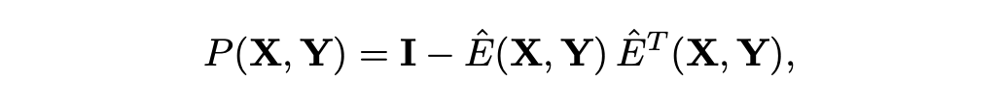
这里的 $I$ 表示单位算子（identity operator）。MSSIM 是一个可微的，并且这个过程收敛到一个客观测量的局部最大值/最小值。对这些最好和最佳图像以及初始失真图像的目视检查，可以直观表明被客观测量认为是最重要/最不重要的失真类型。因此，这是一个揭示感知含义合适且直接的方法。图 5 展示了一个原图被高斯白噪声污染的例子。
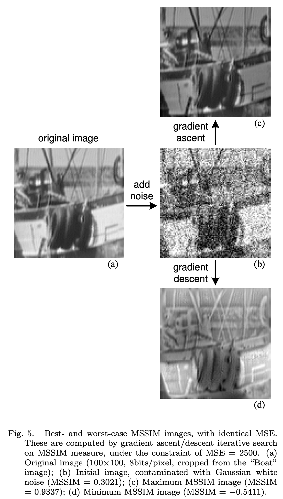
可以看出，在最大  MISSIM 图像中，原图的局部结构得到了很好的保留。
另一方面，在最差 MISSIM 图像中，图像结构发生了巨大改变，在某些例子中反转了对比度。

**B. 在 JPEG 和 JPEG2000 图像数据库上的测试**
&emsp;&emsp;我们在一个由 JPEG 和 JPEG2000 压缩图像构成的图像数据库中，对比了不同质量评估模型交叉失真和交叉图像的性能。29 个高分辨率的，在质量等级范围内用 JPEG 或 JPEG2000 压缩的，每像素 24 bit RGB 颜色（通常在 768 * 512 尺寸或相似尺寸）的图像，一共生成 175 个 JPEG 图像 和 169 个 JPEG2000 图像。被非均匀选取的比特率分别为 0.150 到 3.336 像素/比特和 0.028 到 3.150 像素/比特的，以至于质量分数的分布在整个范围内被均匀估计。受试者从舒适的距离观察图像（这个距离是经过适度控制的，并且使数据反应神经观测条件），并被要求提供他们在持续线性缩放上的质量感知，这个质量感知分为五个相同的区域，分别用形容词标记，“Bad” “Poor” “Fair” “Good” 和 “Excellent”。每个被 13 到 20 和 25 个受试者分别观察的 JPEG 和 JPEG2000 格式的图像。受试者大多数为男大学生。
&emsp;&emsp;每个受试者的分数通过该受试者分数的平均值和方差归一化（原始值被变换到 Z-分数），接着整个数据集会被重新放缩，以覆盖 1～100 范围内。接着为每个图像计算平均意见分数，接着去除离群值（多数受试者没有离群值）。受试者对 JPEG、JPEG2000 以及所有图像分数的平均标准偏差（每个图像的）分别是 6.00，7.33 和 6.65。图像数据库，以及每个图像的主观分数和标准偏差，已经能在互联网上获取到（引用 55）
&emsp;&emsp;在计算 MSSIM 值之前，每个 JPEG 和 JPEG2000 压缩图像的亮度成分在局部 2*2 窗口中平均，以 2 的系数下采样。我们在当前数据库下的实验展现了其他颜色成分不会显著改变模型的性能，尽管这在色彩图像质量评估中不被认为是正确的。不像许多其他感知图像质量评估方法，在应用被提出的算法到数据库之前，无需执行专门的训练程序，因为被提出的方法是用于通用图像质量评估（而不是针对图像压缩）。图例 6 和 7 展示了源自数据库的一些不同质量等级的图例，以及它们的 SSIM 指标映射和绝对误差映射。
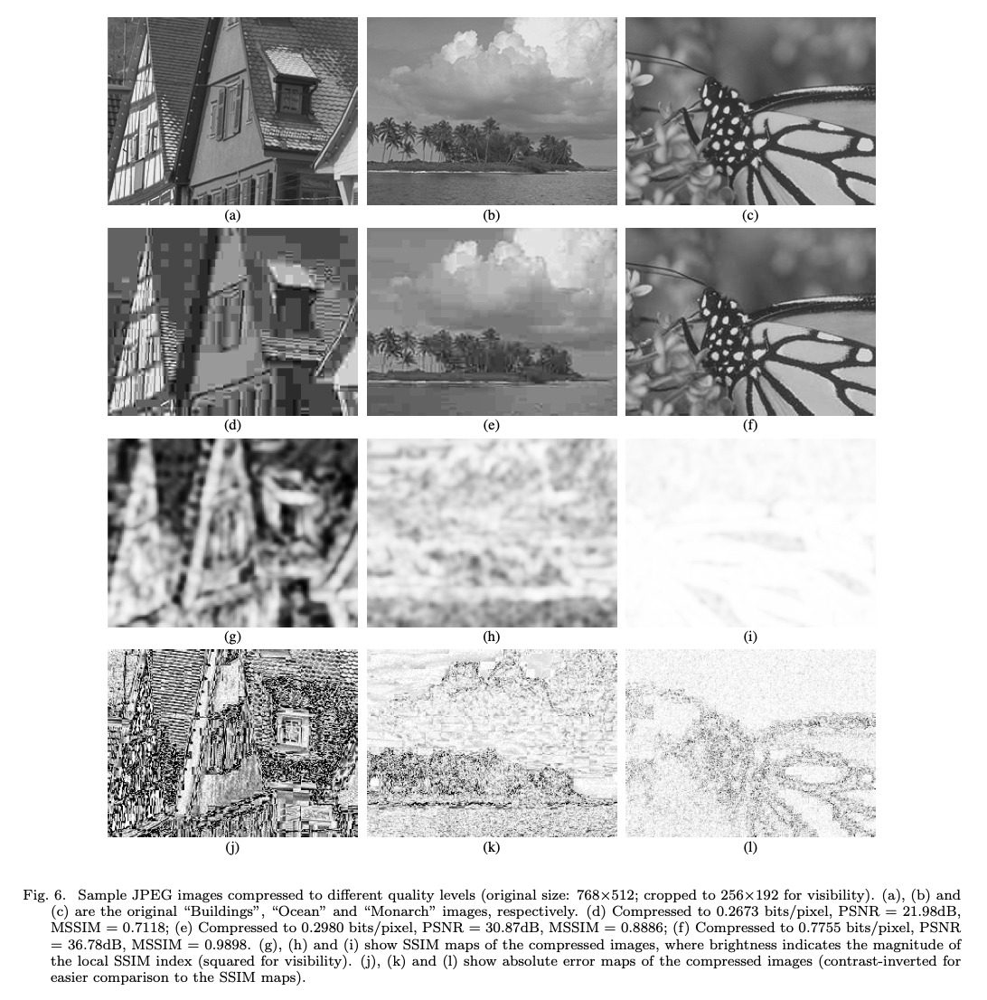
注意，在低比特率的情况下，JPEG 和 JPEG2000 的粗量化常常导致图像的细微区域的平滑表示,（比如，图例 6(d) 的瓦片和 图例 7(d) 的树。与其他类型的区域比较，这些区域在逐点差异测量方面可能并不糟糕，例如绝对差。然而，因为图像的结构化信息细节几乎完全丢失，它们的视觉质量很差。比较图例 6(g) 和 图例 6(j)，图例 7(g) 和 图例 6(j)）我们注意到 SSIM 指标在捕捉低质量区域的表现较好。同时也注意到，对于带有强边缘结构（例如图例 7(c)）的图像，很难在被压缩图像上降低逐点的误差，甚至是在相对高比特率的图像中也会如此（如图例 7(l)）。然而，被压缩图像在图例 7(f)提供了可接受的感知质量。事实上，尽管图例 7(f) 的视觉质量比 Fig 7(e) 的视觉质量更高，它的绝对误差映射 图例 7(l) 却比后者更差 图例 7(k)，正如它们的 PSNR 值所表现的那样。SSIM 指标映射 图例 7(h) 和 图例 7(i)，提供了与感知质量测量更好的一致性。
&emsp;&emsp;质量评估模型用于比较 PSNR，Sarnoff 模型，UQI 模型和 MSSIM。图例 8 展示了每个模型的 MOS 的散点图与模型预测。
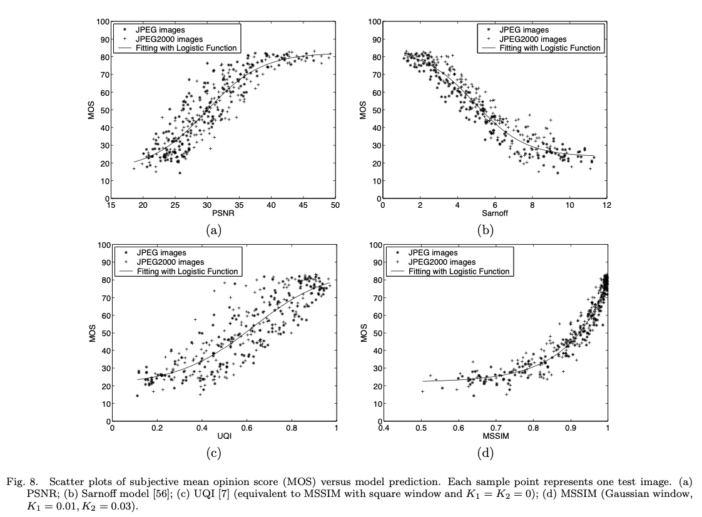
如果 PSNR 被认为是一个评估其他图像质量指标效率的基准方法，Sarnoff 方法则在这次测试中表现较好。这雨之前提出的测试结果相反（例如引用 57，58），这里大多数模型的性能（包括 Sarnoff 模型）都在统计上与均方根误差和 PSNR 相等。在简单的交叉失真测试中（引用 7，8），UQI 方法比 MSE 表现的更好，但是 UQI 方法并没有在 图例 8 中表现出令人满意的结果。我们认为主要的原因是，在近乎平坦的区域内，对比度比较公式的分子近乎于 0，这使得算法不稳定。通过插入小常数 $C_1$ 和 $C_2$，MSSIM 完全避免了这个问题，并且散点图上显示出，MSSIM 方法为主观评测提供了很好的预测。
&emsp;&emsp;为了在客观质量评估模型的性能提供定量测量，我们遵循了视频质量专家组（VQEG）第一阶段 FR-TV 测试（引用 58）的性能评估程序，并使用了其中的四个指标。首先，在拟合程序中使用逻辑函数，为客观/主观分数之间提供非线性映射。图例 8 中展示了拟合曲线。在引用 58 中，指标 1 是在方差加权回归分析后，客观/主观分数之间的相关性系数，指标 2 是非线性回归分析后，客观/主观分数之间的相关性系数。这两个被合并的标准，提供了一个预测准确值的评估方法。第三种指标是客观/主观分数之间的 Spearman 等级相关系数。它被认为是一个预测单调性测量。最后，指标 4 是非线性映射后预测的离群比率（是超出标准差 $\pm$ 2 倍预测值数量的百分比）。引用 58 可以找到这类指标的更多信息。除了这些指标外，我们还计算了平均绝对误差（MAE）、非线性误差回归后的均方根预测误差（RMS）、加权平均绝对误差（WMAE）以及方差加权回归后的加权均方根预测误差（WRMS）。表格 $I$ 中给出了所有被比较模型的评估结果。对于每一个标准，MSSIM 比其他被比较的模型表现的都要好。
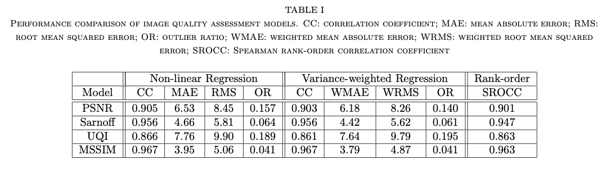

#### V. 讨论
&emsp;&emsp;在这篇论文中，我们总结了基于误差敏感度的传统图像质量评估方法，并且枚举了它们的局限性。我们提出了在图像质量评估设计上，使用结构相似度作为可替换的激励原则。为了阐述我们的结构化相似度概念，我们开发了一个 SSIM 指标并展示了它与其他方法相比，更好地说明了 344 个使用 JPEG 和 JPEG2000 压缩的图像主观质量。
&emsp;&emsp;尽管被提出的 SSIM 指标方法是出于本质不同的设计原则，但我们将它视作是传统方法的补充。仔细的分析表明了 SSIM 指标和几个近期开发的基于掩盖模型的 divisive-normalization ，在测量信号失真中，表现了输入有关的行为。两种方法最终似乎最终会收敛到相似的解决方案。
&emsp;&emsp;关于等式 12 的特定的 SSIM 指标，还有许多问题值得探讨。首先，用于多种图像处理算法的 SSIM 指标优化还需要研究。比如，它可能应用于在图像压缩算法的设计中的比特失真优化。只并不是一个简单的课题，因为等式 12 在数学上比 MSE 更麻烦。第二，SSIM 指标的应用范围在图像处理上可能受限。事实上，因为这是一个对称测量，它可以被认为是一个用于比较两种信号的相似度测量。信号可以是离散或者连续的，并且可以存在于任何维度的空间中。从一个图像形成的角度看，我们认为被提出的S SIM 指标方法是结构相似性理论的一个特定实现。在相同的理论下，可能会出现与被提议的 SSIM 指标算法完全不同的其他方法。结构信息概念的创造性研究和结构化失真可能会推动这些创新的成功。

### 研读后仍旧不太理解的地方
#### 1. base-sensitivity normalization factor 
#### 2. image subband
#### 3. Channel Decomposition
#### 4. space-varying visibility threshold
#### 5. A spatial map indicating the relative importance of different regions may also be used to provide spatially variant weighting （Error Pooling）
#### 6. psychophysi- cally understood simple patterns.
#### 7. spatial patches
#### 8. μ<sub>y</sub> = (1+R)μ<sub>x</sub>（Letting R represent the size of luminance change relative to background luminance, we rewrite the luminance of the distorted signal as μ<sub>y</sub> = (1+R)μ<sub>x</sub>）
#### 9. Structural SIMilarity (SSIM) index 的 index 含义
#### 10. image component