### 目录
[toc]
### 参考网址
1. https://www.paulinternet.nl/?page=bicubic
2. https://blog.csdn.net/qq_37577735/article/details/80041586
3. https://www.cnblogs.com/wxl845235800/p/7446270.html
4. https://max.book118.com/html/2016/1007/57565818.shtm
5. https://zhuanlan.zhihu.com/p/51185248
6. https://en.wikipedia.org/wiki/Bicubic_interpolation
7. https://baike.baidu.com/item/龙格现象/5473475?fr=aladdin
8. https://ieeexplore.ieee.org/document/1163711
9. https://citeseerx.ist.psu.edu/viewdoc/summary?doi=10.1.1.320.776
10. https://blog.csdn.net/deramer1/article/details/79034201
11. https://baike.baidu.com/item/奈奎斯特稳定判据/4302656?fr=aladdin
12. https://github.com/rootpine/Bicubic-interpolation/blob/master/bicubic.py
### 文章中使用的标注
1. <font color=red>注意事项</font>
2. <font color=blue>【自己的理解】</font>
### 前言
&emsp;&emsp;本篇将阐述双立方插值（bicubic interpolation）的公式推导以及 bicubic convolution algorithm 的公式推导和代码实现。该方法在 SRCNN（Super-Resolution Convolutional Neural Network）被用于图像缩放处理。文章内容用了大量数学公式，若 github 无法显示，请点击文件夹下的 PDF 文件阅览。
### 正文
#### 1. bicubic interpolation
&emsp;&emsp;不管是 Nearest Interpolation 还是 Bilinear Interpolation，都意在解决如何将原图放大后的图像坐标与原图的图像坐标做最合适的对应。举例子来说就是：若想将一个尺寸为 3 * 3 的图像放大到尺寸为 6 * 6 的图像，如何处理 6 * 6 图像中，(0，1)，也就是对应原图坐标（0，0.5）的像素值。其实在效果上，双线性插值看起来挺不错的，为什么还需要 bicubic interpolation 呢？下图是 Bilinear Interpolation（左） 与 Nearest Interpolation（右）的对比效果（详细可查看[这里](https://github.com/Intro1997/ImageRebuild/tree/master/2_BIlinear_interpolation)）。

仔细观察上图左侧的 Bilinear Interpolation 处理后图像的边缘部分（尤其是下边缘和右边缘），会发现锯齿还是存在的（这里之前也提到过，可能是自己算法的问题，导致下，右边的锯齿，根据这篇[博客](https://blog.csdn.net/qq_37577735/article/details/80041586)可以猜测，可能是图像未对齐，但总体结论为边缘模糊），查阅了一些博文（https://www.cnblogs.com/wxl845235800/p/7446270.html，https://max.book118.com/html/2016/1007/57565818.shtm），均表示 Bilinear Interpolation 虽然解决了 Nearest Interpolation 马赛克样的缺点，但是没有考虑灰度变化值，具有[低通滤波性](https://baike.baidu.com/item/低通滤波/3506429?fr=aladdin)，会损失高频信息，因此导致边缘模糊。虽然 bicubic interpolation 算法在一定程度上考虑了灰度变化值，但对比 bilinear interpolation，仅从考虑周围 2$\times$2 像素，变成了考虑周围 4$\times$4 像素，仍具有低通滤波性。
##### 1. 公式推导
&emsp;&emsp;这里我们使用 $f(x) = ax^3+bx^2+cx+d$ 表示图像的像素值，关于为什么要个这样做，可以参考[这里](https://zhuanlan.zhihu.com/p/51185248)。先考虑一维情形，假定有点 $P_1 = 0,P_2 = 1$（这里指的是像素值） 满足该公式，想求出位于上述两点之间的 $P'$，那么应该先推导上述公式中的参数 $a,b,c,d$，步骤如下：
$$f(1) = a+b+c+d$$ $$f(0) = d$$ $$f'(1) = 3a+2b+c$$ $$f'(0) = c$$
由以上公式可以得出：
$$a=f'(1)-2f(1)+f'(0)+2f(0)$$ $$b=3f(1)-f'(1)-2f'(0)-3f(0)$$ $$c=f'(0)$$ $$d=f(0)$$原图像素值一般可以得到，但是像素值的导数一般是不知道的，因此我们需要自己求出导数。求导方法是：使用被求导点左右两侧点的像素值之差（右侧减左侧）除以 2。若被求导点为边缘情况，则可用以下两种方法：
若被求导点 $P_1$ 处于左边缘，其假想左侧点为 $P_0$；$P_2$ 处于右边缘，其假想右侧点为 $P_3$。令 $P_0,P_1,P_2,P_3$ 点的像素值分别为 $p_0,p_1,p_2,p_3$ 则，边缘两点有两种求法：
###### 1. 重复边缘像素值
$p_0 = p_1$
$p_3 = p_2$
###### 2. 被求导点像素值是左右两侧像素点像素值之和的一半
$p_1= \frac{p_2 + p_0}{2}$ 等价于 $p_0= 2p_1 - p_2$
$p_2= \frac{p_1 + p_3}{2}$ 等价于 $p_3= 2p_2 - p_1$

&emsp;&emsp;综上所述，可以总结几个已知的参数：

$f(0) = f(P_1) = p_1$
$f(1) = f(P_2) = p_2$
$f'(0) = f'(P_1) = \frac{p_2 - p_0}{2}$
$f'(1) = f'(P_2) = \frac{p_3 - p_1}{2}$

将上述参数带入 $a,b,c,d$ 的四个公式，得到

$$a=-\frac{1}{2}p_0+\frac{3}{2}p_1-\frac{3}{2}p_2+\frac{1}{2}p_3$$ $$b=p_0-\frac{5}{2}p_1+2p_2-\frac{1}{2}p_3$$ $$c= -\frac{1}{2}p_0+\frac{1}{2}p_2$$ $$d=p_1$$

得到最后的等式为：
$$f(p_0,p_1,p_2,p_3,x)=(-\frac{1}{2}p_0+\frac{3}{2}p_1-\frac{3}{2}p_2+\frac{1}{2}p_3)x^3+(p_0-\frac{5}{2}p_1+2p_2-\frac{1}{2}p_3)x^2+( -\frac{1}{2}p_0+\frac{1}{2}p_2)x+p_1$$
以上推导针对一维情况，对于二维的图像像素点来说，需要先对像素点所在列的每个像素点做上述计算，然后根据结果，对该像素点做上述计算。对于4*4图像来说，总推导式为：
$$g(x,y)=f(f(p_{00},p_{01},p_{02},p_{03},y),f(p_{10},p_{11},p_{12},p_13,y),f(p_{20},p_{21},p_{22},p_{23},y),f(p_{30},p_{31},p_{32},p_{33},y),x)$$通过观察这个等式，可以得出这个等式包含 $x^iy^j (i, j∈[0,3])$ 的所有情况，我们假设其系数为 $a_{ij}（i，j∈[0,3]$，则上式可以写为：
$$g(x,y) =  \sum_{i=0}^{3}\sum_{j=0}^{3}a_{ij}x^iy^j$$
令 $Y_j = f(p_0,p_1,p_2,p_3,j)$，则有：
$$g(x,y) = f(Y_0,Y_1,Y_2,Y_3,x)=(-\frac{1}{2}Y_0+\frac{3}{2}Y_1-\frac{3}{2}Y_2+\frac{1}{2}Y_3)x^3+(Y_0-\frac{5}{2}Y_1+2Y_2-\frac{1}{2}Y_3)x^2+( -\frac{1}{2}Y_0+\frac{1}{2}Y_2)x+Y_1$$由此可以计算出所有的 $a_{ij}（i，j∈[0,3]$），这里就不一一列举了。如果想要实现上述对于系数的计算，可以参考[维基百科](https://en.wikipedia.org/wiki/Bicubic_interpolation)中使用矩阵计算的方法。

#### 2. cubic convolution interpolation
&emsp;&emsp;引用 Wikipedia 中提到， bicubic interpolation 能够使用拉格朗日多项式，三次样条插值或 cubic convolution interpolation 实现。这里，由于这个[知乎专栏](https://zhuanlan.zhihu.com/p/51185248)中提到拉格朗日多项式会出现[龙格现象](https://baike.baidu.com/item/龙格现象/5473475?fr=aladdin)，因此本文不使用该方法。维基百科文末给出了 cubic convolution interpolation 的[论文地址](https://citeseerx.ist.psu.edu/viewdoc/summary?doi=10.1.1.320.776)，通过研读论文之后发现，三次样条其核在所有领域内均不为 0，且其系数会出现 tridiagonal matrix 问题，因此本文选择实现的方法是三次卷积插值方法。

##### 1. Abstract
&emsp;&emsp;插值核在可接受的边界条件和限制条件下，cubic convolution interpolation 的准确度介于 linear interpolation 和 cubic splines 之间。本文推导一维情况，图像数据可使用该算法的二维情况。
##### 2. introduction（公式推导）
&emsp;&emsp;插值用于估计离散数据之间的连续值，可用于图像的放大缩小。cubic convolution interpolation 用于提高处理大量图像数据时的效率。本文讨论的算法基于，Rifman [l] 和 Bernstein [2] 的 cubic convolution interpolation，并在下列两种条件下推导公式：
1. 从一维问题中分析，二维可据此拓展
2. 假设样本间距相同，（二维情况下，横纵采样增量不必一致）

&emsp;&emsp;插值函数的基本属性是，对于插值点 $x_k$ ，插值函数 $g(x_k)$ 和 采样方程 $f(x_k)$ 相等。对于等间距数据，插值函数可以被写成以下形式：
$$g(x) = \sum_kc_ku(\frac{x-x_k}{h})\tag1$$ <font color=red>注意，此处的 $u(\frac{x-x_k}{h})$ 是一个函数，</font>线性插值函数和三次条样插值函数均可写成上述形式。其中：
$u$：表示插值核，通过类似卷积的操作将离散数据转换为线性函数。由于插值核在准确性和效率方面的影响，它能够有效地构建新的插值算法。cubic convolution interpolation 就是通过一组插值核产生的，这些插值核被设计为在给定的计算等级下，能最大化准确度。
$x_k$：表示插值节点
$h$：取样增量（取样点间距）
$c_k$：是取决于采样数据的参数
上述参数的选取是为了满足 $f(x_k) = g(x_k)$ 的条件。
&emsp;&emsp;cubic convolution interpolation 的 interpolation kernel 由三次多项式定义而成，分为 $(-2,-1),(-1,0),(0,1),(1,2)$ 四个间隔，间隔之外的 interpolation kernel 被定义为 0，因此，用于估计插值函数的采样数据数量被减少到 4。因此 $u(s)$ 可以被定义为如下形式：
$$u(s)=
\begin{cases}
A_1|s|^3 + B_1|s|^2+C_1|s|+D_1& \text{0<|s|<1}\\
A_2|s|^3 + B_2|s|^2+C_2|s|+D_2& \text{1<|s|<2}\\
0& \text{2<|s|}
\end{cases}
\tag2
$$
$u(0)$ 要求为 1。因为 $h$ 是采样增量，因此 x_j 和 x_k 之间的差值为 $(j - k) \times h$，用 $x_j$ 替换 (1) 式中的 $x$ 得：
$$g(x_j) = \sum_kc_ku(j-k)\tag3$$ 因为只有 $k=j$ 时，$u(j-k)$ 不为 0，因此原来的和式中，只有 $c_j$ 被保留下来了。又因为要满足 $f(x_k) = g(x_k)$ 的条件，因此 $f(x_j) = c_j$。也就是用采样数据替代 (1) 式中的 $c_x$<font color=blue>【原文中提到这样是对内插方法（例如三次条样方法）的重大计算改进，因为非零参数的条样插值核函数值不为0，这里我不太能理解这样说的原因】</font>。
&emsp;&emsp;除了在插值点取 0 或 1 之外，interpolation kernel 必须连续，且在一阶导数上连续，也由此可以产生 7 个等式：
$$
\begin{aligned}
1 &= u(0) = D_1\\
0 &= u(1^-)=A_1+B_1+C_1+D_1\\
0 &= u(1^+)=A_2+B_2+C_2+D_2\\
0 &= u(2^-)=8A_2+4B_2+2C_2+D_2\\
-C1 &=u'(0^-) = u'(0^+) = C_1\\
3A_1 + 2B_1 + C_1 &= u'(1^-) = u'(1^+) = 3A_2+2B_2+C_2\\
12A_2 + 4B_2 + C_2 &= u'(2^-) = u'(2^+) = 0
\end{aligned}
$$
由于有 8 个未知数，而只有 7 个方程，因此在 Rifman [l] 和 Bernstein [2] 中，为了让采样函数 $f$ 和 cubic interpolation 函数 $g$ 尽可能一致，使用了限制条件 $A_2 = -1$。如果采样函数 $f$ 在几阶导函数上连续（符合泰勒定理论），那么可以用这个思想选取 $A_2$，使得 cubic convolution interpolation 函数与采样函数 $f$ 的泰勒展开式尽可能一致。
这里我们选取 $A_2 = a$，并据此计算出上述 7 个等式的所有系数，结论如下：
$$u(s)=
\begin{cases}
(a+2)|s|^3 -(a+3)|s|^2+1& \text{0<|s|<1}\\
a|s|^3 -5a|s|^2+8a|s|-4a& \text{1<|s|<2}\\
0& \text{2<|s|}\\
\end{cases}
\tag4
$$
推导过程很简单，因此不在这里列出了。
&emsp;&emsp;假设 $x$ 是取样点之间的插值点，令 $s=\frac{x-x_j}{h}∈(0,1)$ <font color=blue>【这里 h 是两个采样点之间的距离，x 是两个采样点之间的插值点，$x_j$ 则是位于 $x$ 两侧中的某个采样点，具体哪个不太确定，不过能取到负值，应该是哪个都可以】</font>， 因为 $\frac{x-x_k}{h} = \frac{x-x_j+x_j-x_k}{h}=s+j-k$，故式 (1) 可以写作：
$$g(x) = \sum_kc_ku(s+j-k)\tag5$$ 又因为 $u(s) \neq 0, s∈(-2,2)$，且 $s=\frac{x-x_j}{h}∈(0,1)$，所以公式 (5) 可以写成：
$$g(x) = c_{j-1}u(s+1) + c_{j}u(s) + c_{j+1}u(s-1) + c_{j+2}u(s-2)\tag6$$，根据公式 (4) 可知
$$
\begin{aligned}
u(s+1)&=a(s+1)^2-5a(s+1)^2+8a(s+1)-4a\\
&=as^3-2as^2+as\\
\\
u(s)&=(a+2)s^2-(a+3)s^2+1\\
\\
u(s-1)&=-(a+2)(s-1)^3-(a+3)(s-1)^2+1\\
&=-(a+2)s^3+(2a+3)s^2-as\\
\\
u(s-2)&=-a(s-2)^3-5a(s-2)^2-8a(s-2)-4a\\
&=-ax^3+as^2
\end{aligned}
$$
将上述公式带入式 (6)，合并同指数项得：
$$
\begin{aligned}
g(x)=&-[a(c_{j+2}-c_{j-1})+(a+2)(c_{j+1}-c_j)]x^3\\
&+[2a(c_{j+1}-c_{j-1}) + 3(c_{j+1}-c_j)+a(c_{j+2}-c_j)]s^2\\
&-a(c_{j+1}-c_{j-1})s+c_j
\end{aligned}
\tag7
$$
如果，采样函数 $f$ 在三阶导数都连续，那么在区间 $[x_j,x_{j+1}]$ 上，对 $c_{j+1}$ 进行泰勒展开可得：
$$c_{j+1}=f(x_{j+1})=f(x_j)+f'(x_j)\times h+\frac{f''(x_j)}{2}\times h^2 + o(h^3)\tag8$$ <font color=blue>【最后带的应该是皮亚诺余项，$h=x_{j+1}-x_j$】</font>
同样可以得出：
$$c_{j+2}=f(x_{j+2})=f(x_j)+f'(x_j)\times 2h+f''(x_j)\times 2h^2 + o(h^3)\tag9$$

$$c_{j-1}=f(x_{j-1})=f(x_j)-f'(x_j)\times h+\frac{f''(x_j)}{2}\times h^2 + o(h^3)\tag{10}
$$ 将式 (8)-(10) 带入式 (7) 中，可得：
$$
\begin{aligned}
g(x)=&-(2a+1)[2hf'(x_j)+h^2f''(x_j)]s^3\\
&+[(6a+3)hf'(x_j)+\frac{(4a+3)h^2f''(x_j)}{2}]s^2\\
&-2abf'(x_j)s+f(x_j)+o(h^3)
\end{aligned}
\tag{11}
$$
因为 $s=\frac{x-x_j}{h}$，所以 $sh=x-x_j$，关于 $f(x)$ 的泰勒展开为
$$f(x)=f(x_j)+shf'(x_j)+\frac{s^2h^2f(x_j)}{2}+o(h^3)\tag{12}$$
(12) - (11) 可得
$$
\begin{aligned}
f(x)-g(x)=&(2a+1)[2hf'(x_j)+h^2f''(x_j)]x^3\\
&-(2a+1)[3hf'(x_j)+h^2f''(x_j)]s^2\\
&+(2a+1)shf'(x_j)+o(h^3)
\end{aligned}
$$ 之前也提到过，插值函数的一个基本属性是插值函数和采样函数在采样点上的值相等，因此需要让 $f(x)-g(x)=0$。因此，$a= -\frac{1}{2}$，而上式变为
$$f(x)-g(x)=o(h^3)\tag{13}$$ 上式表明误差以 $h^3$ 的速率接近 0，换句话说就是，$g$ 是 $f$ 的三阶近似。将 $a=-\frac{1}{2}$ 带入 (4) 式可得：
$$u(s)=
\begin{cases}
\frac{3}{2}|s|^3-\frac{5}{2}|s|^2+1& \text{0<|s|<1}\\
-\frac{1}{2}|s|^3+\frac{5}{2}|s|^2-4|s|+2& \text{1<|s|<2}\\
0& \text{2<|s|}
\end{cases}
\tag{15}
$$

&emsp;&emsp;由于采样函数 $f(x)$ 有明确的边界 $[a,b]$，因此对于边界的讨论是有必要的。首先，在 $[a,b]$ 之间定义一组点 $x_k$，使得 $x_k + h = x_{k-1}，k = 1,2,3,...,N，x_0 = a, x_N = b, h = \frac{b-a}{N}$（整数 N 将从 [Nyquist criterion](https://baike.baidu.com/item/奈奎斯特稳定判据/4302656?fr=aladdin) 中选取）。之前已经说明了均匀间隔采样点的有效性，因此这次选点不会有影响。对于 $k=0,1,2,3,..,N,\ c_k=f(x_k)$，但是对于 $k=-1,\ k=N+1$ 的值我们是不知道的。因此 $c_{-1}$ 和 $c_{N+1}$ 是边界条件。
$$g(x)=\sum^{N+1}_{k=-1}c_ku(\frac{x-x_k}{h})\tag{16}$$
边界条件的选取必须要使得在 $[a,b]$ 区间内，$g(x)$ 是 $f(x)$ o(h^3) 的近似值。，为了找到满足上述条件的左边界，我们假设 $x$ 点在子区间 $[x_0，x_1]$ 内。则有：
$$g(x)=c_{-1}u(s+1)+c_0u(s)+c_1u(s-1)+c_2u(s-2)\tag{17}$$ 公式中，$s=\frac{x-x_0}{h}$，将公式 (15) 中的结论带入等式得：
<div align=center>
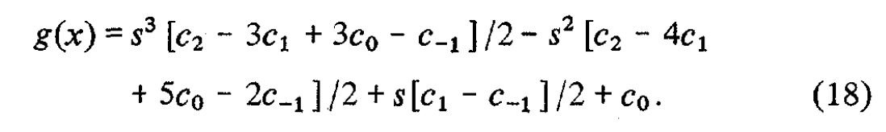
</div>

由于 $f(x)$ 的泰勒展开中不包含 3 次项，因此若想让 $g(x)$ 是 $f(x)$ 在 $o(h^3)$ 上的估计值，需要让 $c_{-1}=c_2-3c_1+3c_0$，等价于 $$c_{-1}=f(x_2)-3f(x_1)+3f(x_0)\tag{19}$$，将式 (19) 代入 (18) 得到:
<div align=center>
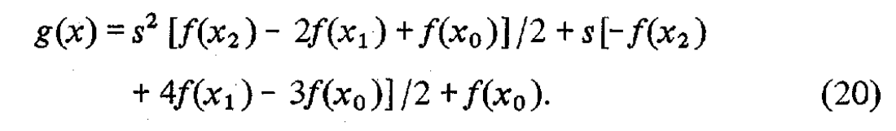
</div>

接着，我们对 $f(x_1)、f(x_2)$ 进行泰勒展开得到：
<div align=center>
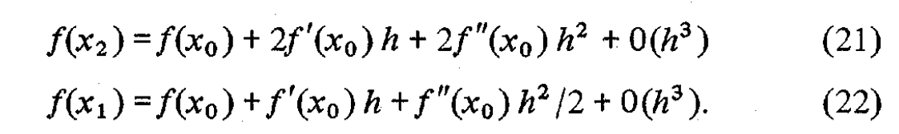
</div>

用上述公式替换 (20) 中的 $f(x_1)$ 和 $f(x_2)$，得到：
<div align=center>
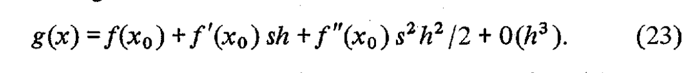
</div>

因为 $sh=x-x_0$，因此 $f(x)$ 的泰勒展开为：
<div align=center>
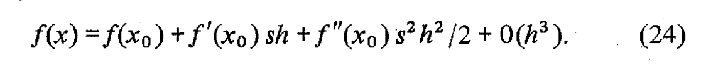
</div>

用 (24) - (23) 可得 $f(x)-g(x)=o(h^3)$，因此 (19) 式给出了 $f(x)$ 在 $x_0 < x < x_1$，三阶估计下的边界条件。类似的，我们可以推导出 $x∈[x_{N-1}, x_N]$ 下的边界条件：
<div align=center>
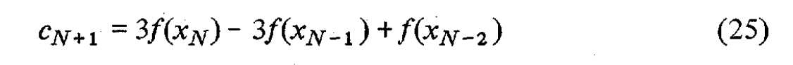
</div>

综合公式 (15)，(19) 和 (25)，可以得出对于 cubic convolution interpolation 的完整描述：
&emsp;&emsp;当 $x_k < x < x_{k+1}$ 时，三次卷积内插函数定义如下：
<div align=center>
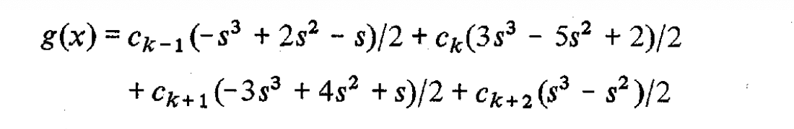
</div>

公式中：
$$
\begin{aligned}
s&=\frac{x-x_k}{h}\\
c_k&=f(x_k) &\text{k=0,1,2,...,N}\\
c_{-1}&=3f(x_0)-3f(x_1)+f(x_2)\\
c_{N+1}&=3f(x_N)-3f(x_{N-1})+f(x_{N-2})
\end{aligned}
$$
&emsp;&emsp;三次卷积内插函数使用的一个假设是采样方程在三次导数上连续，这使得有限区间函数无限可微，符合三次卷积内插函数的需要，但这个并不是所有插值函数的条件。通常，三次卷积内插函数不具有二阶导数连续性。采样函数具备三次导数连续性，根据之前的公式推导，那么插值函数具备三阶近似，这对其他插值函数并不适用。线性插值就是一个例子（这里不展开说明了，论文原文中有提到）
##### 3. 与其他方法的比较
&emsp;&emsp;详细的对比请参阅原文，这里只列出结论。
1. 准确度
&emsp;&emsp;不同插值函数的准确度可以通过收敛速率来衡量，由之前的结论可以得出，三次卷积插值函数的收敛速率为 $o(h^3)$。线性插值函数和最邻近插值方法的收敛速率分别为 $o(h^2)$ 和 $o(h)$，由此对比可以看出，三次卷积插值函数对采样函数的估计最为准确。
2. 光谱属性
&emsp;&emsp;对公式 (1) 进行离散傅里叶变换可得下式：
<div align=center>
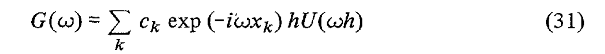
</div>
公式中表明了插值函数的 “光滑”。而下图是最邻近插值，线性插值以及三次卷积插值函数核的振幅图谱：
<div align=center>
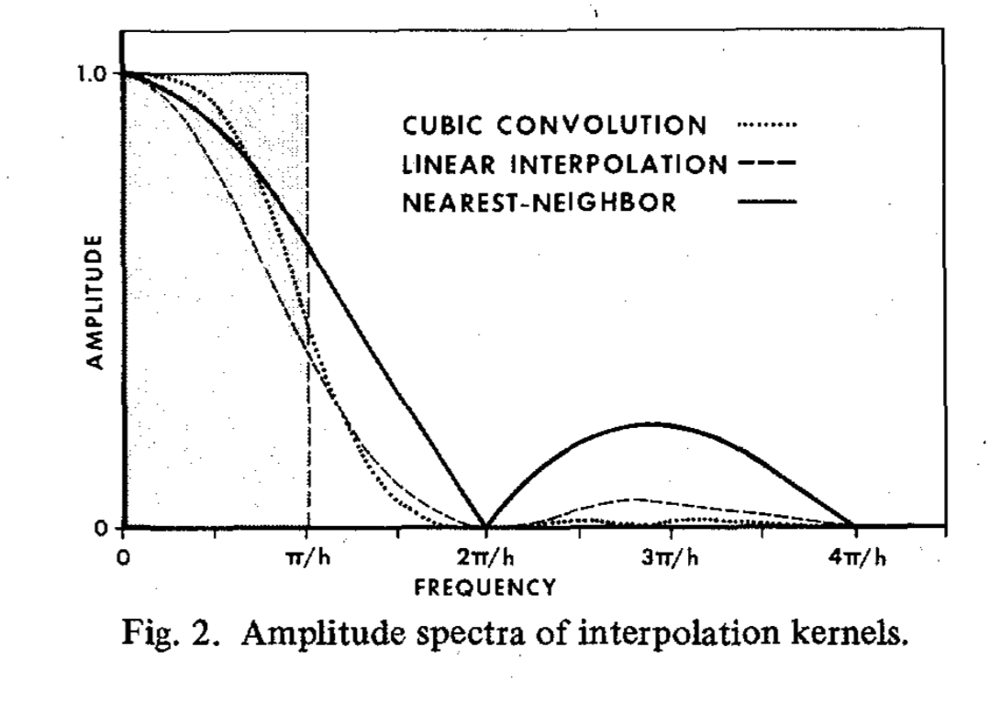
</div>
由此可以看出三次卷积函数比其他函数能够好的保留高频信息<font color=red>（矩形区域内会造成高频信号的丢失）</font>。对于区间没有限制的函数，无法将其重构为离散采样点。

&emsp;&emsp;作者在论文中给出了二维情况下的三次卷积插值函数，当 $(x,y)$ 在矩阵子区间 $[x_j, x_{j+1}]\times[y_k, y_{k+1}]$ 中时，有二维三次卷积插值函数：
<div align=center>
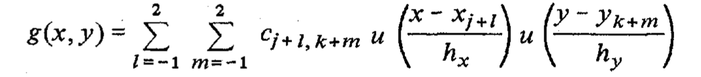
</div>

这里的 $u$ 取公式 (15)，$h_x, h_y$ 分别是 $x,y$ 轴坐标上的增量。$c_{jk}$ 被定义为 $c_{jk} = f(x_j,y_k)$。若 $x_N$ 为 $x$ 上界，$y_M$ 为 $y$ 上界，根据公式 (25) 可得：
<div align=center>
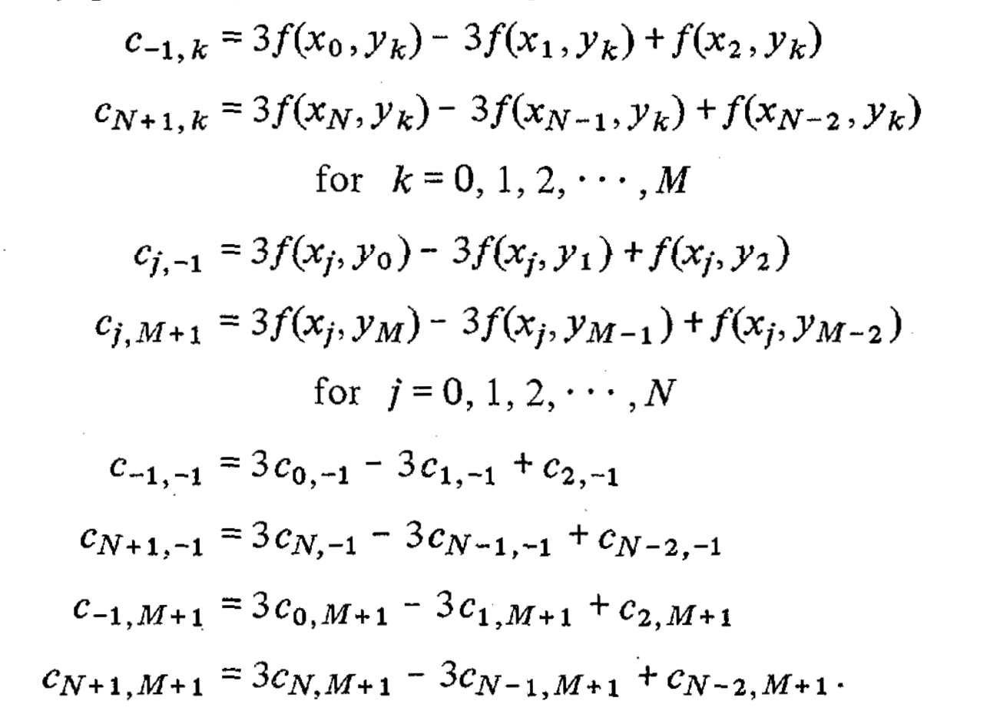
</div>

作者从经过傅里叶变换处理 $f(x,y)=sin(0.5(x^2+y^2)^2)$ 后得到的 $F(ω_x,ω_y)=cos(0.5(ω_x^2+ω_y^2)^2)$ 中取了 64 $\times$ 64 的采样点，用幅值生成图像，黑色为最小幅值，白色为最大幅值。分别用线性插值函数和三次卷积插值函数估计 350 ${\times}$ 366 的情形。从 $F(ω_x,ω_y)=cos(0.5(ω_x^2+ω_y^2)^2)$ 中生成的 350 $\times$ 366 图像，使用线性插值函数和三次卷积差值函数估计的图像分别如下：
<div align=center>
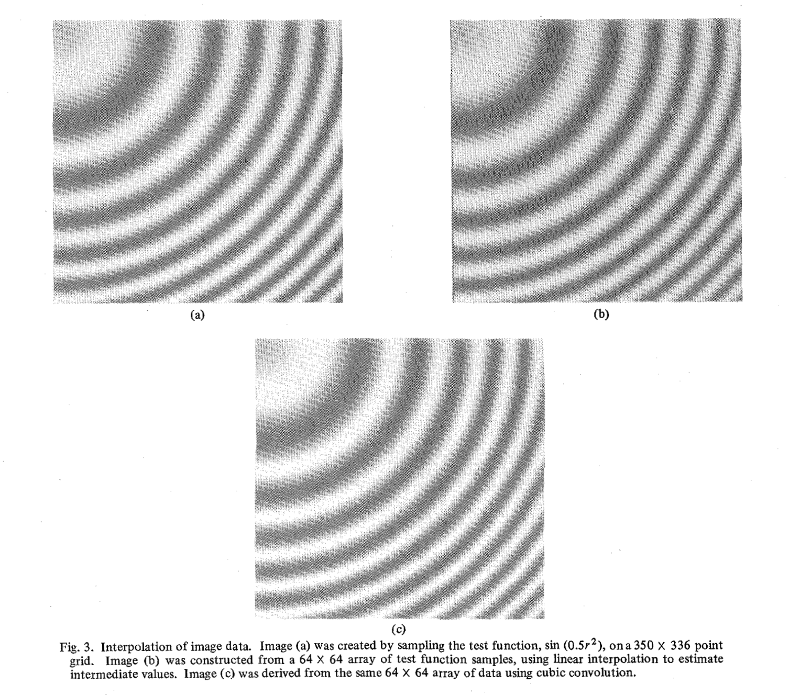
</div>
为了比较两种方法估计的准确度，作者用估计出来的图像和原图做差取绝对值，形成了下图：
<div align=center>
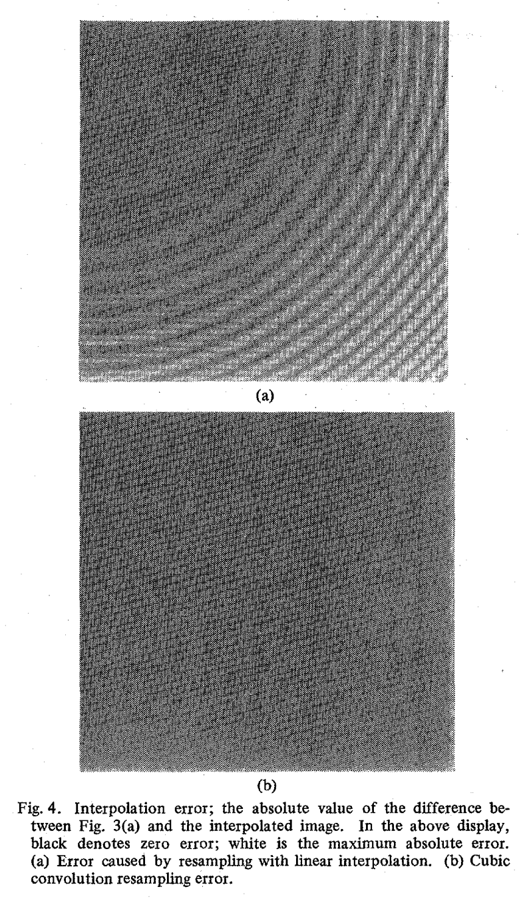
</div>

3. 效率
&emsp;&emsp;三次卷积插值处理花费的时间大于线性插值，小于三次样条（三次样条的系数需要处理 tridiagonal matrix 问题）。三次卷积差值处理与线性插值对单个图像（上述图像）处理花费时间的差值大约在 0.28 与 0.29 分钟之间。

&emsp;&emsp;作者在论文中还对具有 $o(h^3)$ 收敛速率的立方插值函数进行了推导，这里不赘述了，只列出公式：
<div align=center>
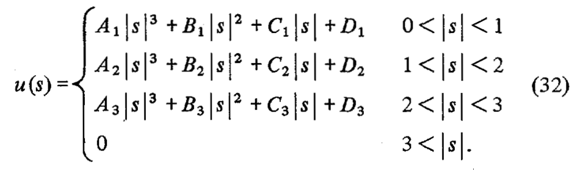
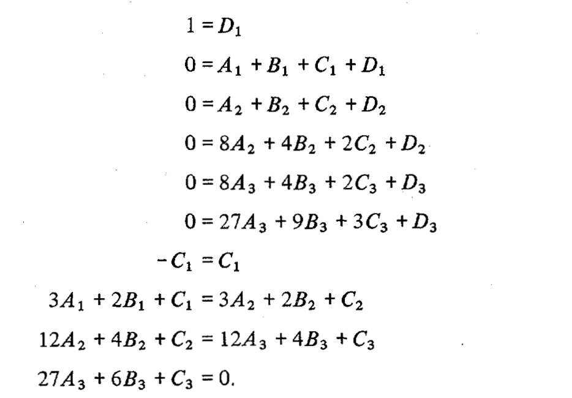
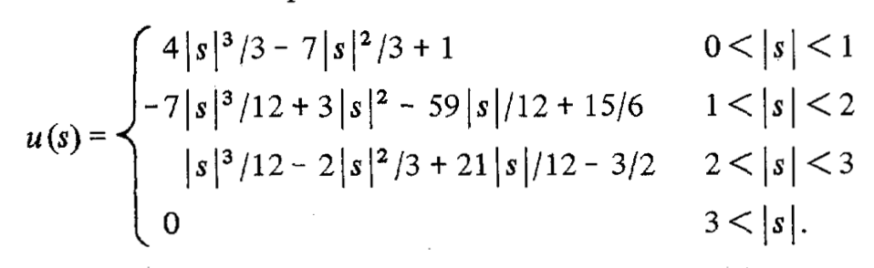
</div>
### 代码实现
&emsp;&emsp;代码实现参考了[这里](https://github.com/rootpine/Bicubic-interpolation/blob/master/bicubic.py)，代码如下：
```python
def calc_u(s, a):
    s = abs(s)
    if(0 <= s and s <= 1):
        return (a+2) * s**3 - (a+3) * s**2 + 1
    if(1 < s and s <= 2):
        return a*s**3 - 5 * a * s**2 + 8 * a * s - 4 * a

    return 0


# 与论文不符，论文中的 padding 需要根据原图采样点计算而成
def padding(image, pad):
    total_pad = pad * 2
    o_w, o_h, o_c = image.shape
    result = np.zeros((o_w + total_pad, o_h + total_pad, o_c))

    # center
    result[pad:o_h+pad, pad:o_w+pad, :] = image

    # around
    result[0:pad, pad:o_w+pad, :]                 = image[:1, :, :]             # up
    result[o_h+pad:o_h+total_pad, pad:o_w+pad, :] = image[o_h - 1:o_h, :, :]    # down
    result[pad:o_h+pad, 0:pad, :]                 = image[:, :1, :]             # left
    result[pad:o_h+pad, o_w+pad:o_w+total_pad, :] = image[:, o_w-1:o_w, :]      # right

    # four corners
    result[0:pad, 0:pad, :]                                 = image[:1, :1, :]                  # top-left
    result[0:pad, o_w+pad:o_w+total_pad, :]                 = image[:1, o_w-1:o_w, :]           # top-right
    result[o_h+pad:o_h+total_pad, 0:pad, :]                 = image[o_h-1:o_h, :1, :]           # down-left

    result[o_h+pad:o_h+total_pad, o_w+pad:o_w+total_pad, :] = image[o_h-1:o_h, o_w-1:o_w, :]    # down-right

    return result


def cubic_convolution_interpolation(origin_image, scale_width, scale_height, a):
    if (type(origin_image) != np.ndarray):
        origin_image = np.array(origin_image)

    H,W,C = origin_image.shape
    pad = 2
    origin_image = padding(origin_image, pad)
    new_H, new_W, C = origin_image.shape
    result_image = np.zeros((scale_height, scale_width, C), dtype=np.uint8)
    w_scale = H / scale_width
    h_scale = H / scale_height

    for c in range(C):
        for j in range(scale_height):
            for i in range(scale_width):

                x = i * w_scale + pad
                y = j * h_scale + pad

                x1 = 1 + x - math.floor(x)  # x 最左侧的采样点距离 x 的距离
                x2 = x - math.floor(x)
                x3 = math.floor(x) + 1 - x
                x4 = math.floor(x) + 2 - x  # x 最右侧的采样点距离 x 的距离               

                y1 = 1 + y - math.floor(y)  # y 最上侧的采样点距离 x 的距离
                y2 = y - math.floor(y)
                y3 = math.floor(y) + 1 - y
                y4 = math.floor(y) + 2 - y  # y 最下侧的采样点距离 x 的距离

                # 参照二维三次卷积插值定义
                u_x = np.matrix([calc_u(x1, a), calc_u(x2, a), calc_u(x3, a), calc_u(x4, a)])
                c_xy = np.matrix([
                    [origin_image[int(y - y1), int(x - x1), c], origin_image[int(y - y2), int(x - x1), c], origin_image[int(y + y3), int(x - x1), c], origin_image[int(y + y4), int(x - x1), c]],
                    [origin_image[int(y - y1), int(x - x2), c], origin_image[int(y - y2), int(x - x2), c], origin_image[int(y + y3), int(x - x2), c], origin_image[int(y + y4), int(x - x2), c]],
                    [origin_image[int(y - y1), int(x + x3), c], origin_image[int(y - y2), int(x + x3), c], origin_image[int(y + y3), int(x + x3), c], origin_image[int(y + y4), int(x + x3), c]],
                    [origin_image[int(y - y1), int(x + x4), c], origin_image[int(y - y2), int(x + x4), c], origin_image[int(y + y3), int(x + x4), c], origin_image[int(y + y4), int(x + x4), c]]
                ])
                u_y = np.matrix([[calc_u(y1, a)], [calc_u(y2, a)], [calc_u(y3, a)], [calc_u(y4, a)]])
                result_image[j, i, c] = abs(np.dot(np.dot(u_x, c_xy), u_y)) # 会出现负值，只能取绝对值                
    return result_image

```
上述方法处理后的图像与 bilinear 处理后的结果对比如下：

需要注意的是，上述代码中，padding 函数的逻辑与论文不符，论文中使用了下述公式计算 padding：
<div align=center>

</div>
而上述代码仅将 padding 拓展为与边缘像素值一致。按照论文中的公式修改后的 padding 函数如下：

```python
def new_padding(image, pad):
    total_pad = pad * 2
    o_w, o_h, o_c = image.shape
    result = np.zeros((o_w + total_pad, o_h + total_pad, o_c))

    # center
    result[pad:o_h+pad, pad:o_w+pad, :] = image

    # around
    # up
    result[1, pad:o_w+pad, :] = 3 * image[0, :, :] - 3 * image[1, :, :] + image[2, :, :]
    result[0, pad:o_w+pad, :] = 3 * result[1, pad:o_w+pad, :] - 3 * result[2, pad:o_w+pad, :] + result[3, pad:o_w+pad, :]

    # down
    result[o_h+pad, pad:o_w+pad, :] = 3 * image[o_h-1, :, :] - 3 * image[o_h-2, :, :] + image[o_h-3, :, :]    # down
    result[o_h+pad+1, pad:o_w+pad, :] = 3 * result[o_h+pad, pad:o_w+pad, :] - 3 * result[o_h+pad-1, pad:o_w+pad, :] + result[o_h+pad-2, pad:o_w+pad,:]  # down

    # left
    result[:, 1, :] = 3 * result[:, 2, :] - 3 * result[:, 3, :] + result[:, 4, :]
    result[:, 0, :] = 3 * result[:, 1, :] - 3 * result[:, 2, :] + result[:, 3, :]

    # right
    result[:, o_w+pad, :] = 3 * result[:, o_w+pad-1, :] - 3 * result[:, o_w+pad-2, :] + result[:, o_w+pad-3, :]
    result[:, o_w+pad+1, :] = 3 * result[:, o_w+pad, :] - 3 * result[:, o_w+pad-1, :] + result[:, o_w+pad-2,:]

    return result
```

对比结果如下<font color=blue>【我自己盯了好久也没盯出来区别】</font>


上面这个实现结果效率非常低，将 144\*144 的图像放大到 720\*720 花费了 91s，应该有更好的实现效率，想到的话，再补充吧。