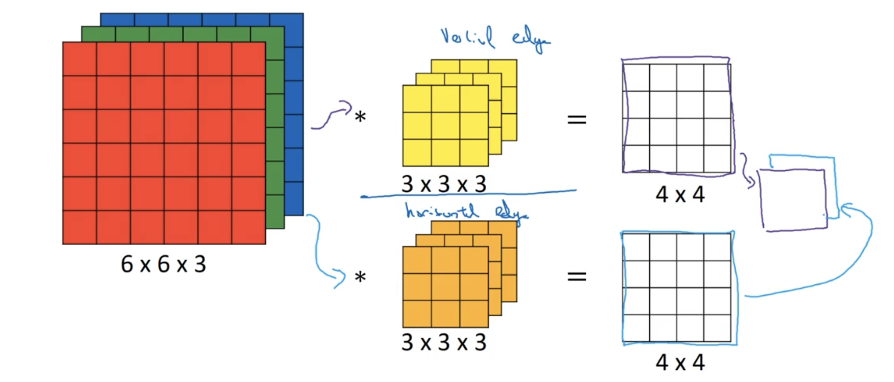
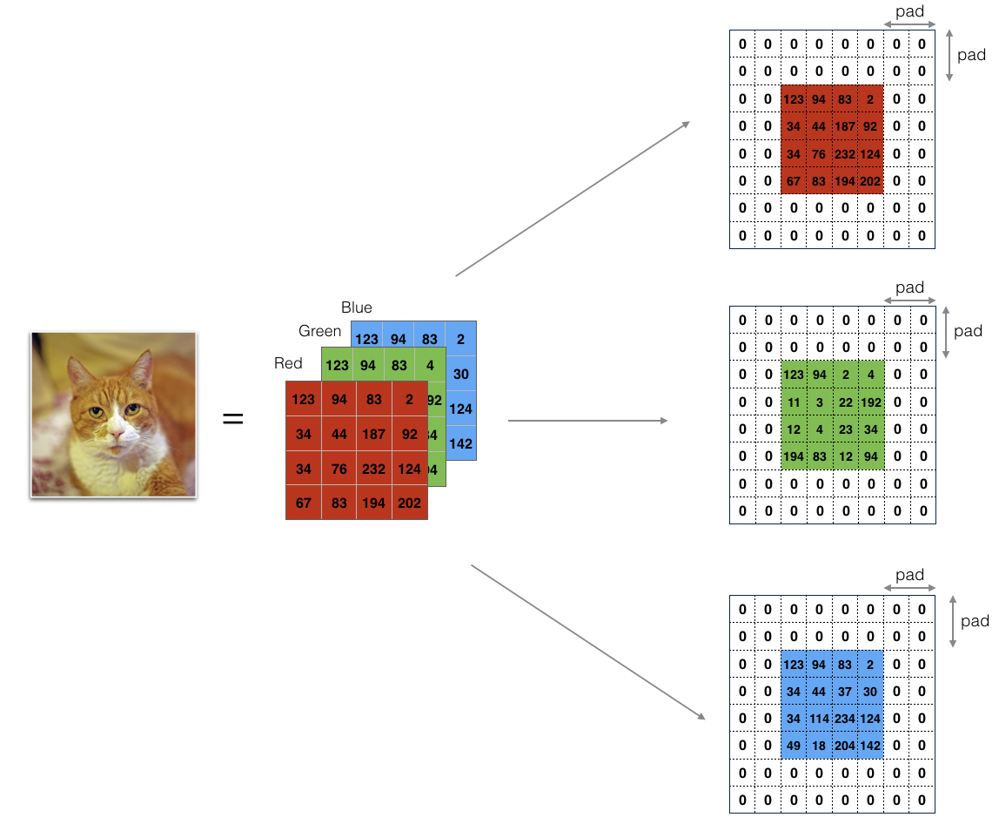
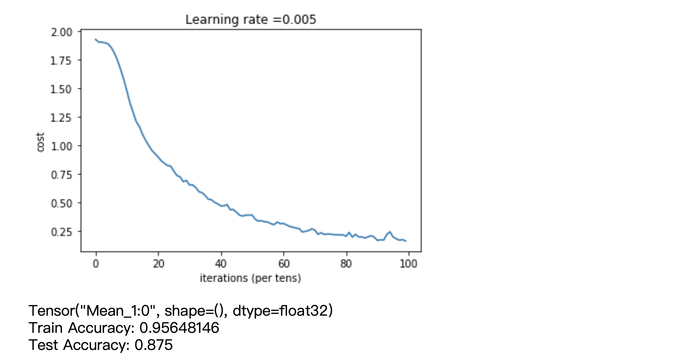

[toc]
### 四、卷积神经网络
#### Week1 卷积神经网络
##### 1.1 计算机视觉
&emsp;&emsp;卷积神经网络一般在计算机视觉领域中被广泛应用，但原因是什么呢？我们在第一章和第二章已经学习了对于一张图片进行二元和多元识别，但是输入图象特征均为 64\*64\*3，即使图象本身大于这个尺寸，我们也会裁剪到这个尺寸然后进行识别，一定程度上并不准确。如果我们假设我们输入的图像有 1000\*1000\*3 个特征值，并且假设神经网络的第一层有 1000 个节点，这样就会导致第一层的参数 w 维度为（1000， 1000\*1000\*3），用我们之前的神经网络去计算如此庞大的数据量，时间成本会非常高，因此我们需要使用卷积神经网络，下一节会介绍这个方法。
##### 1.2 卷积神经网络
&emsp;&emsp;我们通过一个边缘检测的例子来了解卷积计算以及边缘检测的卷积核（或者被叫做过滤器）。所谓边缘检测，对于神经网络来说，就是通过一些细小的边缘，组合成一些物体的部分，最后合成出物体的整体，如下图所示：

一般来说，边缘检测是从垂直或者水平边缘检测开始做起的，例如对左图的垂直边缘检测以及水平边缘检测如右图所示：

我们用垂直边缘检测举例，来说明卷积计算的步骤。
假如我们有一个 6\*6 的图片，为了简单起见，它并不是 3 维的，没有 RGB 通道，如下图所示：

接着，构造一个 3\*3 的矩阵，用来检测图像中的垂直边缘。如下图所示：

这个 3\*3 的矩阵在卷积计算中被称作过滤器（Filter），在有些论文中，它也被称作卷积核（convolution kernel）。这个过滤器与图片进行卷积运算的符号在数学上写作 $*$，但由于 python 和其他编程语言已经占用这个符号作为普通元素的乘法了，因此一般用函数来表示，这个在后面会讲。他们的运算结果矩阵如下图所示：
<center>

</center>
&emsp;&emsp;进行垂直边缘检测的计算过程如下：

1. 我们将这个过滤器放在 6\*6 图片左上角的位置，过滤器中心对准第二行第二列的 5，然后用过滤器的每个元素对应图片的每个元素相乘相加，计算结果放在结果矩阵的第一行第一列位置。过程如下：

$$ 3\times 1 + 1\times1 + 2\times1 + 0\times0 + 5\times0 + 7\times0 + 1\times(-1) + 8\times(-1) + 2\times(-1) = -5$$
2. 按照同样的方式从左到右，从上到下依次对图片的每个位置进行上述操作，这里展示一部分操作：


以此类推直至填完最后 $4\times4$ 的结果矩阵，结果如下图：


&emsp;&emsp;那么这个过滤器为什么能起到边缘检测的效果呢？我们看下面这个卷积计算：

上面两个矩阵可以看成如下图片：

它们卷积后的结果为：

可以看出，其结果如果转换成图形，中间的 $2\times2$ 矩阵即边缘。对于这幅图来说，这个边缘太粗了，但是对于 $1000\times1000$ 的图像来说，这个边缘就没有那么粗了。
&emsp;&emsp;了解了卷积运算的步骤之后，接下来我们来看看如何将卷积运算作为卷积神经网络的基本模块。
##### 1.3 更多的边缘检测内容
&emsp;&emsp;当我们左右反转之前的图片，在进行垂直边缘的卷积计算，就会得到下图：

通过观察总结可以发现，边缘为正，边缘过渡为从明到暗；边缘为负，意为从暗到明。如果你不在意这个的话，其实取绝对值就可以了。
&emsp;&emsp;除了垂直边缘检测的过滤器，还有水平边缘检测的过滤器，对于上述的过滤器，我们将其旋转 90$\degree$ 即可，如下图所示：

一个卷积计算的例子如下图所示：

中间的这些 10 和 -10 过度值在这个例子中可能会比较明显，但是如果图像尺寸比较大，那么这个过渡值会相对非常小。
&emsp;&emsp;除了上述使用的过滤取之外，还有很多其他的过滤器，如下图所示：

中间的叫 Sobel 过滤器（也叫算子），右边的叫 Scharr 过滤器。但是对于复杂图像的边缘，上述过滤器不容易得到很好的效果，因此我们借助神经网络的思想，将过滤器变为参数，调整过滤器参数以至于得到比较好的边缘检测效果，图例如下：

这样一来，不仅能够识别出垂直或水平方向的边缘，也有可能识别出 45$\degree$ 或其他角度的边缘，效果会很好。
&emsp;&emsp;尽管理解了卷积神经网络的大致思路，但在正式使用之前还需要有些细节要将，我们在下节内容中会提到。
##### 1.4 padding 填充
&emsp;&emsp;根据观察会发现，上述卷积操作会使得图像被缩小，这实际上是很不好的，因为如果神经网络有 100 层，那么最后输出的图像会非常的小。不仅如此，由于边缘的像素点只被使用了一次，便中间的像素点被使用了很多次，这会导致边缘像素点信息缺失。因此我们需要一些策略来解决这个问题。不过在讨论策略之前，我们先看看输入图像维度、过滤器维度以及卷积计算后输出图像维度之间的关系。
&emsp;&emsp;若输入图像维度为（i1，i2），过滤器维度为（f1，f2），输出图像维度为（o1，o2），则存在以下关系：
$$
\begin{aligned}
o1 &= i1 - f1 + 1\\
o2 &= i2 - f2 + 1
\end{aligned}
$$
其实可以这样推导公式，例如输入图像维度为（6，6），过滤器为（3，3），那么输入图像列数 6 减去过滤器列数 3 得到 3，含义是过滤器还能移动出 3 中不同的位置，加上目前这一个一共是 4 种，这就对应了上述的公式。那么如果要保证卷积计算之后的维度不变，需要对原来的图像进行扩增。将 o1 = o2 = 6, f1 = f2 = 3 带入上述公式可以求出我们需要将原先的图像扩容至（8，8）。扩容的方式就是在外圈加一层 padding。当 p = 1，时，扩容方式如下：
<center>

</center>
周围蓝色的一圈即为 Padding。由于当 p = 1 时，原先的各个维度会增加 2，因此上述公式变为

$$
\begin{aligned}
o1 &= i1 + 2\times p - f1 + 1\\
o2 &= i2 + 2\times p - f2 + 1
\end{aligned}
$$
那么其实从上式也可以推出来，当 （o1，o2）与（i1，i2）相等时，$p = (f-1)/2$，一般我们用的过滤器都是正方形，所以这里就将行列数简写成 f 了。从公式中也可以看出 f 最好是奇数，起码在计算机视觉领域，奇数过滤器会给你一个中心，告诉你过滤取的位置，不排除偶数会表现得更好，但是一般会用奇数，维度包括 7\*7，5\*5，3\*3 和 1\*1
&emsp;&emsp;上述填充维度的方法被称为 “Same”，另一种 p = 0 的方法被称为是 “Valid”。下一节内容我们来讨论如何设置步长。
##### 1.5 卷积计算中的步长问题以及数学和信号处理领域的卷积计算
&emsp;&emsp;之前讨论的所有卷积计算的基础都建立在步长等于 1 的情况下，我们来看一个步长为 2 的例子，如下图所示：

我们假使输入图像矩阵的维度为（i, i），过滤器的维度为（f，f），输出图像维度为（o，o），padding 在这里为 p = 0，stride 为 s = 2，仔细观察就比较容易推导出与下述公式相近的公式：
$$o = \lfloor\frac{i-f+2\times p}{s} + 1\rfloor$$
&emsp;&emsp;关于卷积的运算，在深度学习领域和数学/信号处理领域是不一样的，在数学领域的卷积计算，简单来说，区别在于做深度学习的卷积运算之前，需要先对过滤器根据中心位置旋转 180$\degree$，这里教程中的示例是不正确的，<font color=red>注意，下图翻转是不正确的</font>

之所以说是不正确的，是因为我参考了 [哪位高手能解释一下卷积神经网络的卷积核？—— 知乎](https://www.zhihu.com/question/52237725) 下 superbrother（截止 2020 年 2 月 18 日） 的答案。之所以深度学习中取消了翻转操作，是因为实际上该操作对于深度学习来说是多余的，去掉对训练神经网络没有什么影响。数学上，深度学习的卷积操作被称作互相关，具体信息可以在上面这个知乎答案中找到，这里就不赘述了。下一节我们来看对 3 维数据的卷积操作。
##### 1.6 三维数据的卷积计算
&emsp;&emsp;之前我们学习了如何对二维数据做卷积计算，现在我们来看看三维的情况。
&emsp;&emsp;一个三维计算的图例如下所示：

这里我们将三维的输入数据看成是一张有着 RGB 通道的图片，其维度为（6（height），6（width），3（channel）），过滤器的维度为（3，3，3）。注意，如果要进行三维的卷积计算，请保证输入数据的通道数和过滤器的通道数相同。我们最终会得到一个维度为（4，4，1）的图像。计算过程如下图所示：

我们将输入数据的每个通道与过滤器的每个通道对应相乘相加，得到维度为（4，4，1）矩阵左上角的第一个数据。其他数据的运算规则与之前类似，只是需要把过滤器和输入图像的对应通道进行计算。其应用例如：我只想检测红色通道的边缘，那么过滤器的三层可以按照如下矩阵设置：
$R = \left[\begin{matrix}1 & 0 & -1\\1 & 0 & -1\\1 & 0 & -1\end{matrix}\right]$，$G = \left[\begin{matrix}0 & 0 & 0\\0 & 0 & 0\\0 & 0 & 0\\\end{matrix}\right]$，$B = \left[\begin{matrix}0 & 0 & 0\\0 & 0 & 0\\0 & 0 & 0\\\end{matrix}\right]$。
如果你想对图片的所有通道的垂直边缘进行检测，那么过滤器的三层矩阵如下图所示：
$R = \left[\begin{matrix}1 & 0 & -1\\1 & 0 & -1\\1 & 0 & -1\end{matrix}\right]$，$G = \left[\begin{matrix}1 & 0 & -1\\1 & 0 & -1\\1 & 0 & -1\end{matrix}\right]$，$B = \left[\begin{matrix}1 & 0 & -1\\1 & 0 & -1\\1 & 0 & -1\end{matrix}\right]$。
&emsp;&emsp;但是如果我既想检测垂直边缘，又想检测水平边缘，还想检测其他角度的边缘应该怎么办。那么在卷积网络中，可以对一个 3 通道图片进行多个过滤器的卷积计算，计算流程图如下：

上述例子计算流程如下：
1. 两个过滤器（垂直边缘，水平边缘）分别对输入图像进行卷积计算，得到两个卷积计算结果
2. 将两个结果按照 RGB 通道的方式叠加在一起，
3. 最终得到的图像就拥有垂直边缘和水平边缘两种特征。

&emsp;&emsp;总结一下，对于三维数据的卷积计算，若输入图像维度为（i，i，nc），过滤器维度为（f，f，nc），s=1，p=0 时，输出图像的维度为（i-f+1，i-f+1，$nc^{[1]}$）这里 $nc^{[1]}$ 表示输出图像的通道数量，与之前的过滤器数量有关系。这实际上就是卷积神经网络中的一层了，接下来我们来看看如何构建神经网络。
##### 1.7 一层卷积神经网络细节
&emsp;&emsp;上一节内容大致讨论了一层卷积神经网络的样子，本节我们继续深入。我们继续观察上节的图例：

得神将网络中一个隐藏单元的计算过程为：$z = wx + b,\ a = g(z)$。实际上，卷积神经网络的计算过程是类似的，如下图所示：

公式如下：
$$
\begin{aligned}
z &= convolution(w, x) + b\\
a &= ReLU(z)
\end{aligned}
$$
除了 wb 为卷积运算之外其他是一致的。接着我们直接来探讨卷积神经网络 $l$ 层的各个数据的维度问题。
&emsp;&emsp;与神经网络一样，我们将输入的维度定为 $(n_H^{[l-1]}, n_W^{[l-1]}, n_c^{[l-1]})$，由于输入图像的宽和高不一定相同，因此我们用 H 和 W 下标表示输入图像的高和宽，用 c 表示通道数量。由于是输入层，因此上标为 [l-1]。由于步长 和 padding 都为实数，所以这里直接使用 $s^{[l]}$ 和 $p^{[l]}$ 来表示。
&emsp;&emsp;接下来是参数 W 和 b。由于过滤器通道数量需要与输入图像的通道数量一致，因此参数 W 的维度为 $(f^{[l]}, f^{[l]}, n_c^{[l-1]})$，对于 b，由于它是个实数，因此其维度为 $(1,1,1,n_c^{[l]})$，$n_c^{[l]}$ 表示当前层的过滤器个数。
&emsp;&emsp;接下来就是激活函数了，由于激活函数计算和线性函数，它们的计算结果维度一样，因此这里只讲激活函数。我们在之前也讨论过卷积计算输出图像维度的计算公式：
$$o = \lfloor\frac{i-f+2\times p}{s} + 1\rfloor$$
这里将参数改成卷积神经网络的统一标记：
$$
\begin{aligned}
n_H^{[l]} &= \lfloor\frac{n_H^{[l-1]}-f^{[l]}+2\times p^{[l]}}{s^{[l]}} + 1\rfloor\\
n_W^{[l]} &= \lfloor\frac{n_W^{[l-1]}-f^{[l]}+2\times p^{[l]}}{s^{[l]}} + 1\rfloor
\end{aligned}
$$
则激活函数计算结果维度为：a^{[l]} = $(n_H^{[l]},n_W^{[l]},n_c^{[l]})$。我们知道其实训练集有时候包含多个样本，如果样本数为 m，则 $A^{[l]} = (m,n_H^{[l]},n_W^{[l]},n_c^{[l]})$。我将这些维度总结在下面：
$$
\begin{aligned}
filter\ dimension &= f^{[l]}\\
padding &= p^{[l]}\\
stride &= s^{[l]}\\
number\ of\ filter &= n_c^{[l]}\\
input &= n_H^{[l-1]} \times n_W^{[l-1]} \times n_c^{[l-1]}\\
W^{[l]} &= f^{[l]} \times f^{[l]} \times n_c^{[l-1]} \times n_c^{[l]}\\
b^{[l]} &= (1,1,1,n_c^{[l]})\\
n_H^{[l]} &= \lfloor\frac{n_H^{[l-1]}-f^{[l]}+2\times p^{[l]}}{s^{[l]}} + 1\rfloor\\
n_W^{[l]} &= \lfloor\frac{n_W^{[l-1]}-f^{[l]}+2\times p^{[l]}}{s^{[l]}} + 1\rfloor\\
a^{[l]}\ or \ output &= n_H^{[l]} \times n_W^{[l]} \times n_c^{[l]}\\
A^{[l]} &= m \times n_H^{[l]} \times n_W^{[l]} \times n_c^{[l]}
\end{aligned}
$$
上述用 $\times$ 描述的方式来自于教程，可以都换成 (,) 的形式。另外，$A^{[l]} = m \times n_H^{[l]} \times n_W^{[l]} \times n_c^{[l]}$ 也可以写成 $A^{[l]} = m \times n_c^{[l]} \times n_H^{[l]} \times n_W^{[l]}$，只要在实现神经网络的时候计算顺序一致，这样写也是可以的，教程中会使用第一种书写方式，在编程练习中，顺序体现为：
```python
    ### START CODE HERE ###
    # Retrieve dimensions from A_prev's shape (≈1 line)  
    (m, n_H_prev, n_W_prev, n_C_prev) = A_prev.shape
    
    # Retrieve dimensions from W's shape (≈1 line)
    (f, f, n_C_prev, n_C) = W.shape
```
接下来，我们来看看如何构建深度神经网络。
##### 1.8 简单的卷积神经网络
&emsp;&emsp;为了方便理解，我们将上节内容的标记，应用于一个简单的卷积神经网络，它可能是用于喵脸识别或者多元分类的识别，在这里我直接将教程中的卷积神经网络放在下面了：

我对上图做一个说明吧。
&emsp;&emsp;首先，输入一个 $39\times39\times3$ 的图像，由于是输入层，它的 H、W 以及 $h_c$ 如图所示，经过 p = 0 和 s = 1 以及 $3\times3\times3$ 的 10 个过滤器的卷积计算之后，得到了 $37\times37\times10$ 的结果。沿着上图的给定的条件一层一层地计算，最终得到了一个 $7\times7\times40$ 的图像。说是图像，其实它就是 $7\times7\times40 = 1960$ 个特征，最终，如果是喵脸识别，我们就把它丢进 sigmoid 函数，如果是多元分类，我们就把它丢进 softmax 函数。需要注意的是，上述卷积神经网络中有许多需要调整的超参数，例如：p，s，f，过滤器等等，这些如果使用手工来调整，会非常繁琐。关于参数调整这里，会在之后提到。
&emsp;&emsp;上述步骤实际上是卷积神经网络三部分中的一部分 —— 卷积层（Convolution），一般写作 Conv，除此之外还有池化层（Pooling，Pool）和全连接层（Fully connected，FC），下节内容会讲到池化层。
##### 1.9 池化层
&emsp;&emsp;最常用的池化层是最大池化层，运算规则如下：

假如左侧是一个包含各种特征的矩阵，若池化所用的过滤器如右图所示，并且此时 stride = 2 时，将左侧矩阵划分成上图的样子，对每个区域取最大值，所得到的结果就是最大池化的结果。最大池化的作用其实是找出区域内的特征。例如，若左图是垂直边缘特征构成的矩阵，那么取值小的，表示特征不明显或者没有特征，相反则是特征明显，最大池化就是保留该区域的垂直边缘特征。那么最大池化的实际作用就是，保留在某个区域提取到的某个特征的最大值。
&emsp;&emsp;最大池化还有两个超参数，分别是 f 和 s，与之前提到的过滤器中的参数含义一样，这里就不多解释了。需要注意的是，尽管是超参数，但是在梯度下降的时候他们是不被训练的，一直都为定值。另外，当输入图像的维度为 $(n\times n)$，过滤器维度为 $(f\times f)$ 最大池化输出的结果，其维度 $(o, o)$ 计算公式如下：
$$o = \lfloor\frac{n + 2\times p - f}{s}+1\rfloor$$
对于三维的最大池化，方法是对第三维的每层进行最大池化计算结果如下图所示：

图示为 2 层，当数据为 $n_c$ 层时，只需要将图中 2 的位置替换成 $n_c$ 即可，这里不再赘述。
&emsp;&emsp;除了最大池化之外，还有一种方法叫平均池化，顾名思义，计算方式如下图：

对每个区域做平均值。一般来说，最大池化要比平均池化更常用，但是也有例外情况，当神经网络非常深的时候，可以用它来分解规模，这个会在之后讲到。
&emsp;&emsp;最后提一下池化方法它的一些要点：
1. 对于池化过滤器的维度，一般在 f=2 s=2，效果相当于高和宽缩减一半，也有 f=3 s=2 的情况。
2. 对于 padding，一般很少去动它，且被设置为 0。
3. 最大池化输入为 $n_H\times n_W \times n_c$ 输出为 $(\lfloor\frac{n_H + 2\times p - f}{s}+1\rfloor)\times(\lfloor\frac{n_W + 2\times p - f}{s}+1\rfloor)\times n_c$
4. 没有任何需要学习的参数。

下一节我们来讲讲全连接的神经网络。  
##### 1.10 卷积神经网络案例
&emsp;&emsp;我们一个手写数字识别来举例卷积神经网络，我们有输入一张 $32\times32\times3$ 的图片，然后构建一个卷积神经网络模型（该模型受到 LeNet-5 模型灵感的影响，许多参数与此模型相同），整体结构如下图所示：

图中 Layer 1 包含的卷积层有 6 个过滤器，过滤器的尺寸以及步长也标明了，这里需要额外说的是之所以吧卷积层和池化层划分到 Layer 1 中，而不是分成卷积层一层，池化层一层，划分标准是 “是否有权重参数 w”。因为池化层并没有权重参数，因此按照该标准不被单独划分为一层，之后的 Layer 也是这个标准。但是也有论文中将池化层单独划分为一层，这也没什么关系。
&emsp;&emsp;Layer 2 层之后，我们将输出结果展开成（400，1）维的向量，接着就是将其输入全连接层 FC3。这里全连接层的样子可以类比单隐藏层的神经网络的输入层和第一层之间的关系，其参数 W 和 b 的维度如图所示。这里教程中没有提到全连接层的作用，我在参考了这个[CNN 入门讲解：什么是全连接层（Fully Connected Layer）? —— 知乎](https://zhuanlan.zhihu.com/p/33841176)之后，个人理解为，（400，1）的向量包含的数据是所有的低级特征，第一次全连接层将低级特征处理成较为高级的特征，之后的每一次都处理成较为高级的特征，直到最后输入 softmax，用以确定输出的是什么数字。
&emsp;&emsp;如果仔细观察就会发现，一般卷积神经网络的 $n_H$、$n_W$ 都随着深度下降，但是 $n_c$ 随着深度上增大。下表展示了卷积神经网络各层的激活函数维度，激活函数尺寸和参数数量如下图：

这里，卷积层参数数量的计算为 $f\times f\times n_c$（这里可能忽略了参数 b），全连接层的参数数量计算方法为输入层的尺寸和输出层的尺寸相乘加上一个 bias 参数（例如 FC3 为 $400 \times 120 + 1$）。
##### 1.11 为什么使用卷积神经网络
&emsp;&emsp;我们来看一个仅有全连接层的神经网络处理图像的例子：

如图，假如我们有一个 $32\times32\times3$ 的输入图像，如果只有全连接层，那么当输出维度为 $28\times28\times6$ 时，我们要训练的参数至少需要 1 千 4 百万个参数，然而这只是 $32\times32\times3$ 的图像。然而使用过滤器维度为 $5\times5$ 时，算上 bias 一共也就 156 个参数。那么为什么如此少的参数能够代替全连接层如此多的参数？
&emsp;&emsp;我们来看之前卷积计算的过程：

1. 第一个原因有关于特征，在处理识别问题时，例如垂直边缘，喵咪识别，这样的过滤器实际上是适合图片上的所有区域的，其实通过对所有区域进行卷积计算，我们才能够提取出对应的特征。例如在做垂直边缘识别时，图像上的各个地方都有可能出现垂直边缘，因此这个过滤器适用于图像中的所有地方。
2. 第二个原因是稀疏连接，这个概念是从深度学习从神经学中借鉴过来的，原来是指人眼视觉神经只对某个特定的区域敏感，在这里是指输出值只被对应的卷积计算影响，如下图：

左图中被斜杠涂满的 $3\times3$ 区域对应着右图被绿色圆圈圈出的 0，这个结果不受其他任何值的影响，只由左图中的绿色部分影响，这个就是卷积神经网络中的稀疏连接概念。

&emsp;&emsp;除了上述的两个原因之外，由于卷积神经网络结构，输入图像即使是平移几个像素，所得到的结果与之前也是相似的，应该与未移动时的图像拥有一样的标签 y，我个人理解，教程想表达的意思是，输入图像在被过滤器处理前后的图像能够使得模型获得更好的自动训练，以获得期望的平移不便属性，但是具体含义还是不太清楚。
&emsp;&emsp;接下来我们来讲讲卷积神经网络的整体结构，如下图所示：

输入一个图像，构建卷积层，池化层和全连接层，最后输出一个预测值，再计算成本函数，最后使用梯度下降训练参数，基本的思路与之前一致，这里不再赘述，我们在编程练习中再详细讲解构建过程。
##### 课后编程练习 1
&emsp;&emsp;本编程练习将会使用 numpy 实现一个卷积层和一个池化层的前向传播和反向传播。对于符号的说明如下：
**Notation**:
- Superscript $[l]$ denotes an object of the $l^{th}$ layer. 
    - Example: $a^{[4]}$ is the $4^{th}$ layer activation. $W^{[5]}$ and $b^{[5]}$ are the $5^{th}$ layer parameters.
- Superscript $(i)$ denotes an object from the $i^{th}$ example. 
    - Example: $x^{(i)}$ is the $i^{th}$ training example input.        
- Lowerscript $i$ denotes the $i^{th}$ entry of a vector.
    - Example: $a^{[l]}_i$ denotes the $i^{th}$ entry of the activations in layer $l$, assuming this is a fully connected (FC) layer.        
- $n_H$, $n_W$ and $n_C$ denote respectively the height, width and number of channels of a given layer. If you want to reference a specific layer $l$, you can also write $n_H^{[l]}$, $n_W^{[l]}$, $n_C^{[l]}$. 
- $n_{H_{prev}}$, $n_{W_{prev}}$ and $n_{C_{prev}}$ denote respectively the height, width and number of channels of the previous layer. If referencing a specific layer $l$, this could also be denoted $n_H^{[l-1]}$, $n_W^{[l-1]}$, $n_C^{[l-1]}$. 

由于与之前没有太大区别，这里不做详细说明，教程中引用的包如下：
```python
import numpy as np
import h5py
import matplotlib.pyplot as plt

plt.rcParams['figure.figsize'] = (5.0, 4.0) # set default size of plots
plt.rcParams['image.interpolation'] = 'nearest'
plt.rcParams['image.cmap'] = 'gray'

np.random.seed(1)
```
你要实现的卷积神经网络模块以及各个模块所需要的函数如下：
- 卷积层
    1. 零填充（zero padding）
    2. 卷积窗口（Convolution window）
    3. 前向传播
    4. 反向传播（optional）
- 池化层
    1. 前向传播
    2. 构建掩码（Create Mask，这里指之前提到的池化层过滤器）
    3. 分配值（Distribute Value）
    4. 反向传播（optional）

本模型的框架如下：

由于跟之前一样，实现反向传播的时候会用到前向传播已经计算好的参数，因此我们会在前向传播中返回 cache。
<big>**1. 零填充**</big>
&emsp;&emsp;零填充的意思是在愿图像外围填充一圈儿 0，如下图所示：

这样做能够：
1. 保持原先输入图片的维度不变
2. 使得边缘信息被保留

接下来我们来用 ```np.pad``` 实现这个函数。``np.pad`` 的例子如下：
```python
import numpy as np
a = np.array([[1,2,3,4,5]])
print(a.shape)
print(np.pad(a, ((2,1), (1,2)), 'constant', constant_values=(0)))
```
大家可以自己调整参数试试，下面是函数实现：
```python
def zero_pad(X, pad):
    ### START CODE HERE ### (≈ 1 line)
    X_pad = np.pad(X, ((0,0),(pad,pad),(pad,pad),(0,0)), 'constant', constant_values=(0))
    ### END CODE HERE ###
    
    return X_pad
```
测试代码：
```python
np.random.seed(1)
x = np.random.randn(4, 3, 3, 2) # 按照这里的维度修改的上述函数，
                                # 如果包含 RGB 通道，则上述函数的 np.pad 中的维度
                                # 还需要修改
x_pad = zero_pad(x, 2)
print ("x.shape =", x.shape)
print ("x_pad.shape =", x_pad.shape)
print ("x[1,1] =", x[1,1])
print ("x_pad[1,1] =", x_pad[1,1])

fig, axarr = plt.subplots(1, 2)
axarr[0].set_title('x')
axarr[0].imshow(x[0,:,:,0])
axarr[1].set_title('x_pad')
axarr[1].imshow(x_pad[0,:,:,0])
plt.show()
```
如果直接运行上述代码，则会得到下面这个图片
<center>

</center>

看起来会不对劲，因为明明 padding 为 0，填充出来的却是深蓝色，这是因为 plt 的映射规则是色盘，一个颜色值不管是什么，被映射出来的时候都是紫色，第二个是黄色，具体可参考 [matplotlib plt.imshow()，明明只有0,1像素，但是输出的图片是紫色和黄色的 —— CSDN](https://blog.csdn.net/sinat_35080868/article/details/99738768)，如果想得到教程中的输出效果的话，将测试代码中输出图像的部分修改为如下代码：
```python
plt.set_cmap('binary')
fig, axarr = plt.subplots(1, 2)
axarr[0].set_title('x')
axarr[0].imshow(x[0,:,:,0])
axarr[1].set_title('x_pad')
axarr[1].imshow(x_pad[0,:,:,0])
plt.show()
```
输出结果为：
<center>

</center>

<big>**2. 一次卷积计算**</big>
接下来，我们按照输入数据，用过滤器进行卷积计算，输出图像的步骤实现一步卷积计算。实现代码如下：
```python
def conv_single_step(a_slice_prev, W, b):
    """
    Arguments:
    a_slice_prev -- slice of input data of shape (f, f, n_C_prev)
    W -- Weight parameters contained in a window - matrix of shape (f, f, n_C_prev)
    b -- Bias parameters contained in a window - matrix of shape (1, 1, 1)
    
    Returns:
    Z -- a scalar value, result of convolving the sliding window (W, b) on a slice x of the input data
    """
    ### START CODE HERE ### (≈ 2 lines of code)
    # Element-wise product between a_slice and W. Do not add the bias yet.
    s = np.multiply(a_slice_prev, W)
    # Sum over all entries of the volume s.
    Z = np.sum(s)
    # Add bias b to Z. Cast b to a float() so that Z results in a scalar value.
    Z = Z + b
    ### END CODE HERE ###
    return Z
```
测试代码与输出结果：
```python
np.random.seed(1)
a_slice_prev = np.random.randn(4, 4, 3)
W = np.random.randn(4, 4, 3)
b = np.random.randn(1, 1, 1)

Z = conv_single_step(a_slice_prev, W, b)
print("Z =", Z)

# result 
# Z = [[[-6.99908945]]]
```
<big>**3. 卷积计算的前向传播**</big>
&emsp;&emsp;教程中使用视频（参阅 video/conv_kiank.mp4）阐述了前向传播的计算过程，由于要是用过滤器对输入图像的固定维度区域进行卷积计算，这里我们使用 input_image[0:x, 0:y, :] 对愿图像进行切片，除此之外，我们使用四个变量来移动视窗，如下图所示：
<center>

</center>
下面是前向传播的函数实现：
```python
# GRADED FUNCTION: conv_forward

def conv_forward(A_prev, W, b, hparameters):
    """
    Implements the forward propagation for a convolution function
    
    Arguments:
    A_prev -- output activations of the previous layer, numpy array of shape (m, n_H_prev, n_W_prev, n_C_prev)
    W -- Weights, numpy array of shape (f, f, n_C_prev, n_C)
    b -- Biases, numpy array of shape (1, 1, 1, n_C)
    hparameters -- python dictionary containing "stride" and "pad"
        
    Returns:
    Z -- conv output, numpy array of shape (m, n_H, n_W, n_C)
    cache -- cache of values needed for the conv_backward() function
    """
    
    ### START CODE HERE ###
    # Retrieve dimensions from A_prev's shape (≈1 line)  
    (m, n_H_prev, n_W_prev, n_C_prev) = A_prev.shape
    
    # Retrieve dimensions from W's shape (≈1 line)
    (f, f, n_C_prev, n_C) = W.shape
    
    # Retrieve information from "hparameters" (≈2 lines)
    stride = hparameters['stride']
    pad = hparameters['pad']
    
    # Compute the dimensions of the CONV output volume using the formula given above. Hint: use int() to floor. (≈2 lines)
    n_H = np.int((n_H_prev - f + 2 * pad)/stride) + 1
    n_W = np.int((n_W_prev - f + 2 * pad)/stride) + 1
    
    # Initialize the output volume Z with zeros. (≈1 line)
    Z = np.zeros((m, n_H, n_W, n_C))
    
    # Create A_prev_pad by padding A_prev
    A_prev_pad = zero_pad(A_prev, pad)
    
    for i in range(m):                               # loop over the batch of training examples
        a_prev_pad = A_prev_pad[i, :, :, :]                               # Select ith training example's padded activation
        for h in range(n_H):                           # loop over vertical axis of the output volume
            for w in range(n_W):                       # loop over horizontal axis of the output volume
                for c in range(n_C):                   # loop over channels (= #filters) of the output volume
                    
                    # Find the corners of the current "slice" (≈4 lines)
                    vert_start = h*stride
                    vert_end = h*stride + f
                    horiz_start = w*stride
                    horiz_end = w*stride + f
                    
                    # Use the corners to define the (3D) slice of a_prev_pad (See Hint above the cell). (≈1 line)
                    a_slice_prev = a_prev_pad[vert_start:vert_end, horiz_start:horiz_end, :]
                    
                    # Convolve the (3D) slice with the correct filter W and bias b, to get back one output neuron. (≈1 line)
                    Z[i, h, w, c] = conv_single_step(a_slice_prev, W[:,:,:,c], b[0,0,0,c])
                                        
    ### END CODE HERE ###
    
    # Making sure your output shape is correct
    assert(Z.shape == (m, n_H, n_W, n_C))
    
    # Save information in "cache" for the backprop
    cache = (A_prev, W, b, hparameters)
    
    return Z, cache
```
测试代码和测试结果如下：
```python
np.random.seed(1)
A_prev = np.random.randn(10,4,4,3)
W = np.random.randn(2,2,3,8)
b = np.random.randn(1,1,1,8)
hparameters = {"pad" : 2,
               "stride": 2}

Z, cache_conv = conv_forward(A_prev, W, b, hparameters)
print("Z's mean =", np.mean(Z))
print("Z[3,2,1] =", Z[3,2,1])
print("cache_conv[0][1][2][3] =", cache_conv[0][1][2][3])
# result
Z's mean = 0.048995203528855794
Z[3,2,1] = [-0.61490741 -6.7439236  -2.55153897  1.75698377  
3.56208902  0.53036437 5.18531798  8.75898442]
cache_conv[0][1][2][3] = [-0.20075807  0.18656139  0.41005165]
```
虽然卷积层需要使用激活函数，需要在循环中添加代码 ```A[i, h, w, c] = activation(Z[i, h, w, c])``` 但是教程中说并不需要这样做。
<big>**4. 池化层的前向传播**</big>
&emsp;&emsp;池化层虽然有超参数（窗口尺寸 f），但是它不需要通过反向传播来训练。关于池化层的种类这里不再赘述，我们直接来实现代码：
```python
# GRADED FUNCTION: pool_forward

def pool_forward(A_prev, hparameters, mode = "max"):
    """
    Implements the forward pass of the pooling layer
    
    Arguments:
    A_prev -- Input data, numpy array of shape (m, n_H_prev, n_W_prev, n_C_prev)
    hparameters -- python dictionary containing "f" and "stride"
    mode -- the pooling mode you would like to use, defined as a string ("max" or "average")
    
    Returns:
    A -- output of the pool layer, a numpy array of shape (m, n_H, n_W, n_C)
    cache -- cache used in the backward pass of the pooling layer, contains the input and hparameters 
    """
    
    # Retrieve dimensions from the input shape
    (m, n_H_prev, n_W_prev, n_C_prev) = A_prev.shape
    
    # Retrieve hyperparameters from "hparameters"
    f = hparameters["f"]
    stride = hparameters["stride"]
    
    # Define the dimensions of the output
    n_H = int(1 + (n_H_prev - f) / stride)
    n_W = int(1 + (n_W_prev - f) / stride)
    n_C = n_C_prev
    
    # Initialize output matrix A
    A = np.zeros((m, n_H, n_W, n_C))              
    
    ### START CODE HERE ###
    for i in range(m):                         # loop over the training examples
        for h in range(n_H):                     # loop on the vertical axis of the output volume
            for w in range(n_W):                 # loop on the horizontal axis of the output volume
                for c in range (n_C):            # loop over the channels of the output volume
                    
                    # Find the corners of the current "slice" (≈4 lines)
                    vert_start = h*stride
                    vert_end = h*stride + f
                    horiz_start = w*stride
                    horiz_end = w*stride + f
                    
                    # Use the corners to define the current slice on the ith training example of A_prev, channel c. (≈1 line)
                    a_prev_slice = A_prev[i, vert_start:vert_end, horiz_start:horiz_end, c]
                    
                    # Compute the pooling operation on the slice. Use an if statment to differentiate the modes. Use np.max/np.mean.
                    if mode == "max":
                        A[i, h, w, c] = np.max(a_prev_slice)
                    elif mode == "average":
                        A[i, h, w, c] = np.mean(a_prev_slice)
    
    ### END CODE HERE ###
    
    # Store the input and hparameters in "cache" for pool_backward()
    cache = (A_prev, hparameters)
    
    # Making sure your output shape is correct
    assert(A.shape == (m, n_H, n_W, n_C))
    
    return A, cache
```
测试代码及结果为：
```python
np.random.seed(1)
A_prev = np.random.randn(2, 4, 4, 3)
hparameters = {"stride" : 2, "f": 3}

A, cache = pool_forward(A_prev, hparameters)
print("mode = max")
print("A =", A)
print()
A, cache = pool_forward(A_prev, hparameters, mode = "average")
print("mode = average")
print("A =", A)
# result
mode = max
A = [[[[1.74481176 0.86540763 1.13376944]]]
 [[[1.13162939 1.51981682 2.18557541]]]]
mode = average
A = [[[[ 0.02105773 -0.20328806 -0.40389855]]]
 [[[-0.22154621  0.51716526  0.48155844]]]]
```
<big>**5. 卷积层反向传播（optional）**</big>
&emsp;&emsp;计算 dA 的公式如下：
$$ dA += \sum _{h=0} ^{n_H} \sum_{w=0} ^{n_W} W_c \times dZ_{hw}$$ dZ 表示损失函数对 Z 的导数，这里我们将 W 与不同的 dZ 相乘，原因是在前向传播中对 Z 计算时，就是用输入数据的 a_slice 与 W 相乘求和，这里的 slice 是不同的。因此在这里我们同样对 W 和 dZ 相乘求和。
&emsp;&emsp;计算 dW 的公式如下：
$$ dW_c  += \sum _{h=0} ^{n_H} \sum_{w=0} ^ {n_W} a_{slice} \times dZ_{hw}$$
&emsp;&emsp;计算 db 的公式如下：
$$ db = \sum_h \sum_w dZ_{hw} \tag{3}$$
那么我们根据上述公式来实现卷积层反向传播的代码：
```python
def conv_backward(dZ, cache):
    """
    Implement the backward propagation for a convolution function
    
    Arguments:
    dZ -- gradient of the cost with respect to the output of the conv layer (Z), numpy array of shape (m, n_H, n_W, n_C)
    cache -- cache of values needed for the conv_backward(), output of conv_forward()
    
    Returns:
    dA_prev -- gradient of the cost with respect to the input of the conv layer (A_prev),
               numpy array of shape (m, n_H_prev, n_W_prev, n_C_prev)
    dW -- gradient of the cost with respect to the weights of the conv layer (W)
          numpy array of shape (f, f, n_C_prev, n_C)
    db -- gradient of the cost with respect to the biases of the conv layer (b)
          numpy array of shape (1, 1, 1, n_C)
    """
    
    ### START CODE HERE ###
    # Retrieve information from "cache"
    (A_prev, W, b, hparameters) = cache
    
    # Retrieve dimensions from A_prev's shape
    (m, n_H_prev, n_W_prev, n_C_prev) = A_prev.shape
    
    # Retrieve dimensions from W's shape
    (f, f, n_C_prev, n_C) = W.shape
    
    # Retrieve information from "hparameters"
    stride = hparameters['stride']
    pad = hparameters['pad']
    
    # Retrieve dimensions from dZ's shape
    (m, n_H, n_W, n_C) = dZ.shape
    
    # Initialize dA_prev, dW, db with the correct shapes
    dA_prev = np.zeros((m, n_H_prev, n_W_prev, n_C_prev))                           
    dW = np.zeros((f, f, n_C_prev, n_C))                           
    db = np.zeros((1, 1, 1, n_C))

    # Pad A_prev and dA_prev
    A_prev_pad = zero_pad(A_prev, pad)
    dA_prev_pad = zero_pad(dA_prev, pad)
    
    for i in range(m):                       # loop over the training examples
        
        # select ith training example from A_prev_pad and dA_prev_pad
        a_prev_pad = A_prev_pad[i, :, :, :]
        da_prev_pad = dA_prev_pad[i, :, :, :]
        
        for h in range(n_H):                   # loop over vertical axis of the output volume
            for w in range(n_W):               # loop over horizontal axis of the output volume
                for c in range(n_C):           # loop over the channels of the output volume
                    
                    # Find the corners of the current "slice"
                    vert_start = h*stride
                    vert_end = h*stride + f
                    horiz_start = w*stride
                    horiz_end = w*stride + f
                    
                    # Use the corners to define the slice from a_prev_pad
                    a_slice = a_prev_pad[vert_start:vert_end, horiz_start:horiz_end, :]

                    # Update gradients for the window and the filter's parameters using the code formulas given above
                    da_prev_pad[vert_start:vert_end, horiz_start:horiz_end, :] += W[:, :, :, c] * dZ[i, h, w, c]
                    dW[:,:,:,c] += a_slice * dZ[i, h, w, c]
                    db[:,:,:,c] += dZ[i, h, w, c]
                    
        # Set the ith training example's dA_prev to the unpaded da_prev_pad (Hint: use X[pad:-pad, pad:-pad, :])
        dA_prev[i, :, :, :] = da_prev_pad[pad:-pad, pad:-pad, :]
    ### END CODE HERE ###
    
    # Making sure your output shape is correct
    assert(dA_prev.shape == (m, n_H_prev, n_W_prev, n_C_prev))
    
    return dA_prev, dW, db
```
测试代码和测试结果如下：
```python
np.random.seed(1)
dA, dW, db = conv_backward(Z, cache_conv)
print("dA_mean =", np.mean(dA))
print("dW_mean =", np.mean(dW))
print("db_mean =", np.mean(db))
# result
dA_mean = 1.4524377775388075
dW_mean = 1.7269914583139097
db_mean = 7.839232564616838
```
<big>**6. 池化层反向传播**</big>
&emsp;&emsp;尽管池化层中没有参数需要训练，但你仍旧需要计算前向传播阶段池化层之前一层数据的梯度。教程中没有写明原因，显示实现了一个方法，输入矩阵最大值为 1，其余值为 0，将这些转化后的值对应位置存在一个与输入矩阵同维度的矩阵中，过程示例如下：
$$ X = \begin{bmatrix}
1 && 3 \\
4 && 2
\end{bmatrix} \quad \rightarrow  \quad M =\begin{bmatrix}
0 && 0 \\
1 && 0
\end{bmatrix}$$
经过查询资料发现这个就是对最大池化求导的过程，可以理解为如下公式：
$$
\frac{dy}{dx} = \left\{
\begin{aligned}
1 & & (x\ is\ max)\\
2 & & (x\ isn't\ max)
\end{aligned}
\right.
$$
接下来来实现这个函数：
```python
def create_mask_from_window(x):
    """
    Creates a mask from an input matrix x, to identify the max entry of x.    
    Arguments:
    x -- Array of shape (f, f)    
    Returns:
    mask -- Array of the same shape as window, 
    contains a True at the position corresponding to the max entry of x.
    """    
    ### START CODE HERE ### (≈1 line)
    mask = (x == np.max(x))
    ### END CODE HERE ###    
    return mask
```
测试代码和结果：
```python
np.random.seed(1)
x = np.random.randn(2,3)
mask = create_mask_from_window(x)
print('x = ', x)
print("mask = ", mask)
# result
x =  [[ 1.62434536 -0.61175641 -0.52817175]
 [-1.07296862  0.86540763 -2.3015387 ]]
mask =  [[ True False False]
 [False False False]]
```
平均池化函数的导数则可以理解为如下公式：
$$
\frac{dy}{dx} = \frac{1}{f\times f}
$$
其中 f 为池化层过滤器维度。实现代码如下：
```python
def distribute_value(dz, shape):
    """
    Distributes the input value in the matrix of dimension shape
    
    Arguments:
    dz -- input scalar
    shape -- the shape (n_H, n_W) of the output matrix for which we want to distribute the value of dz
    
    Returns:
    a -- Array of size (n_H, n_W) for which we distributed the value of dz
    """
    
    ### START CODE HERE ###
    # Retrieve dimensions from shape (≈1 line)
    (n_H, n_W) = shape
    
    # Compute the value to distribute on the matrix (≈1 line)
    average = dz / (n_H * n_W)
    
    # Create a matrix where every entry is the "average" value (≈1 line)
    a = np.ones(shape) * average
    ### END CODE HERE ###
    
    return a
```
测试代码和测试结果为：
```python
a = distribute_value(2, (2,2))
print('distributed value =', a)
# result
distributed value = [[0.5 0.5]
 [0.5 0.5]]
```
最后，总结上述实现可以得到池化层的反向传播函数实现如下：
```python
def pool_backward(dA, cache, mode = "max"):
    """
    Implements the backward pass of the pooling layer
    
    Arguments:
    dA -- gradient of cost with respect to the output of the pooling layer, same shape as A
    cache -- cache output from the forward pass of the pooling layer, contains the layer's input and hparameters 
    mode -- the pooling mode you would like to use, defined as a string ("max" or "average")
    
    Returns:
    dA_prev -- gradient of cost with respect to the input of the pooling layer, same shape as A_prev
    """
    
    ### START CODE HERE ###
    
    # Retrieve information from cache (≈1 line)
    (A_prev, hparameters) = cache
    
    # Retrieve hyperparameters from "hparameters" (≈2 lines)
    stride = hparameters['stride']
    f = hparameters['f']
    
    # Retrieve dimensions from A_prev's shape and dA's shape (≈2 lines)
    m, n_H_prev, n_W_prev, n_C_prev = A_prev.shape
    m, n_H, n_W, n_C = dA.shape
    
    # Initialize dA_prev with zeros (≈1 line)
    dA_prev = np.zeros(A_prev.shape)
    
    for i in range(m):                       # loop over the training examples
        
        # select training example from A_prev (≈1 line)
        a_prev = A_prev[i, :, :, :]
        
        for h in range(n_H):                   # loop on the vertical axis
            for w in range(n_W):               # loop on the horizontal axis
                for c in range(n_C):           # loop over the channels (depth)
                    
                    # Find the corners of the current "slice" (≈4 lines)
                    vert_start = h*stride
                    vert_end = h*stride + f
                    horiz_start = w*stride
                    horiz_end = w*stride + f
                    
                    # Compute the backward propagation in both modes.
                    if mode == "max":
                        
                        # Use the corners and "c" to define the current slice from a_prev (≈1 line)
                        a_prev_slice = a_prev[vert_start:vert_end, horiz_start:horiz_end, c]
                        # Create the mask from a_prev_slice (≈1 line)
                        mask = create_mask_from_window(a_prev_slice)
                        # Set dA_prev to be dA_prev + (the mask multiplied by the correct entry of dA) (≈1 line)
                        dA_prev[i,vert_start:vert_end,horiz_start:horiz_end,c] += np.multiply(mask,dA[i,h,w,c])
                        
                    elif mode == "average":
                        
                        # Get the value a from dA (≈1 line)
                        da = dA[i, h, w, c]
                        # Define the shape of the filter as fxf (≈1 line)
                        shape = (f, f)
                        # Distribute it to get the correct slice of dA_prev. i.e. Add the distributed value of da. (≈1 line)
                        dA_prev[i, vert_start: vert_end, horiz_start: horiz_end, c] += distribute_value(da, shape)
                        
    ### END CODE ###
    
    # Making sure your output shape is correct
    assert(dA_prev.shape == A_prev.shape)
    
    return dA_prev
```
测试代码和测试结果如下：
```python
np.random.seed(1)
A_prev = np.random.randn(5, 5, 3, 2)
hparameters = {"stride" : 1, "f": 2}
A, cache = pool_forward(A_prev, hparameters)
dA = np.random.randn(5, 4, 2, 2)

dA_prev = pool_backward(dA, cache, mode = "max")
print("mode = max")
print('mean of dA = ', np.mean(dA))
print('dA_prev[1,1] = ', dA_prev[1,1])  
print()
dA_prev = pool_backward(dA, cache, mode = "average")
print("mode = average")
print('mean of dA = ', np.mean(dA))
print('dA_prev[1,1] = ', dA_prev[1,1]) 

# result
mode = max
mean of dA =  0.14571390272918056
dA_prev[1,1] =  [[ 0.          0.        ]
 [ 5.05844394 -1.68282702]
 [ 0.          0.        ]]
mode = average
mean of dA =  0.14571390272918056
dA_prev[1,1] =  [[ 0.08485462  0.2787552 ]
 [ 1.26461098 -0.25749373]
 [ 1.17975636 -0.53624893]]
```
##### 课后编程练习 2
<font color=red>对于 tf.contrib.layers.flatten() 函数，找了很久都没有找到合适的，因此这个编程练习是基于 tensorflow v1.15.2 版本实现的。</font>
&emsp;&emsp;接下来，我们用 Tensorflow 框架来实现卷积神经网络，并用它来实现我们之前的手势识别。
&emsp;&emsp;我们先导包。代码如下：
```python
import math
import numpy as np
import h5py
import matplotlib.pyplot as plt
import scipy
from PIL import Image
from scipy import ndimage
import tensorflow as tf2
import tensorflow.compat.v1 as tf # 我的版本高于 v1.x，直接这样用了 
tf.disable_v2_behavior()
from tensorflow.python.framework import ops
from cnn_utils import * # 文件里面也改过了 tf 的版本

np.random.seed(1)
```
cnn_utils 文件我放在了 codes 文件夹下，数据集放在了 datasets 文件夹下，接着我们读取训练机和测试集，代码如下：
```python
# Loading the data (signs)
X_train_orig, Y_train_orig, X_test_orig, Y_test_orig, classes = load_dataset()
```
查看一张图片
```python
# Example of a picture
index = 6
plt.imshow(X_train_orig[index])
# plt.show() # If you use PyCharm, remove the annotation
print ("y = " + str(np.squeeze(Y_train_orig[:, index])))
```
没有问题则会显示如下信息：

开始前，我们来看看图片的维度信息：
```python
X_train = X_train_orig/255.
X_test = X_test_orig/255.
Y_train = convert_to_one_hot(Y_train_orig, 6).T
Y_test = convert_to_one_hot(Y_test_orig, 6).T
print ("number of training examples = " + str(X_train.shape[0]))
print ("number of test examples = " + str(X_test.shape[0]))
print ("X_train shape: " + str(X_train.shape))
print ("Y_train shape: " + str(Y_train.shape))
print ("X_test shape: " + str(X_test.shape))
print ("Y_test shape: " + str(Y_test.shape))
conv_layers = {}
```
输出如下：
```
number of training examples = 1080
number of test examples = 120
X_train shape: (1080, 64, 64, 3)
Y_train shape: (1080, 6)
X_test shape: (120, 64, 64, 3)
Y_test shape: (120, 6)
```
其中 convert_to_one_hot() 函数代码如下
```python
def convert_to_one_hot(Y, C):
    Y = np.eye(C)[Y.reshape(-1)].T
    return Y
```
np.eye() 将标签值转换成 one-hot 的形式。one hot encoding 的概念在第二章的编程练习1 中有讲解过，这里不再赘述。
<big>**1. 构建占位符**</big>
&emsp;&emsp;使用 Tensorflow 之前需要先构建占位符以便于传递不同样本，需要传递的是测试集和训练集，我们直接来实现代码：
```python
def create_placeholders(n_H0, n_W0, n_C0, n_y):
    """
    Creates the placeholders for the tensorflow session.
    
    Arguments:
    n_H0 -- scalar, height of an input image
    n_W0 -- scalar, width of an input image
    n_C0 -- scalar, number of channels of the input
    n_y -- scalar, number of classes
        
    Returns:
    X -- placeholder for the data input, of shape [None, n_H0, n_W0, n_C0] and dtype "float"
    Y -- placeholder for the input labels, of shape [None, n_y] and dtype "float"
    """

    ### START CODE HERE ### (≈2 lines)
    X = tf.placeholder(tf.float32, shape=(None, n_H0, n_W0, n_C0))
    Y = tf.placeholder(tf.float32, shape=(None, n_y))

    ### END CODE HERE ###
    
    return X, Y
```
测试代码和输出：
```python
X, Y = create_placeholders(64, 64, 3, 6)
print ("X = " + str(X))
print ("Y = " + str(Y))
# result 
X = Tensor("Placeholder:0", shape=(?, 64, 64, 3), dtype=float32)
Y = Tensor("Placeholder_1:0", shape=(?, 6), dtype=float32)
```
<big>**2. 初始化参数**</big>
&emsp;&emsp;在这里，我们只需要初始化卷积层（卷积和池化）的 W1 和 W2 参数，tensorflow 会处理 bias 参数和全连接层的参数。与之前一样，这里使用 ```tf2.initializers.GlorotUniform(seed=0))``` 来代替 ```tf.contrib.layers.xavier_initializer(seed = 0)```，实现如下：
```python
# GRADED FUNCTION: initialize_parameters

def initialize_parameters():
    """
    Initializes weight parameters to build a neural network with tensorflow. The shapes are:
                        W1 : [4, 4, 3, 8]
                        W2 : [2, 2, 8, 16]
    Returns:
    parameters -- a dictionary of tensors containing W1, W2
    """
    
    tf.set_random_seed(1) # so that your "random" numbers match ours
        
    ### START CODE HERE ### (approx. 2 lines of code)
    W1 = tf.get_variable('W1', [4, 4, 3, 8], 
    initializer=tf.contrib.layers.xavier_initializer(seed = 0))
    W2 = tf.get_variable('W2', [2, 2, 8, 16], 
    initializer=tf.contrib.layers.xavier_initializer(seed = 0))
    ### END CODE HERE ###

    parameters = {"W1": W1,
                  "W2": W2}
    
    return parameters
```
测试代码及结果为：
```python
tf.reset_default_graph()
with tf.Session() as sess_test:
    parameters = initialize_parameters()
    init = tf.global_variables_initializer()
    sess_test.run(init)
    print("W1 = " + str(parameters["W1"].eval()[1,1,1]))
    print("W2 = " + str(parameters["W2"].eval()[1,1,1]))
# result
W1 = [ 0.00131723  0.1417614  -0.04434952  0.09197326  0.14984085 -0.03514394
 -0.06847463  0.05245192]
W2 = [-0.08566415  0.17750949  0.11974221  0.16773748 -0.0830943  -0.08058
 -0.00577033 -0.14643836  0.24162132 -0.05857408 -0.19055021  0.1345228
 -0.22779644 -0.1601823  -0.16117483 -0.10286498]
```
接着我们来用 TF 实现正向传播，代码如下：
```python
# GRADED FUNCTION: forward_propagation

def forward_propagation(X, parameters):
    """
    Implements the forward propagation for the model:
    CONV2D -> RELU -> MAXPOOL -> CONV2D -> RELU -> MAXPOOL -> FLATTEN -> FULLYCONNECTED
    
    Arguments:
    X -- input dataset placeholder, of shape (input size, number of examples)
    parameters -- python dictionary containing your parameters "W1", "W2"
                  the shapes are given in initialize_parameters

    Returns:
    Z3 -- the output of the last LINEAR unit
    """
    
    # Retrieve the parameters from the dictionary "parameters" 
    W1 = parameters['W1']
    W2 = parameters['W2']
    
    ### START CODE HERE ###
    # CONV2D: stride of 1, padding 'SAME'
    Z1 = tf.nn.conv2d(X, W1, strides=[1,1,1,1], padding='SAME')
    # RELU
    A1 = tf.nn.relu(Z1)
    # MAXPOOL: window 8x8, sride 8, padding 'SAME'
    P1 = tf.nn.max_pool(A1, ksize=[1,8,8,1], strides=[1,8,8,1], padding='SAME')
    # CONV2D: filters W2, stride 1, padding 'SAME'
    Z2 = tf.nn.conv2d(P1, W2, strides=[1,1,1,1], padding='SAME')
    # RELU
    A2 = tf.nn.relu(Z2)
    # MAXPOOL: window 4x4, stride 4, padding 'SAME'
    P2 = tf.nn.max_pool(A2, ksize=[1,4,4,1], strides=[1,4,4,1], padding='SAME')
    # FLATTEN
    P2 = tf.contrib.layers.flatten(P2)
    # FULLY-CONNECTED without non-linear activation function (not not call softmax).
    # 6 neurons in output layer. Hint: one of the arguments should be "activation_fn=None" 
    Z3 = tf.contrib.layers.fully_connected(P2, 6, activation_fn=None)
    ### END CODE HERE ###

    return Z3    
```
测试代码和结果如下：
```python
tf.reset_default_graph()

with tf.Session() as sess:
    np.random.seed(0)
    X, Y = create_placeholders(64, 64, 3, 6)
    parameters = initialize_parameters()
    Z3 = forward_propagation(X, parameters)
    init = tf.global_variables_initializer()
    sess.run(init)
    a = sess.run(Z3, {X: np.random.randn(2,64,64,3), Y: np.random.randn(2,6)})
    print("Z3 = " + str(a))
# result 
Z3 = [[ 1.4416982  -0.24909668  5.4504995  -0.2618962  -0.20669872  1.3654671 ]
 [ 1.4070847  -0.02573182  5.08928    -0.4866991  -0.4094069   1.2624853 ]]
```
这里的输出结果与教程中不一致，我参考了这里 https://blog.csdn.net/u013733326/article/details/80086090 发现大家都有这个问题，之后的数值会跟教程中不一样，之后不再赘述。
接下来是 Cost function
```python
# GRADED FUNCTION: compute_cost 

def compute_cost(Z3, Y):
    """
    Computes the cost
    
    Arguments:
    Z3 -- output of forward propagation (output of the last LINEAR unit), of shape (6, number of examples)
    Y -- "true" labels vector placeholder, same shape as Z3
    
    Returns:
    cost - Tensor of the cost function
    """
    
    ### START CODE HERE ### (1 line of code)
    cost = tf.reduce_mean(tf.nn.softmax_cross_entropy_with_logits(logits=Z3, labels=Y))
    ### END CODE HERE ###
    
    return cost
```
测试代码和结果：
```python
tf.reset_default_graph()

with tf.Session() as sess:
    np.random.seed(1)
    X, Y = create_placeholders(64, 64, 3, 6)
    parameters = initialize_parameters()
    Z3 = forward_propagation(X, parameters)
    cost = compute_cost(Z3, Y)
    init = tf.global_variables_initializer()
    sess.run(init)
    a = sess.run(cost, {X: np.random.randn(4,64,64,3), Y: np.random.randn(4,6)})
    print("cost = " + str(a))
# result
cost = 4.6648703    
```
接着我们直接构建模型，代码如下：
```python
# GRADED FUNCTION: model

def model(X_train, Y_train, X_test, Y_test, learning_rate = 0.005,
          num_epochs = 100, minibatch_size = 64, print_cost = True):
    """
    Implements a three-layer ConvNet in Tensorflow:
    CONV2D -> RELU -> MAXPOOL -> CONV2D -> RELU -> MAXPOOL -> FLATTEN -> FULLYCONNECTED
    
    Arguments:
    X_train -- training set, of shape (None, 64, 64, 3)
    Y_train -- test set, of shape (None, n_y = 6)
    X_test -- training set, of shape (None, 64, 64, 3)
    Y_test -- test set, of shape (None, n_y = 6)
    learning_rate -- learning rate of the optimization
    num_epochs -- number of epochs of the optimization loop
    minibatch_size -- size of a minibatch
    print_cost -- True to print the cost every 100 epochs
    
    Returns:
    train_accuracy -- real number, accuracy on the train set (X_train)
    test_accuracy -- real number, testing accuracy on the test set (X_test)
    parameters -- parameters learnt by the model. They can then be used to predict.
    """
    
    ops.reset_default_graph()                         # to be able to rerun the model without overwriting tf variables
    tf.set_random_seed(1)                             # to keep results consistent (tensorflow seed)
    seed = 3                                          # to keep results consistent (numpy seed)
    (m, n_H0, n_W0, n_C0) = X_train.shape             
    n_y = Y_train.shape[1]                            
    costs = []                                        # To keep track of the cost
    
    # Create Placeholders of the correct shape
    ### START CODE HERE ### (1 line)
    X, Y = create_placeholders(n_H0, n_W0, n_C0, n_y)
    ### END CODE HERE ###

    # Initialize parameters
    ### START CODE HERE ### (1 line)
    parameters = initialize_parameters()
    ### END CODE HERE ###
    
    # Forward propagation: Build the forward propagation in the tensorflow graph
    ### START CODE HERE ### (1 line)
    Z3 = forward_propagation(X, parameters)
    ### END CODE HERE ###
    
    # Cost function: Add cost function to tensorflow graph
    ### START CODE HERE ### (1 line)
    cost = compute_cost(Z3, Y)
    ### END CODE HERE ###
    
    # Backpropagation: Define the tensorflow optimizer. Use an AdamOptimizer that minimizes the cost.
    ### START CODE HERE ### (1 line)
    optimizer = tf.train.AdamOptimizer(learning_rate=learning_rate).minimize(cost)
    ### END CODE HERE ###
    
    # Initialize all the variables globally
    init = tf.global_variables_initializer()
     
    # Start the session to compute the tensorflow graph
    with tf.Session() as sess:
        
        # Run the initialization
        sess.run(init)
        
        # Do the training loop
        for epoch in range(num_epochs):

            minibatch_cost = 0.
            num_minibatches = int(m / minibatch_size) # number of minibatches of size minibatch_size in the train set
            seed = seed + 1
            minibatches = random_mini_batches(X_train, Y_train, minibatch_size, seed)

            for minibatch in minibatches:

                # Select a minibatch
                (minibatch_X, minibatch_Y) = minibatch
                # IMPORTANT: The line that runs the graph on a minibatch.
                # Run the session to execute the optimizer and the cost, the feedict should contain a minibatch for (X,Y).
                ### START CODE HERE ### (1 line)
                _ , temp_cost = sess.run([optimizer, cost], {X:minibatch_X, Y:minibatch_Y})
                ### END CODE HERE ###
                
                minibatch_cost += temp_cost / num_minibatches
                

            # Print the cost every epoch
            if print_cost == True and epoch % 5 == 0:
                print ("Cost after epoch %i: %f" % (epoch, minibatch_cost))
            if print_cost == True and epoch % 1 == 0:
                costs.append(minibatch_cost)
        
        
        # plot the cost
        plt.plot(np.squeeze(costs))
        plt.ylabel('cost')
        plt.xlabel('iterations (per tens)')
        plt.title("Learning rate =" + str(learning_rate))
        plt.show()

        # Calculate the correct predictions
        predict_op = tf.argmax(Z3, 1)
        correct_prediction = tf.equal(predict_op, tf.argmax(Y, 1))
        
        # Calculate accuracy on the test set
        accuracy = tf.reduce_mean(tf.cast(correct_prediction, "float"))
        print(accuracy)
        train_accuracy = accuracy.eval({X: X_train, Y: Y_train})
        test_accuracy = accuracy.eval({X: X_test, Y: Y_test})
        print("Train Accuracy:", train_accuracy)
        print("Test Accuracy:", test_accuracy)
                
        return train_accuracy, test_accuracy, parameters
```
测试代码和测试结果如下：
```python
_, _, parameters = model(X_train, Y_train, X_test, Y_test)
# result
Cost after epoch 0: 1.927826
Cost after epoch 5: 1.857160
Cost after epoch 10: 1.477220
Cost after epoch 15: 1.097473
Cost after epoch 20: 0.898176
Cost after epoch 25: 0.774758
Cost after epoch 30: 0.653630
Cost after epoch 35: 0.562470
Cost after epoch 40: 0.470498
Cost after epoch 45: 0.414650
Cost after epoch 50: 0.390986
Cost after epoch 55: 0.329899
Cost after epoch 60: 0.317288
Cost after epoch 65: 0.272704
Cost after epoch 70: 0.259633
Cost after epoch 75: 0.223965
Cost after epoch 80: 0.205134
Cost after epoch 85: 0.199689
Cost after epoch 90: 0.169097
Cost after epoch 95: 0.199209
```

这里我修改了原教程中的学习率，原先为 0.009，效果很差，只有 50% 左右的正确率，修改为现在这个值比较适合当前模型。