&emsp;&emsp;这里记录一些学习 Deep Learning 的一些笔记
### 目录
[toc]
### 1. Deep Learning
#### 什么是神经网络？
&emsp;&emsp;从对于房价预测的案例入手。对于房价来说，影响因素可能包括房屋面积，周围学校好坏，卧室的数量等等因素。先考虑单方面因素 —— 面积。假定有这样一个映射关系：x(area) -> y(price)，对于给定的房屋面积输出房屋的价格。对于给定的房屋面积与房屋价格的数据集，可以绘制一张描述该数据集的图像如下所示：
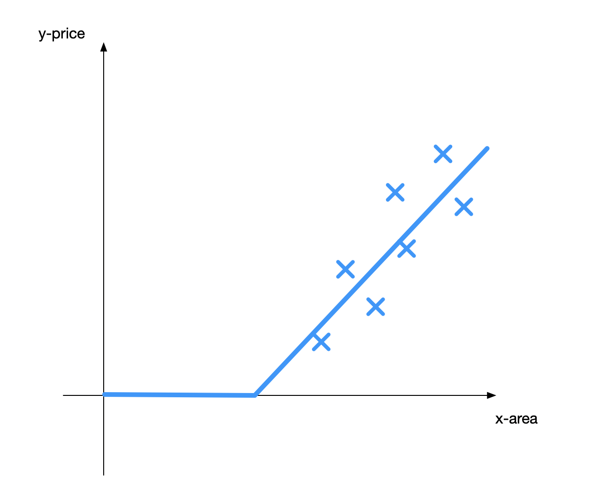
由于房屋价格不能为负数，因此最小取到 0。该图像被描述为 ReLU（Rectified Linear Unit）。
&emsp;&emsp;对于这样一个映射关系，可以用下图来描述：
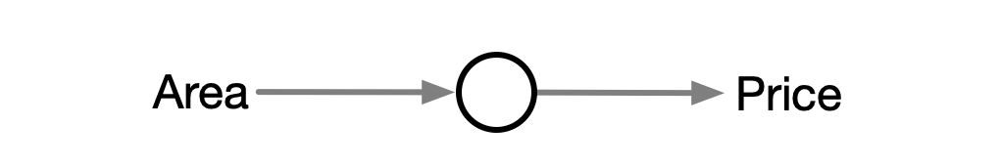
图中的小圈表示一个神经元，我们可以组合这样的关系可以得到下图：
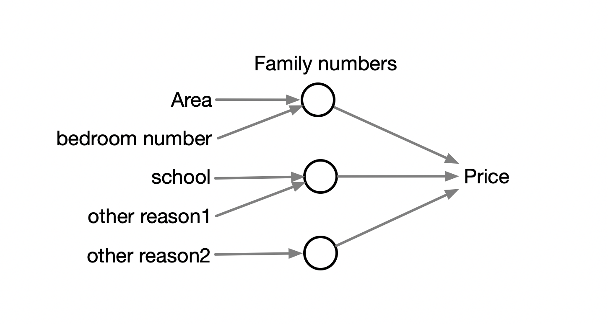
中间的节点可以概括为前两个特征描述的特征，例如：图中的房屋面积和卧室数量可以概括为家庭成员的数量（这里可以类比图像识别中，部分边缘是由更低级的特征组成的，这些边缘又可以组成更高级的特征，例如结构）。最终我们可以得到一个神经网络，如下图：
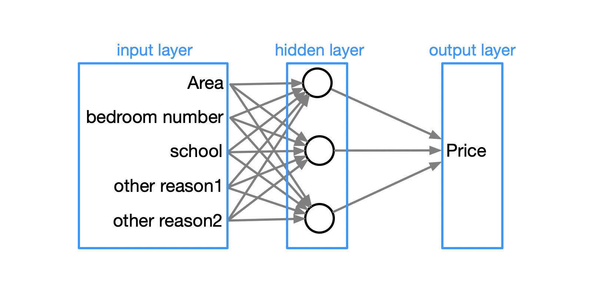
输入的特征被称为输入层，与输入层和输出层紧密相关的神经元被称为隐藏层，输出的数据在输出层。
#### 什么是监督学习？
&emsp;&emsp;给定数据集，通过训练，给出结果，监督学习可以被大致概括为上述过程。对于监督学习的官方解释为 ：“利用一组已知类别的样本调整分类器的参数，使其达到所要求性能的过程，也称为监督训练或有教师学习。”。用“监督”来描述上述行为确实比较合适。
#### 什么是结构化数据和非结构化数据？
&emsp;&emsp;结构化数据：形如数据库，表等数据
&emsp;&emsp;非结构化数据：形如图像、音频、文字等数据。
#### 机器学习和深度学习 sigmoid 和 ReLU
&emsp;&emsp;机器学习相比深度学习，可能会在数据集较少的情况下，性能强于深度学习。但是随着数据集越来越大，机器学习的性能逐渐趋于平稳，而深度学习构建的神经网络性能依旧在不断上升。
&emsp;&emsp;sigmoid 函数的图像，其起初和末尾的梯度几乎趋于 0，表示学习的效率在开始逐渐提高，在末尾逐渐降低。而 ReLU 图像从 0 开始的学习效率会稳定在梯度为 1 处，这使得模型的训练速度能够得到提升。<font color=red>（这里由于了解不够，描述不完善，需要在学习，完善知识后补充）</font>
#### 什么是二元分类？
&emsp;&emsp;wikipedia 定义如下：Binary or binomial classification is the task of classifying the elements of a given set into two groups (predicting which group each one belongs to) on the basis of a classification rule. 举个例子就是，给一组图片，处理成两类，是猫，不是猫。逻辑回归是用于二元分类的一种算法。
#### 如何处理（读取，存储）图片数据？
&emsp;&emsp;对于给定的图片数据，根据 RGB 三个通道分成三个矩阵，将三个矩阵存储到 n * 1 维的特征向量如下图所示：
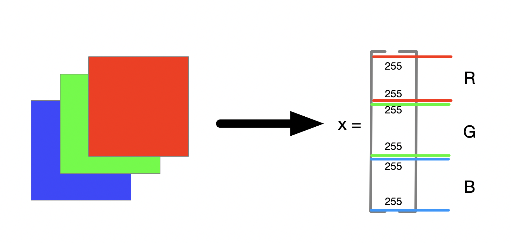
放置顺序为：从右到左，从上到下。假定图片为 64\*64，则三个通道数据一共为 $64*64*3=12288$，我们使用 $nx$ 表示这个值（特征向量的维度），则 $n=nx=12288$。要训练一个神经网络，需要训练集，检验被训练的神经网络则需要测试集。不管是训练集还是测试集，都有一个共同的特征就是：一个数据对应一个标签。可以用 $(x,y)$ 表示，$x$ 表示数据，如上图所示，$y$ 则表示标签，例如对于猫脸识别，有两个值：1（是） 和 0（否）。一般来说，$x$ 和 $y$ 的表示为：$x∈\mathbb{R}^{nx}，y∈\{0,1\}$。
&emsp;&emsp;对于训练集或测试集组成的矩阵，一般定义如下图:
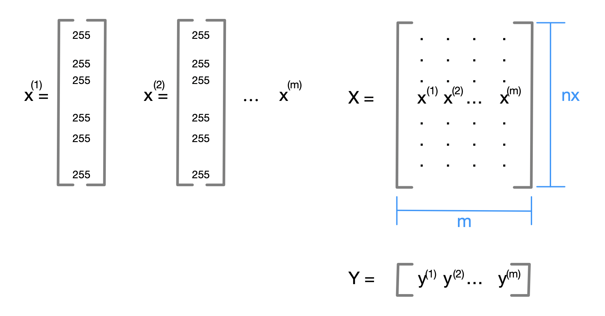
数学表示为：$x∈\mathbb{R}^{nx*m}，y∈\mathbb{R^{1*m}}$。
对于 python 中，检测数组维度的函数来说，结果如下：
```python
X.shape() # = (nx, m)
Y.shape() # = (1, m)
```
#### 逻辑回归模型
&emsp;&emsp;目前要解决的问题是：对于输入的图像数据 $x∈\mathbb{R}^{nx}$，需要给定一个 $y=1$ 的预测值 $\hat{y}∈[0,1]$。根据线性回归确定一个模型：$\hat{y}=w^Tx + b$，其中 $w∈\mathbb{R}^{nx}$，$b$ 是一个实数。
&emsp;&emsp;由于我们的目标是给定一个图片对于 $y=1$ 的预测值 $\hat{y}∈[0,1]$，但是对于 $\hat{y}=w^Tx + b$ 其范围远远超过 $[0,1]$，因此我们需要对该模型进行一下处理，使其范围处在 $[0,1]$。教程中采用的方式是使用 sigmoid 函数：$y=\frac{1}{1+e^{-z}}$，当 $z$ 很大时，$y$ 趋近于 1，反之 $y$ 趋近于 0。因此我们令 sigmoid 函数中的 $z=w^Tx + b$，令 $\hat{y}=\frac{1}{1+e^{-z}}$，就实现了我们的目的。一般写作 $\hat{y}=\sigma(w^Tx + b)$。一般为了明确这个模型，我们会训练它的两个参数 $w^T$ 和 $b$，这块儿内容会在<font color=red>后面（需要补充）</font>提到。<font color=blue>
【个人理解】这个模型对于输入的训练集 x 先计算，得出 $\hat{y}$，根据 $\hat{y}$ 与 $y$ 的值进行比较，对 $w^T$ 和 $b$ 进行调整，以实现最大程度接近 $y$ 值的目的。有了这个想法，就不难理解为什么需要损失函数和成本函数了。</font>
#### 损失函数（lost funciton）和成本函数（cost function）
&emsp;&emsp;虽然 $\hat{y}=\sigma(w^Tx + b)$ 能够给出对输入训练集的结果预测，但是我们仍然需要一个标准去衡量预测值和真实值之间的差距，用以接近训练集的结果。为了更好地表明我们所研究的对象（单个还是整体），我们用 $\hat{y}^{(i)}$ 表示对 $x^{(i)}$ ，也就是训练集中对第 i 个图像进行特征向量化后，这个特征向量的预测值。因此我们的目标就细化为：**对于给定的训练集 $\{(x^{(1)}, y^{(2)}),(x^{(2)}, y^{(1)}),...,(x^{(m)}, y^{(m)})\}$，使得 $\hat{y}^{(i)}$ 近似等于 $y^{(i)}$**。
&emsp;&emsp;为了衡量 $\hat{y}^{(i)}$ 和 $y^{(i)}$ 之间的差距，我们采用损失函数（Lost Function）$L(\hat{y}, y)$。比较简单的方法是使用 $L(\hat{y}, y)=(\hat{y}-y)^2$，或者使用 $L(\hat{y}, y)=\frac{1}{2}(\hat{y}-y)^2$，但是这样做会使得梯度下降不太好用<font color=red>（这里不好理解的话请继续向后看，总之先记住这个就好，后面会说明原因）</font>。对于损失函数，我们最后选择的是：$$L(\hat{y}, y)=-[ ylog\hat{y}+(1-y)log(1-\hat{y}) ]$$ 接下来给出证明：
&emsp;&emsp;我们已知 $\hat{y}$ 是 $y=1$ 时，对 $x$ 的预测值，则可以写作 $y = 1，p(y|x)=\hat{y}$，则有 $y = 0，p(y|x)=1-\hat{y}$。因此 $p(y|x)$ 可以写作 $p(y|x) = \hat{y}^y(1-\hat{y})^{(1-y)}$。若我们想让这个概率尽可能大<font color=blue>【原视频中是这个意思，但我并不是很理解，只能大概理解为想要最终获得的损失函数尽可能小】</font>，我们使用 log(x) 使其单调递增，可得到 $$log[\hat{y}^y(1-\hat{y})^{(1-y)}] = ylog(\hat{y}) + (1-y)log(1-\hat{y})$$ 因为想让该值获得最小，所以在前面加上一个负号，最终形式为：$$L(\hat{y}, y)=-[ ylog\hat{y}+(1-y)log(1-\hat{y}) ]$$
&emsp;&emsp;该函数的目标与 $L(\hat{y}, y)=(\hat{y}-y)^2$，或 $L(\hat{y}, y)=\frac{1}{2}(\hat{y}-y)^2$ 一致，都是使得 $L(\hat{y}, y)$ 本身很小。因此，对于这个函数的比较简单的理解是：
当 $y=0，L(\hat{y}, y)=-log(1-\hat{y})$，此时若想要 $L(\hat{y}, y)$ 最小，则需要 $log(1-\hat{y})$ 最大，则需要 $\hat{y}$ 最小，由于 $\hat{y}∈[0,1]$，所以应调整参数 $w^T$ 和 $b$ 使 $\hat{y}$ 趋向于 0。同理可阐明 $y=1$ 时，$\hat{y}$ 应该趋向于 1。
&emsp;&emsp;对于整体情况的衡量，可采用成本函数（Cost Function）阐述，公式定义如下：$$J(w, b)=\frac{1}{m}\sum^m_{i=1}L(\hat{y}^{(i)}, y^{(i)})$$
#### 梯度下降
&emsp;&emsp;教程中给出的成本函数（Cost Function）的图像如下图所示：
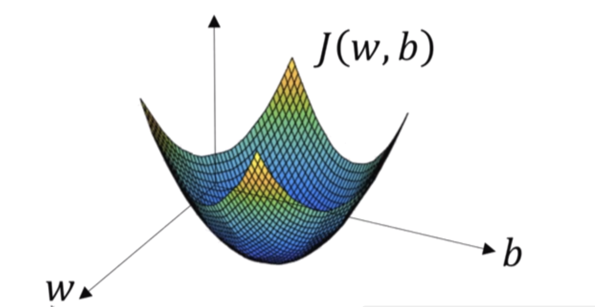
（图源自 Coursera 中的 Deep Learning 教程，作者吴恩达）
对于为什么是凸函数，作者没有给出原因。当我试图使用 MyGraphCalc 软件确定大致图像时，发现成本函数中有太多需要确定的变量，例如训练集的标签 $y$，$\hat{y}$ 中的 $w^T$，$x$ 和 $b$。因此这里我设定成本函数如下形式（不正确，只是为了找出大致图形）：$J(z)=-log\hat{y}-log(1-\hat{y})$，$\hat{y}=\frac{1}{1+e^{-z}}$，该图像在 MyGraphCalc 中表现为：

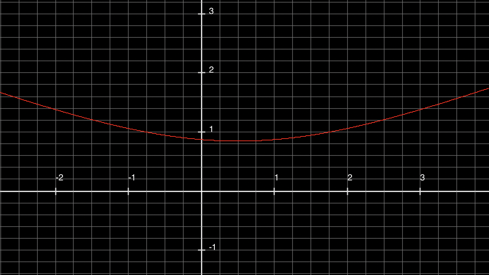
该方法仅作为参考，不一定正确。
&emsp;&emsp;之前提到过，对于成本函数，我们的目标是使其函数值最小，也就是通过调整参数 $w$ 和 $b$，使得函数值接近下图中红点的位置
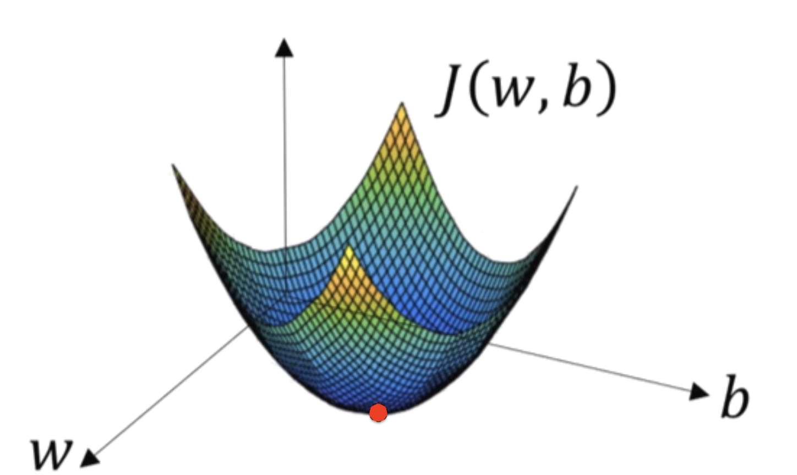
为了更好地理解调整参数的过程，视频中使用 $J(w)$ 的图像进行了讲解，我在这里引用这个方法。对于函数 $J(w)$，其图像大致如下所示：
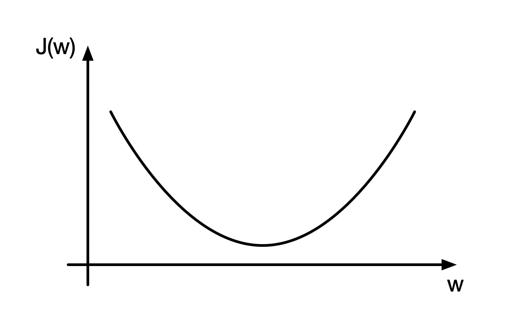
对于 $w$ 参数，作者采用的更新策略是 $w:=w-\alpha\frac{dJ(w)}{dw}$，$:=$ 表示更新，$\alpha$ 表示学习率。直观的理解就是使得 $w$ 朝着函数底部移动 $\alpha\frac{dJ(w)}{dw}$ 的距离，如下图所示：
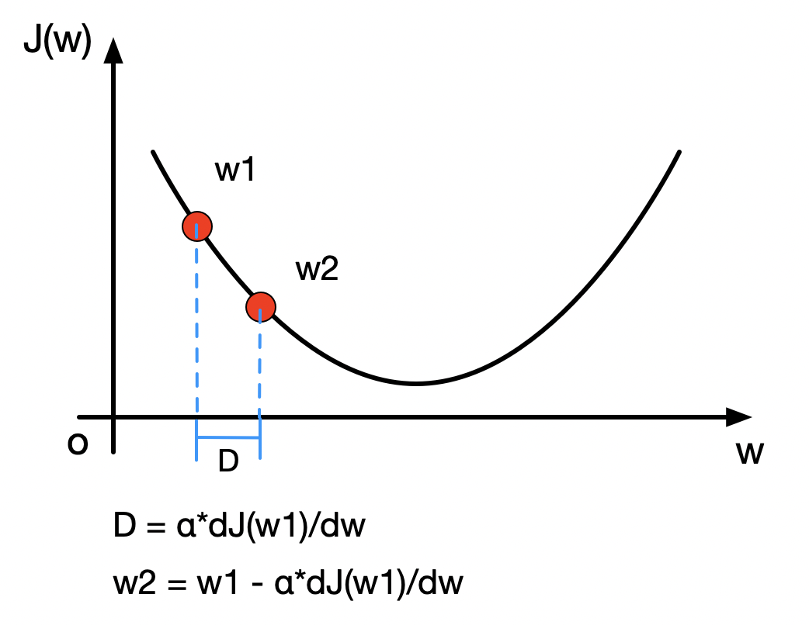
红点在函数最低点左侧时，$\alpha\frac{dJ(w)}{dw}$ 为负，红点向右移动，反之则向左移动。这就是调整参数 $w$ 和 $b$ 的策略。
#### 计算图和简单的反向传播求导
&emsp;&emsp;这个概念和方法不难理解，简单来说就是为计算的步骤制定流程，方便正向传播和反向传播的理解和实现。这里就放一下视频中的流程图：
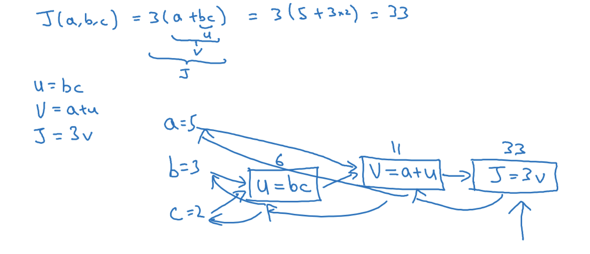
为了方便理解，我们给定一个特征向量 $x$ 包含两个特征 $x_1$ 和 $x_2$
及其标签 $y$ 表明对应特征向量是否是猫，参数 $w_1$、$w_2$ 和 $b$。则流程图如下所示：
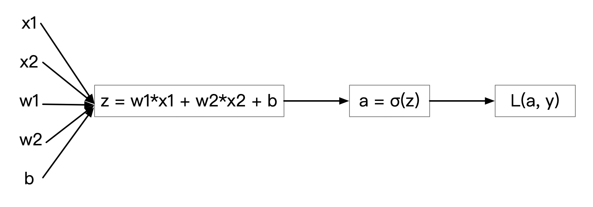
接下来，要计算各个参数的导数，然后使用之前说过的更新方法（例如 $w:=w-\alpha\frac{dL}{dw}$）更新对应参数。
&emsp;&emsp;我们从参数 a 开始，用函数 $L(a, y)$ 对 a 求导，推导过程如下：
$$
\begin{aligned}
\frac{dL(a,y)}{da}&=\frac{d[-(ylog_{10}a+(1-y)log_{10}(1-a)]}{da}\\
&=-(\frac{y}{a}-\frac{1-y}{1-a})\\
&=\frac{1-y}{1-a}-\frac{y}{a}
\end{aligned}
$$
在 python 中，我们将这个结果命名为 da。
接着，我们分别求出函数 $L(a, y)$ 对变量 $z$，$w1$，$w2$ 和 $b$ 的导数，在 python 中分别给予变量名 dz, dw1, dw2 和 db。推导过程如下：
$$
\begin{aligned}
dz=\frac{dL}{dz}&=\frac{dL}{da}\frac{da}{dz}\\
&=(\frac{1-y}{1-a}-\frac{y}{a})*\frac{e^{-z}}{(1+e^{-z})^2}\\
&=(\frac{1-y}{1-a}-\frac{y}{a})*a(1-a))\\
&=a-y
\end{aligned}
$$
$$
\begin{aligned}
dw1=\frac{dL}{dw1}&=\frac{dL}{da}\frac{da}{dz}\frac{dz}{w1}\\
&=(a-y)*x1\\
\end{aligned}
$$
$$
\begin{aligned}
dw2=\frac{dL}{dw1}&=\frac{dL}{da}\frac{da}{dz}\frac{dz}{w2}\\
&=(a-y)*x2\\
\end{aligned}
$$
$$
\begin{aligned}
db=\frac{dL}{dw1}&=\frac{dL}{da}\frac{da}{dz}\frac{dz}{b}\\
&=(a-y)*1\\
&=(a-y)\\
\end{aligned}
$$
然后按照如下步骤更新 $w1$，$w2$ 和 $b$：
$$
\begin{aligned}
w1&:=w1-\alpha * dw1\\
w2&:=w2-\alpha * dw2\\
b&:=b-\alpha * db
\end{aligned}
$$
####对 m 个样本进行 logistics 回归和梯度下降的代码框架
&emsp;&emsp;之前讨论了在损失函数下对参数求导的情况，但是最终我们仍是要使用成本函数对参数进行求导。例如，成本函数对参数 $w_1$ 的求导可以写成下面这种形式：
$$\frac{\partial J(a, y)}{\partial w_1}=\frac{1}{m}\sum_{i=1}^{m}\frac{\partial L(a, y)}{\partial w_1}$$也就是说，成本函数对参数的导数实际上是每个损失函数对参数导数之和的平均值。据此我们可以撰写伪代码描述大致的算法过程。
&emsp;&emsp;假设训练集中有 m 个图像，每个图像拥有两个特征 $x_1$ $x_2$，则伪代码如下：
```python
# 代码中的参数 wT, b 均假定已初始化过
J = 0
dw1 = 0
dw2 = 0
db = 0
for i in range(m):
    z = wT * X[i] + b # X 是包含 m 个特征向量的训练集
    a = sigmoid(z)
    J += -( y[i]*log(a) + (1-y[i]) * log(1-a) )
    dz = a-y
    dw1 += X[i][1] * dz # 这里本来数组下表应该从 0 开始，
                        # 为了更好地理解之前的特征 x_1，x_2，就采用了 1
    dw2 += X[i][2] * dz
    db += dz
J /= m
dw1 /= m
dw2 /= m
db /= m
```
上述的伪代码存在一定的效率问题，因为真实情况中，一个图像的特征远远超过 2 个，例如 64\*64 的图像，其特征向量包含的数据多达 64\*64\*3 个，对应参数 w 的个数也应该是 64\*64\*3 个。因此，在对 dw1 和 dw2 初始化时，使用向量操作会比 for 循环更能提高效率。因此，我们可以将上述伪代码重写为下段代码：
```python
# 代码中的参数 wT, b 均假定已初始化过
J = 0
dw = np.zeros(n_x, 1) # n_x 表示特征向量的数据个数
db = 0
for i in range(m):
    z = wT * X[i] + b # X 是包含 m 个特征向量的训练集
    a = sigmoid(z)
    J += -( y[i]*log(a) + (1-y[i]) * log(1-a) )
    dz = a-y
    dw += X[i] * dz 
    db += dz
J /= m
dw /= m
db /= m
```
#### 正向传播与反向传播的向量化实现
&emsp;&emsp;对伪代码向量化实现的方法，同样能够应用在前向传播过程中。前向传播包括对下面两个等式的编程实现：
$$
\begin{aligned}
z^{(i)}&=w^T*x^{(i)}+b\\
a^{(i)}&=sigmoid(z^{(i)})
\end{aligned}
$$
在教程前面有提到过，我们将训练集写成一个矩阵 $X$，定义如下：

若已知 $w$，则上述等式能够被 python 代码实现为：
```python
Z = np.dot(w.T, X)+b
A = sigmoid(Z) # sigmoid 函数在 scipy 中被实现为 expit() 函数
```
我们把 $A$ 和 $Z$ 从循环中去除了，但是在伪代码中，$J$，$dw$，$db$ 和 $dz$ 仍然还在循环中。我们先对 $dw$，$db$ 和 $dz$ 进行处理。伪代码更新至下段代码：
```python
# 代码中的参数 wT, b 均假定已初始化过
J = 0
dw = np.zeros(n_x, 1) # n_x 表示特征向量的数据个数
db = 0
Z = np.dot(w.T, X)+b
A = sigmoid(Z) # sigmoid 函数在 scipy 中被实现为 expit() 函数
for i in range(m):
    z = wT * X[i] + b # X 是包含 m 个特征向量的训练集
    a = sigmoid(z)
    J += -( y[i]*log(a) + (1-y[i]) * log(1-a) )
    dz = a-y
    dw += X[i] * dz 
    db += dz
J /= m
dw /= m
db /= m
```
&emsp;&emsp;很容易看出 $dz$ 可以更新为 ```dz = A - Y```。
&emsp;&emsp;对于 ```dw += X[i] * dz```（此处 dz 仍是每次循环求出的值，而非向量）X[i] 是一个 nx\*1 向量，而循环 m 次求出的 dz 一共有 m 个。若 dz 为 1\*m 的向量，则 m 次循环的 dw 计算可以更新为 ```dw = np.dot(X, dz.T)```，而最后要求出平均值，因此 ```dw = 1/m * np.dot(X, dz.T)```。
&emsp;&emsp;对于 ```db += dz``` 则可以直接更新为 ```db = 1/m * np.sum(dz)```，则原先的伪代码更新为：
```python
# 代码中的参数 wT, b 均假定已初始化过
Z = np.dot(w.T, X)+b
A = sigmoid(Z) # sigmoid 函数在 scipy 中被实现为 expit() 函数
dz = A - Y
dw = 1/m * np.dot(X, dz.T)
db = 1/m * np.sum(dz)

J = 0
for i in range(m):
    a = sigmoid(z)
    J += -( y[i]*log(a) + (1-y[i]) * log(1-a) )
J /= m
```
#### 课后编程作业 1
```python
import numpy as np
import matplotlib.pyplot as plt
import h5py
import scipy
from PIL import Image
from scipy import ndimage
from lr_utils import load_dataset
import imageio

def sigmoid(z):
    '''
    :usage: Use to calculate sigmoid value
    :param z: Sigmoid function parameter
    :return: Sigmoid result with z
    '''

    return 1.0 / (1.0 + np.exp(-z))

def initialize__with_zeros(dim):
    '''
    :usage: use to intialize the nerual network parameters w and b
    :param dim: row number of w
    :return: w and b
    '''

    w = np.zeros((dim, 1))
    b = 0.0

    assert(w.shape == (dim, 1))
    assert(isinstance(b, float) or isinstance(b, int))
    return w, b

def propagate(w, b, X, Y):
    '''
    :usage: Calculate forward and backword propagation
    :param X: training set images data
    :param Y: training set lables
    :param w: logistic regression paramter
    :param b: logistic regression paramter
    :return: w, b
    '''

    m = X.shape[1]      # The number of training images.

    ### Forward propagation
    A = sigmoid(np.dot(w.T, X) + b)                                         # y-hat or activation function
    cost = (-(Y * np.log(A) + (1 - Y) * np.log(1 - A))).sum() * 1.0 / m     # cost function
    ###

    ### Backward propagation
    dw = 1.0 / m * np.dot(X, (A - Y).T)
    db = 1.0 / m * (A - Y).sum()
    ###

    cost = np.squeeze(cost)
    grads = {"dw": dw,
             "db": db}

    return grads, cost


def optimize(w, b, X, Y, num_iterations, learning_rate, print_cost = False):
    '''
    :usage: Calculate forward and backword propagation
    :param w: logistic regression paramter
    :param b: logistic regression paramter
    :param X: training set images data
    :param Y: training set lables
    :param num_iterations: decides loop times
    :param learning_rate: alpha value in paramters alter
    :param print_cost: decides if you need print cost every 100 times
    :return: params{w, b}, grads{dw, db}, costs
    '''

    costs = []


    for i in range(num_iterations):
        grads, cost = propagate(w, b, X, Y)

        dw = grads["dw"]
        db = grads["db"]


        w = w - learning_rate * dw
        b = b - learning_rate * db

        if(i % 100 == 0):
            costs.append(cost)

        if(print_cost and i % 100 == 0):
            print ("Cost after iteration %i: %f" %(i, cost))

    params = {"w": w,
              "b": b}

    grads = {"dw": dw,
             "db": db}

    return params, grads, costs

def predict(w, b, X):
    '''
    :usage: predict if it's a MiaoMiao
    :param w: trained parameter
    :param b: trained parameter
    :param X: test set
    :return: predict list for each image
    '''

    m = X.shape[1]                  # get the number of images
    w = w.reshape(X.shape[0], 1)    # get the number of eigenvector's data
    Y_prediction = np.zeros((1, m));


    A = sigmoid(np.dot(w.T, X) + b)
    for i in range(A.shape[1]):

        if(A[0][i] > 0.5):
            Y_prediction[0][i] = 1
        else:
            Y_prediction[0][i] = 0

    return Y_prediction

def model(X_train, Y_train, X_test, Y_test, num_iterations = 2000, learning_rate = 0.5, print_cost = False):
    '''
    usage: Merge all functions
    :param X_train: train set
    :param Y_train: train label
    :param X_test: test set
    :param Y_test: test label
    :param num_iterations: decides loop times
    :param learning_rate: alpha value in paramters alter
    :param print_cost: decides if you need print cost every 100 times
    :return:
    '''

    w, b = initialize__with_zeros(X_train.shape[0])

    paramters, grads, costs = optimize(w, b, X_train, Y_train, num_iterations, learning_rate, print_cost)

    w = paramters["w"]
    b = paramters["b"]

    Y_prediction_test = predict(w, b, X_test)
    Y_prediction_train = predict(w, b, X_train)
    print("train accuracy: {} %".format(100 - np.mean(np.abs(Y_prediction_train - Y_train)) * 100))
    print("test accuracy: {} %".format(100 - np.mean(np.abs(Y_prediction_test - Y_test)) * 100))

    d = {"costs": costs,
         "Y_prediction_test": Y_prediction_test,
         "Y_prediction_train": Y_prediction_train,
         "w": w,
         "b": b,
         "learning_rate": learning_rate,
         "num_iterations": num_iterations}

    return d

# get the train image data, train labels, test image data and test labels.
# train_set_x_orig.shape    = (209, 64, 64, 3)
# train_set_y.shape         = (1, 209)
# test_set_x_orig.shape     = (50, 64, 64, 3)
# test_set_y.shape          = (1, 50)
train_set_x_orig, train_set_y, test_set_x_orig, test_set_y, classes = load_dataset("datasets/train_catvnoncat.h5", "datasets/test_catvnoncat.h5")


# m_train = 209
# m_test = 50
# num_px = 64

m_train = train_set_y.shape[1]     # number of train examples
m_test = test_set_y.shape[1]      # number of test examples
num_px = train_set_x_orig.shape[1]      # height/width of a training image


# train_set_x_flatten.shape  = (12288, 209)
# test_set_y_flatten.shape   = (12288, 50)
train_set_x_flatten = train_set_x_orig.reshape(m_train, -1).T     # keep dimension straight
test_set_x_flatten = test_set_x_orig.reshape(m_test, -1).T

# train_set_x.shape  = (12288, 209)
# train_set_y.shape  = (12288, 50)
train_set_x = train_set_x_flatten / 255     # change the color range to [0,1]
test_set_x = test_set_x_flatten / 255

d = model(train_set_x, train_set_y, test_set_x, test_set_y, num_iterations = 2000, learning_rate = 0.005, print_cost = False)

# Try the images found in the internet
image_name = "Cat"   # change this to the name of your image file
image_number = 12
for i in range(image_number):
    fname = "Cats/" + image_name + str(i+1) + ".jpg"
    print(fname)
    image = np.array(imageio.imread(fname))
    # my_image = scipy.misc.imresize(image, size=(num_px, num_px)).reshape((1, num_px * num_px * 3)).T
    my_image = np.array(Image.fromarray(image).resize((num_px, num_px))).reshape((1, num_px * num_px * 3)).T
    my_predicted_image = predict(d["w"], d["b"], my_image)

    plt.imshow(image)
    print("y = " + str(np.squeeze(my_predicted_image)) + ", your algorithm predicts a \"" + classes[
        int(np.squeeze(my_predicted_image)),].decode("utf-8") + "\" picture.")
```
值得注意的是，在使用了自己找的图片时，np.exp(-z) 溢出了，这个问题目前还没有想好如何解决。网上搜到的解决办法是：对于 z < 0 的情况，为 sigmoid 函数分子分母同时乘以 e^z，但这个方法不适用于矩阵，解决办法可参考 https://stackoverflow.com/questions/40726490/overflow-error-in-pythons-numpy-exp-function 。比较完美的是使用 python scipy 库中的 expit 函数，代码如下：
```python
from scipy import special
special.expit(z)
```
自己找的图片放在 Cats 文件夹下了，图片均来自百度 “猫” 结果中的图片。

#### Nerual Network 神经网络
&emsp;&emsp;之前我们学习并使用了线性回归方程、sigmoid 函数、损失函数和成本函数构建了一个简单的逻辑回归模型，来识别喵脸。前面的章节有提到过，一个神经网络由多个之前学习的逻辑回归模型构成，关系如下图：
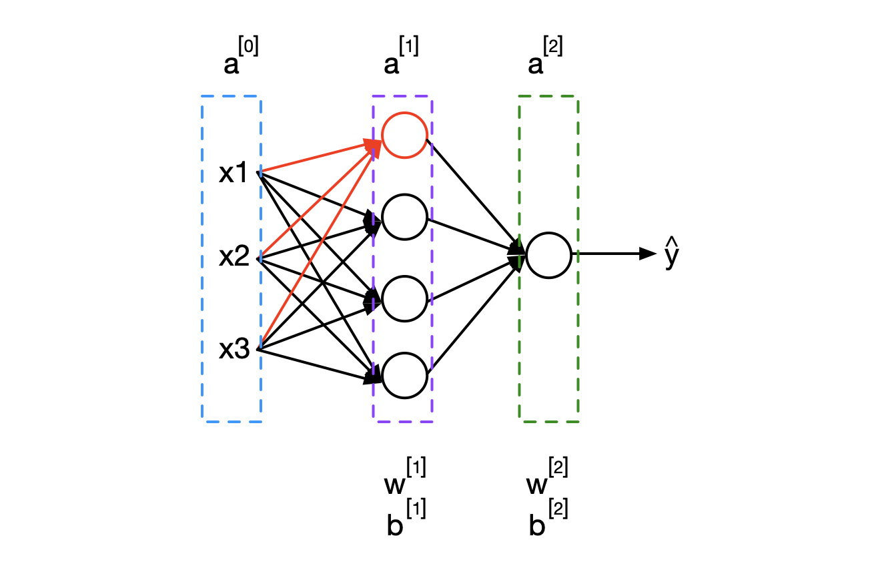
&emsp;&emsp;上图就是一个简单的神经网络模型。图中的红色部分就是我们之前构建的逻辑回归模型。图中的蓝色部分被称作输入层，用 $a^{[0]}$ 表示，紫色部分被称作隐藏层（因为我们无法得知隐藏层内部的输出数据），用 $a^{[1]}$ 表示，绿色部分被称作输出层，用 $a^{[2]}$ 表示。$w^{[1]}$ 和 $b^{[1]}$ 表示在隐藏层中参与 $\hat{y}$ 运算的参数，$w^{[2]}$ 和 $b^{[2]}$ 则表示在输出层中参与运算的参数。
&emsp;&emsp;实际上 $a^{[0]}$ 也可以表示为输入的数据 X，$a^{[1]}$ 表示为隐藏层运算后的输出结果，$a^{[2]}$ 则表示为输出层运算后的输出结果。通常，图中所示的神经网络结构也被称作双层神经网络，这里的双层指的是隐藏层和输出层，一般不计算输入层。具体涉及的计算流程如下图所示:

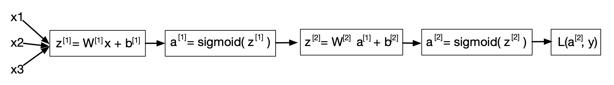
根据上图所示，不论是前向传播或者反向传播，都可以按照前面的思路求出来。上图中描述的神经网络，可以看出，输入的数据维度为（3，1），所以可以看作是三行一列的向量。对于公式 $a = w^{T}x + b$ 这里的 $w$ 在当前的例子中，本应是 （3，n），而当前计算流程图中的 $W$ 是 $w^{T}$ 的集合（有关 $w^{T}$ 的矩阵），由于图中可以看出，隐藏层有四个节点，因此此处的 $W^{[1]}$ 维度为（4，3），$b^{[1]}$ 为（4，1）。由于计算之后 $a^{[1]}$ 的维度为（4，1），且需要作为下一次计算的输入，因此 $W^{[2]}$ 的维度为（1，4），$b^{[2]}$ 则为（1，1）。关于它们具体的细节，可以从下面的 ppt 中直观的感受到：
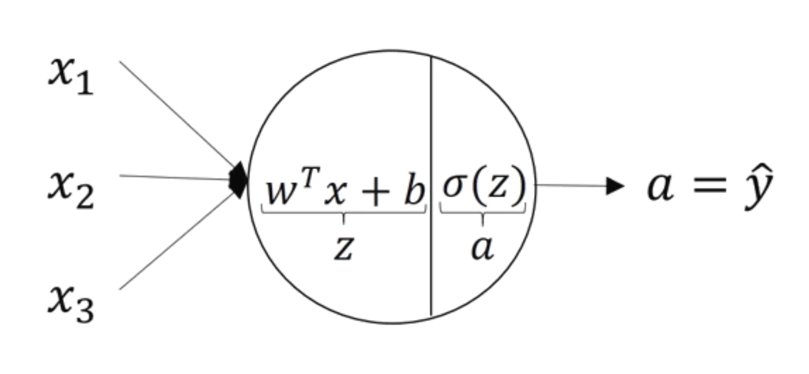
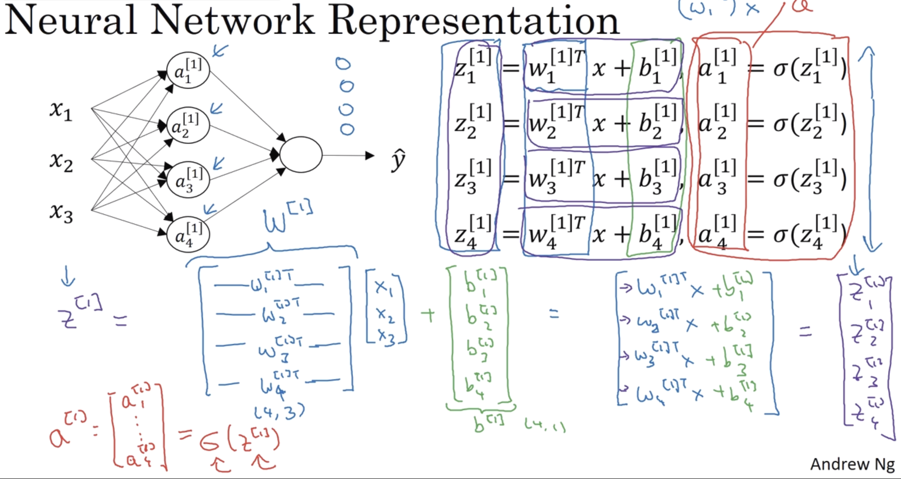
最终需要计算的四行代码如下图所示：
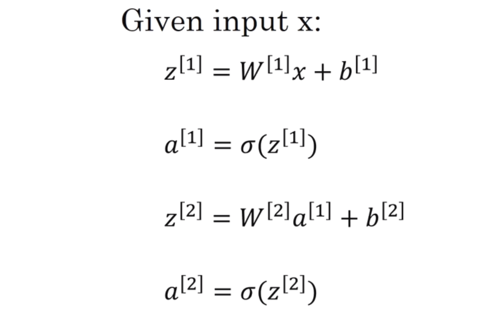
上述神经网络模型和计算流程都是针对单个图片特征的。若想要在不使用 for 循环的情况下计算一个训练集的图片，需要对训练集进行向量化。我们将训练集堆叠在一起，构成一个矩阵，那么其对应的结果也需要堆叠在一起，教程中解释的很清楚，因此这里引用教程中的 ppt 来解释说明，具体请参考下图：
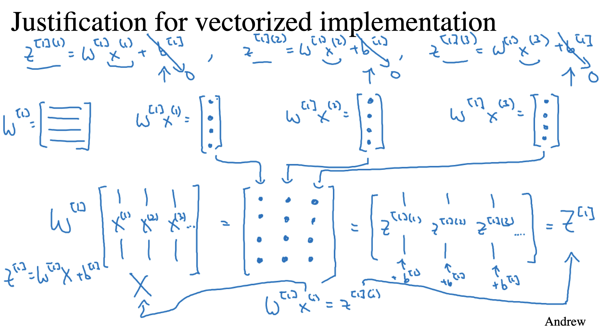
上图中的为了简化推导过程省略了 $b$（或将 b 设为 0），不过后续加上 $b$ 即可。最终，本例中神经网络的计算将会采用下述四个公式：
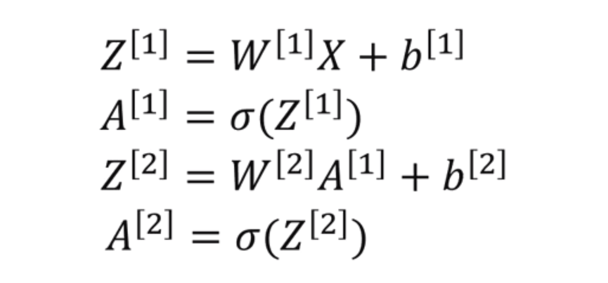
#### 激活函数
&emsp;&emsp;对于之前在逻辑回归模型中使用的 sigmoid 函数，实际是很少被用到的。多数情况下，tanh(x) 的表现要比 sigmoid 函数要好，这里可以直观的从图像中看出来。如下图：
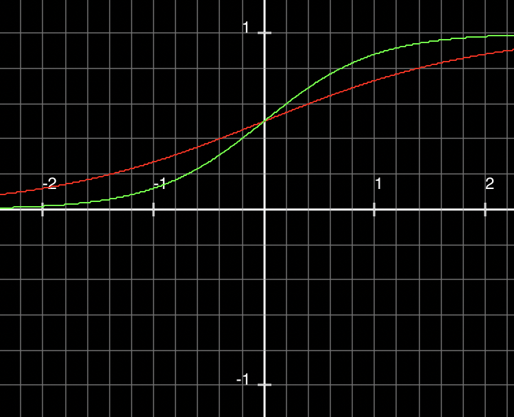
图源自 iOS 应用 MyGraphCalc。绿色函数图像为 $y=(tanh(x)+1)*0.5$，红色图像为 $y=sigmoid(z)$，能够看出 $y=(tanh(x)+1)*0.5$ 比 $y=sigmoid(z)$ 能更快的接近 1 和 0。隐藏层的激活函数一般会选择 $a=tanh(z)=\frac{e^{z}-e^{-z}}{e^{z}+e^{-z}}$。对于输出层，若要解决的问题为二元分类，则输出层的激活函数应选用 sigmoid 函数。但这两个函数都有各自的问题，它们的在接近 1 和 0 的时候梯度都趋近于0，因此成本函数对参数的的导数会变小，这拖慢梯度下降算法。例如 $\frac{dJ(w,b)}{dw} = \frac{dJ(w,b)}{da} * \frac{da}{dz} * \frac{dz}{dw}$，当 $\frac{dJ(w,b)}{da}$ 和 $\frac{dz}{dw}$ 不变的情况下，$z$ 越大，而 $\frac{da}{dz}$ 越小，使得 $\frac{dJ(w,b)}{dw}$ 整体变小。由于参数更新公式为 $w = w - \alpha*\frac{dJ(w,b)}{dw}$，所以这将使得梯度下降算法更新很慢。因此，一般选用 ReLU 激活函数作为隐藏层的函数。ReLU 函数的公式和图像如下：
$$a = max(0,z)$$
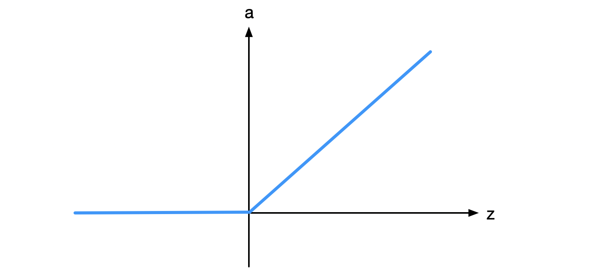
从图像中可以看出，该函数的梯度是一个定值，对于 $z<0$，$a=0$，对于 $z>0$ 则 $a>0$，当 $z=0$ 时，$a$ 可正可负，在使用这个函数的时，梯度下降算法的效率会比之前高很多，因为该算法在 $z>0$ 时，梯度为定值且为正。虽然对于 ReLU 函数来说，有一半范围的斜率等于 0 ，但是实际情况下，有足够多的隐藏单元使得 $z>0$。由于该函数在 $z<0$ 时 $a=0$，会在一定情况下带来不便，因此人们也会使用另外一个函数 —— leaky ReLU，其公式和函数图像如下：
$$a=max(0.01z, z)$$
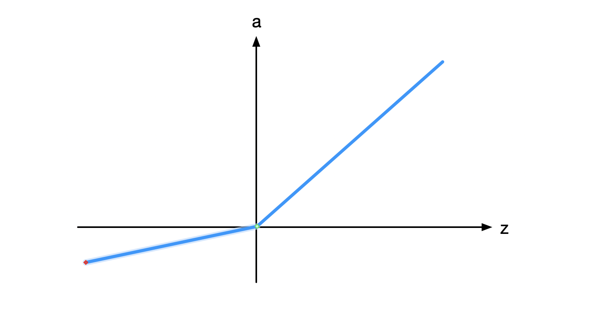
对于参数 0.01 的选取，可以是其他参数，甚至可以是在神经网络中进行调整，视情况而定。
&emsp;&emsp;本教程的激活函数使用的是 ReLU，但是没有明确说明输出层是否也会使用这个函数。这个问题在之后的说明中会解答。
&emsp;&emsp;关于不使用线性函数作为激活函数的原因，可以从推导中得知。假如使 $a$ 就只是等于 $w^{T}x+b$，那么下一层激活函数也只是关于 $x$ 的线性组合，如此一来，整个神经网络的激活函数救几乎都是由线性函数构成的，这样一来，无论多少个线性函数都不会使得最终的输出值获得有效的结果。因为这样做获得的结果与直接使用线性函数作为激活函数的逻辑回归模型没有太大差别。因此激活层最好不要使用线性函数。对于输出层，在预测房价的问题上则可以使用线性函数输出一个单个的值，这类问题也被称作是机器学习中的回归问题。
&emsp;&emsp;四种激活函数的导数如下：
1. 对于 $a = sigmoid(z)$ 其导数在之前已经推导过了，这里就直接列出公式了：$sigmoid'(z)=a(a-1)$
2. 对于 $a = tanh(z)$ 其导数推导如下：
$$
\begin{aligned}
a' = tanh'(z) &= (\frac{e^{z}-e^{-z}}{e^{z}+e^{-z}})'\\
&=\frac{(e^{z}+e^{-z})^2-(e^{z}-e^{-z})^2}{(e^{z}+e^{-z})^2}\\
&=1-tanh^2(z)\\
&=1-a^2
\end{aligned}
$$
3. 对于 $a=ReLU(z)=max(0,z)$，其导数结果如下：
$$a'=(ReLU(z))'=\left\{
\begin{aligned}
0,& &z<0\\
1,& &z>0\\
undefine,& &z=0
\end{aligned}
\right.
$$
对于 undefine 的情况，导数取 0 或者 1 均可。
4. 对于 $a=leaky\_ReLU(z)=max(0.01z,z)$，其导数结果如下：
$$a'=(leaky\_ReLU(z))'=\left\{
\begin{aligned}
0.01,& &z<0\\
1,& &z>0\\
undefine,& &z=0
\end{aligned}
\right.
$$
对于 undefine 的情况，导数取 0.01 或者 1 均可。
#### 神经网络的正向传播和反向传播
&emsp;&emsp;之前的知识内容给出了激活函数的选择，现在，假定我们的隐藏层所使用的函数为 $g(z)$，输出层所使用的激活函数为 $sigmoid(z)$，则正想传播的公式如下所示：
$$
\begin{aligned}
Z^{[1]} &= W^{[1]}X+b^{[1]}\\
A^{[1]} &= g^{[1]}(Z^{[1]})\\
Z^{[2]} &= W^{[2]}A^{[1]}+b^{[2]}\\
A^{[2]} &= g^{[2]}(Z^{[2]})\\
\end{aligned}
$$
这里 $X$ 的维度沿用之前的假设，为 $(n_x，m)$，$n_x$ 为特征数量，$m$ 为训练集中样本（图片）数量。我们将每层的节点数记做：$n^{[i]}$ 在本例中一共有三层：输入层，隐藏层和输出层，它们对应的节点个数为：$n^{[0]}$、$n^{[1]}$ 以及 $n^{[2]}$。因此可以推出其他参数以及结果的维度如下：
$$
\begin{aligned}
X &: (n_x，m)\\
Y &: (1，m)\\
\\
W^{[1]} &: (n^{[1]}，n_x)\\
b^{[1]} &: (n^{[1]}，1)\\
Z^{[1]} &: (n^{[1]}，m)\\
A^{[1]} &: (n^{[1]}，m)\\
\\
W^{[2]} &: (n^{[2]}，n^{[1]})\\
b^{[2]} &: (n^{[2]}，1)\\
A^{[2]} &: (n^{[2]}，m)\\
Z^{[2]} &: (n^{[2]}，m)
\end{aligned}
$$
上述公式很简单就不做推导了，重点是反向传播的公式。根据之前计算逻辑回归的经验，我们发现，要更新参数，需要获得参数的导数以及 $dZ$。我们从第二层（输出层）向输入层一层一层计算。对于 $dZ^{[2]}$，计算过程如下：
$$
\begin{aligned}
dZ^{[2]} &= \frac{dL}{dA^{[2]}}*\frac{dA^{[2]}}{dZ^{[2]}}\\
&=(\frac{1-y}{1-A^{[2]}}-\frac{y}{A^{[2]}})*A^{[2]}(1-A^{[2]})\\
&=A^{[2]} - Y
\\
dZ^{[2]} &: (n^{[2]}，m)
\end{aligned}
$$

这里使用 Lost Function 对 $Z$ 进行求导，是因为后期在计算 Cost Function 对参数的导数时，$dZ$ 仅为中间变量，不需要再进行加和求平均。若只求最后的 $dZ$，则需要进行加和平均。注意，这里的激活函数 $g^{[2]}(z)$ 为 $sigmoid$ 函数。对于 $dW^{[2]}$，计算过程如下：
$$
\begin{aligned}
dW^{[2]} &= \frac{1}{m}*\frac{dL}{dA^{[2]}}*\frac{dA^{[2]}}{dZ^{[2]}}*\frac{dZ^{[2]}}{dW^{[2]}}\\
&=\frac{1}{m}*dZ^{[2]}*\frac{dZ^{[2]}}{dW^{[2]}}\\
&=\frac{1}{m}*dZ^{[2]}*A^{[1]T}
\\
dZ^{[2]} &: (n^{[2]}，m)\\
A^{[2]} &: (n^{[1]}，m)\\
dW^{[2]} &: (n^{[2]}，n^{[1]})
\end{aligned}
$$
对于 $db^{[2]}$、$dZ^{[1]}$、$dW^{[1]}$ 以及 $db^{[1]}$，推导和维度如下：
$$
\begin{aligned}
db^{[2]} &= \frac{1}{m}*np.sum(\frac{dL}{dA^{[2]}}*\frac{dA^{[2]}}{dZ^{[2]}}*\frac{dZ^{[2]}}{db^{[2]}},axis=1,keepdim=True)\\
&=\frac{1}{m}*dZ^{[2]}*np.sum(\frac{dZ^{[2]}}{db^{[2]}},axis=1,keepdim=True)\\
&=\frac{1}{m}*np.sum(dZ^{[2]},axis=1,keepdim=True)
\\
dZ^{[2]} &: (n^{[2]}，m)\\
db^{[2]} &: (n^{[2]}，1)\\
\end{aligned}
$$

$$
\begin{aligned}
dZ^{[1]} &= \frac{dL}{dA^{[2]}}*\frac{dA^{[2]}}{dZ^{[2]}}*\frac{dZ^{[2]}}{dA^{[1]}}*\frac{dA^{[1]}}{dZ^{[1]}}\\
&=W^{[2]T}*dZ^{[2]}*g^{[1]'}(Z^{[1]})\\
dZ^{[2]} &: (n^{[2]}，m)\\
W^{[2]} &: (n^{[2]}，n^{[1]})\\
Z^{[1]} &: (n^{[1]}，m)\\
dZ^{[1]} &: (n^{[1]}，m)\\
\end{aligned}
$$

$$
\begin{aligned}
dW^{[1]} &= \frac{1}{m}*\frac{dL}{dA^{[2]}}*\frac{dA^{[2]}}{dZ^{[2]}}*\frac{dZ^{[2]}}{dA^{[1]}}*\frac{dA^{[1]}}{dZ^{[1]}}*\frac{dZ^{[1]}}{dW^{[1]}}\\
&=\frac{1}{m}*dZ^{[1]}*X^{T}\\
dZ^{[1]} &: (n^{[1]}，m)\\
X &: (n_x，m)\\
dW^{[1]} &: (n^{[1]}，n_x)
\end{aligned}
$$

$$
\begin{aligned}
db^{[1]} &= \frac{1}{m}*np.sum(\frac{dL}{dA^{[2]}}*\frac{dA^{[2]}}{dZ^{[2]}}*\frac{dZ^{[2]}}{dA^{[1]}}*\frac{dA^{[1]}}{dZ^{[1]}}*\frac{dZ^{[1]}}{db^{[1]}},axis=1,keepdim=True)\\
&=\frac{1}{m}*np.sum(dZ^{[1]},axis=1,keepdim=True)
\\
dZ^{[1]} &: (n^{[1]}，m)\\
db^{[1]} &: (n^{[1]}，1)\\
\end{aligned}
$$
#### 神经网络的参数选取
&emsp;&emsp;之前的逻辑回归模型中，参数是可以随机选取的，我们将参数 $w$ 和 $b$ 均初始化为 0。但在神经网络中，将 $W$ 初始化为 0 会导致对称性，引发问题。
&emsp;&emsp;假设有下图的神经网络：
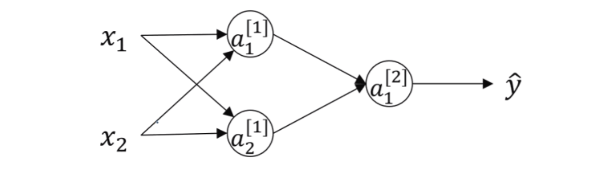
若初始化 
$$W^{[1]}=
\left[
    \begin{matrix}
    0 & 0\\
    0 & 0
    \end{matrix}
\right]
$$

$$b^{[1]}=
\left[
    \begin{matrix}
    0\\
    0
    \end{matrix}
\right]
$$
则 $a_1^{[1]}$ = $a_2^{[1]}$，$dZ_1^{[1]}$ = $dZ_2^{[1]}$，这使得 $dW$ 矩阵的每行均相同，这就失去了多个 $w$ 权重（参数）的意义，这导致神经网络的每个 $w$ 均相同。因此在初始化 $W^{[1]}$ 矩阵时，应使用随机函数```np.random.randn((2,2)) * 0.01```。这里乘以 0.01 是因为，无论是 tanh(z) 还是 sigmoid(z)，z 太大时会导致梯度值非常小，导致梯度下降速度缓慢，因此选用较小值会使得梯度下降速度较快。
#### 课后编程作业 2
所有代码如下：
```python
import numpy as np
import matplotlib.pyplot as plt
from testCases_v2 import *
import sklearn
import sklearn.datasets
import sklearn.linear_model
from planar_utils import plot_decision_boundary, sigmoid, load_planar_dataset, load_extra_datasets


# GRADED FUNCTION: layer_sizes

def layer_sizes(X, Y):
    """
    Arguments:
    X -- input dataset of shape (input size, number of examples)
    Y -- labels of shape (output size, number of examples)

    Returns:
    n_x -- the size of the input layer
    n_h -- the size of the hidden layer
    n_y -- the size of the output layer
    """
    ### START CODE HERE ### (≈ 3 lines of code)
    n_x = X.shape[0]  # size of input layer
    n_h = 4
    n_y = Y.shape[0]  # size of output layer
    ### END CODE HERE ###
    return (n_x, n_h, n_y)


# GRADED FUNCTION: initialize_parameters

def initialize_parameters(n_x, n_h, n_y):
    """
    Argument:
    n_x -- size of the input layer
    n_h -- size of the hidden layer
    n_y -- size of the output layer

    Returns:
    params -- python dictionary containing your parameters:
                    W1 -- weight matrix of shape (n_h, n_x)
                    b1 -- bias vector of shape (n_h, 1)
                    W2 -- weight matrix of shape (n_y, n_h)
                    b2 -- bias vector of shape (n_y, 1)
    """

    np.random.seed(2)  # we set up a seed so that your output matches ours although the initialization is random.

    ### START CODE HERE ### (≈ 4 lines of code)
    W1 = np.random.randn(n_h, n_x) * 0.01
    b1 = np.zeros((n_h, 1))
    W2 = np.random.randn(n_y, n_h) * 0.01
    b2 = np.zeros((n_y, 1))
    ### END CODE HERE ###

    assert (W1.shape == (n_h, n_x))
    assert (b1.shape == (n_h, 1))
    assert (W2.shape == (n_y, n_h))
    assert (b2.shape == (n_y, 1))

    parameters = {"W1": W1,
                  "b1": b1,
                  "W2": W2,
                  "b2": b2}

    return parameters


def forward_propagation(X, parameters):
    """
    Argument:
    X -- input data of size (n_x, m)
    parameters -- python dictionary containing your parameters (output of initialization function)

    Returns:
    A2 -- The sigmoid output of the second activation
    cache -- a dictionary containing "Z1", "A1", "Z2" and "A2"
    """
    # Retrieve each parameter from the dictionary "parameters"
    ### START CODE HERE ### (≈ 4 lines of code)
    W1 = parameters["W1"]
    b1 = parameters["b1"]
    W2 = parameters["W2"]
    b2 = parameters["b2"]
    ### END CODE HERE ###

    # Implement Forward Propagation to calculate A2 (probabilities)
    ### START CODE HERE ### (≈ 4 lines of code)

    Z1 = np.dot(W1, X) + b1
    A1 = np.tanh(Z1)
    Z2 = np.dot(W2, A1) + b2
    A2 = sigmoid(Z2)


    ### END CODE HERE ###

    assert (A2.shape == (1, X.shape[1]))

    cache = {"Z1": Z1,
             "A1": A1,
             "Z2": Z2,
             "A2": A2}

    return A2, cache


# GRADED FUNCTION: compute_cost
def compute_cost(A2, Y, parameters):
    """
    Computes the cross-entropy cost given in equation (13)

    Arguments:
    A2 -- The sigmoid output of the second activation, of shape (1, number of examples)
    Y -- "true" labels vector of shape (1, number of examples)
    parameters -- python dictionary containing your parameters W1, b1, W2 and b2

    Returns:
    cost -- cross-entropy cost given equation (13)
    """

    m = Y.shape[1]  # number of example

    # Compute the cross-entropy cost
    ### START CODE HERE ### (≈ 2 lines of code)
    logprobs = np.multiply(Y, np.log(A2)) + np.multiply(1-Y, np.log(1-A2))
    cost = 1/m * -np.sum(logprobs)
    ### END CODE HERE ###

    cost = np.squeeze(cost)  # makes sure cost is the dimension we expect.
    # E.g., turns [[17]] into 17
    assert (isinstance(cost, float))

    return cost


# GRADED FUNCTION: backward_propagation

def backward_propagation(parameters, cache, X, Y):
    """
    Implement the backward propagation using the instructions above.

    Arguments:
    parameters -- python dictionary containing our parameters
    cache -- a dictionary containing "Z1", "A1", "Z2" and "A2".
    X -- input data of shape (2, number of examples)
    Y -- "true" labels vector of shape (1, number of examples)

    Returns:
    grads -- python dictionary containing your gradients with respect to different parameters
    """
    m = X.shape[1]

    # First, retrieve W1 and W2 from the dictionary "parameters".
    ### START CODE HERE ### (≈ 2 lines of code)
    W1 = parameters["W1"]
    W2 = parameters["W2"]
    ### END CODE HERE ###

    # Retrieve also A1 and A2 from dictionary "cache".
    ### START CODE HERE ### (≈ 2 lines of code)
    A1 = cache["A1"]
    A2 = cache["A2"]
    ### END CODE HERE ###

    # Backward propagation: calculate dW1, db1, dW2, db2.
    ### START CODE HERE ### (≈ 6 lines of code, corresponding to 6 equations on slide above)
    dZ2 = A2 - Y
    dW2 = 1/m * np.dot(dZ2, A1.T)
    db2 = 1/m * np.sum(dZ2, axis=1, keepdims=True)
    dZ1 = np.dot(W2.T, dZ2) * (1-np.power(A1, 2))
    dW1 = 1/m * np.dot(dZ1, X.T)
    db1 = 1/m * np.sum(dZ1, axis=1, keepdims=True)
    ### END CODE HERE ###

    grads = {"dW1": dW1,
             "db1": db1,
             "dW2": dW2,
             "db2": db2}

    return grads


# GRADED FUNCTION: update_parameters
def update_parameters(parameters, grads, learning_rate=1.2):
    """
    Updates parameters using the gradient descent update rule given above

    Arguments:
    parameters -- python dictionary containing your parameters
    grads -- python dictionary containing your gradients

    Returns:
    parameters -- python dictionary containing your updated parameters
    """
    # Retrieve each parameter from the dictionary "parameters"
    ### START CODE HERE ### (≈ 4 lines of code)
    W1 = parameters["W1"]
    b1 = parameters["b1"]
    W2 = parameters["W2"]
    b2 = parameters["b2"]
    ### END CODE HERE ###

    # Retrieve each gradient from the dictionary "grads"
    ### START CODE HERE ### (≈ 4 lines of code)
    dW1 = grads["dW1"]
    db1 = grads["db1"]
    dW2 = grads["dW2"]
    db2 = grads["db2"]
    ## END CODE HERE ###

    # Update rule for each parameter
    ### START CODE HERE ### (≈ 4 lines of code)
    W1 = W1 - learning_rate * dW1
    b1 = b1 - learning_rate * db1
    W2 = W2 - learning_rate * dW2
    b2 = b2 - learning_rate * db2
    ### END CODE HERE ###

    parameters = {"W1": W1,
                  "b1": b1,
                  "W2": W2,
                  "b2": b2}

    return parameters


# GRADED FUNCTION: nn_model
def nn_model(X, Y, n_h, num_iterations=10000, print_cost=False):
    """
    Arguments:
    X -- dataset of shape (2, number of examples)
    Y -- labels of shape (1, number of examples)
    n_h -- size of the hidden layer
    num_iterations -- Number of iterations in gradient descent loop
    print_cost -- if True, print the cost every 1000 iterations

    Returns:
    parameters -- parameters learnt by the model. They can then be used to predict.
    """

    np.random.seed(3)
    n_x = layer_sizes(X, Y)[0]
    n_y = layer_sizes(X, Y)[2]

    # Initialize parameters, then retrieve W1, b1, W2, b2. Inputs: "n_x, n_h, n_y". Outputs = "W1, b1, W2, b2, parameters".
    ### START CODE HERE ### (≈ 5 lines of code)
    parameters = initialize_parameters(n_x, n_h, n_y)
    W1 = parameters["W1"]
    b1 = parameters["b1"]
    W2 = parameters["W2"]
    b2 = parameters["b2"]
    ### END CODE HERE ###

    # Loop (gradient descent)

    for i in range(0, num_iterations):

        ### START CODE HERE ### (≈ 4 lines of code)
        # Forward propagation. Inputs: "X, parameters". Outputs: "A2, cache".
        A2, cache = forward_propagation(X, parameters)

        # Cost function. Inputs: "A2, Y, parameters". Outputs: "cost".
        cost = compute_cost(A2, Y, parameters)

        # Backpropagation. Inputs: "parameters, cache, X, Y". Outputs: "grads".
        grads = backward_propagation(parameters, cache, X, Y)

        # Gradient descent parameter update. Inputs: "parameters, grads". Outputs: "parameters".
        parameters = update_parameters(parameters, grads)

        ### END CODE HERE ###

        # Print the cost every 1000 iterations
        if print_cost and i % 1000 == 0:
            print("Cost after iteration %i: %f" % (i, cost))

    return parameters


# GRADED FUNCTION: predict
def predict(parameters, X):
    """
    Using the learned parameters, predicts a class for each example in X

    Arguments:
    parameters -- python dictionary containing your parameters
    X -- input data of size (n_x, m)

    Returns
    predictions -- vector of predictions of our model (red: 0 / blue: 1)
    """

    # Computes probabilities using forward propagation, and classifies to 0/1 using 0.5 as the threshold.
    ### START CODE HERE ### (≈ 2 lines of code)
    A2, cache = forward_propagation(X, parameters)
    predictions = np.round(A2)
    ### END CODE HERE ###

    return predictions


### GET THE DATA
X, Y = load_planar_dataset()
### START CODE HERE ### (≈ 3 lines of code)
shape_X = X.shape
shape_Y = Y.shape
m = X.shape[1]  # training set size
### END CODE HERE ###

print ('The shape of X is: ' + str(shape_X))
print ('The shape of Y is: ' + str(shape_Y))
print ('I have m = %d training examples!' % (m))

# Train the logistic regression classifier
print("# Train the logistic regression classifier")
clf = sklearn.linear_model.LogisticRegressionCV();
clf.fit(X.T, Y.T.ravel());
# Plot the decision boundary for logistic regression
plot_decision_boundary(lambda x: clf.predict(x), X, Y, False)
# Print accuracy
LR_predictions = clf.predict(X.T)
print ('Accuracy of logistic regression: %d ' % float((np.dot(Y,LR_predictions) + np.dot(1-Y,1-LR_predictions))/float(Y.size)*100) +
       '% ' + "(percentage of correctly labelled datapoints)")
print()

print("Test Layer size")
X_assess, Y_assess = layer_sizes_test_case()
print("The dimension of X_assess is: " + str(X_assess.shape))
print("The dimension of Y_assess is: " + str(Y_assess.shape))
(n_x, n_h, n_y) = layer_sizes(X_assess, Y_assess)
print("The size of the input layer is: n_x = " + str(n_x))
print("The size of the hidden layer is: n_h = " + str(n_h))
print("The size of the output layer is: n_y = " + str(n_y))
print()

print("Test initializing the paramters")
n_x, n_h, n_y = initialize_parameters_test_case()
print("The size of the input layer is: n_x = " + str(n_x))
print("The size of the hidden layer is: n_h = " + str(n_h))
print("The size of the output layer is: n_y = " + str(n_y))
parameters = initialize_parameters(n_x, n_h, n_y)
print("W1 = " + str(parameters["W1"]))
print("b1 = " + str(parameters["b1"]))
print("W2 = " + str(parameters["W2"]))
print("b2 = " + str(parameters["b2"]))
print()

print("Test Forward propagation test")
X_assess, parameters = forward_propagation_test_case()
A2, cache = forward_propagation(X_assess, parameters)
# Note: we use the mean here just to make sure that your output matches ours.
print(np.mean(cache['Z1']) ,np.mean(cache['A1']),np.mean(cache['Z2']),np.mean(cache['A2']))
print()

print("Test Cost Function")
A2, Y_assess, parameters = compute_cost_test_case()
print("cost = " + str(compute_cost(A2, Y_assess, parameters)))
print()

print("Test backward propagation")
parameters, cache, X_assess, Y_assess = backward_propagation_test_case()
grads = backward_propagation(parameters, cache, X_assess, Y_assess)
print ("dW1 = "+ str(grads["dW1"]))
print ("db1 = "+ str(grads["db1"]))
print ("dW2 = "+ str(grads["dW2"]))
print ("db2 = "+ str(grads["db2"]))
print()

print("Test parameters update")
parameters, grads = update_parameters_test_case()
parameters = update_parameters(parameters, grads)
print("W1 = " + str(parameters["W1"]))
print("b1 = " + str(parameters["b1"]))
print("W2 = " + str(parameters["W2"]))
print("b2 = " + str(parameters["b2"]))
print()

print("Test nn_model()")
X_assess, Y_assess = nn_model_test_case()
parameters = nn_model(X_assess, Y_assess, 4, num_iterations=10000, print_cost=True)
print("W1 = " + str(parameters["W1"]))
print("b1 = " + str(parameters["b1"]))
print("W2 = " + str(parameters["W2"]))
print("b2 = " + str(parameters["b2"]))
print()

print("Test predict function")
parameters, X_assess = predict_test_case()
predictions = predict(parameters, X_assess)
print("predictions mean = " + str(np.mean(predictions)))

print("Test total work on flower data")
# Build a model with a n_h-dimensional hidden layer
parameters = nn_model(X, Y, n_h = 4, num_iterations = 10000, print_cost=True)
# Plot the decision boundary
plot_decision_boundary(lambda x: predict(parameters, x.T), X, Y)
plt.title("Decision Boundary for hidden layer size " + str(4))

# Print accuracy
print("Test accuracy")
predictions = predict(parameters, X)
print ('Accuracy: %d' % float((np.dot(Y,predictions.T) + np.dot(1-Y,1-predictions.T))/float(Y.size)*100) + '%')

# This may take about 2 minutes to run
print("This may take about 2 minutes to run")
plt.figure(figsize=(16, 32))
hidden_layer_sizes = [1, 2, 3, 4, 5, 20, 50]
for i, n_h in enumerate(hidden_layer_sizes):
    plt.subplot(5, 2, i+1)
    plt.title('Hidden Layer of size %d' % n_h)
    parameters = nn_model(X, Y, n_h, num_iterations = 5000)
    plot_decision_boundary(lambda x: predict(parameters, x.T), X, Y)
    predictions = predict(parameters, X)
    accuracy = float((np.dot(Y,predictions.T) + np.dot(1-Y,1-predictions.T))/float(Y.size)*100)
    print ("Accuracy for {} hidden units: {} %".format(n_h, accuracy))
plt.show()
print()


# Datasets
noisy_circles, noisy_moons, blobs, gaussian_quantiles, no_structure = load_extra_datasets()

datasets = {"noisy_circles": noisy_circles,
            "noisy_moons": noisy_moons,
            "blobs": blobs,
            "gaussian_quantiles": gaussian_quantiles}


print("Test another dataset")
### START CODE HERE ### (choose your dataset)
dataset = "noisy_moons"
### END CODE HERE ###
X, Y = datasets[dataset]
X, Y = X.T, Y.reshape(1, Y.shape[0])
# make blobs binary
if dataset == "blobs":
    Y = Y%2
# Visualize the data
plt.scatter(X[0, :], X[1, :], c=np.squeeze(Y), s=40, cmap=plt.cm.Spectral);
# Build a model with a n_h-dimensional hidden layer
parameters = nn_model(X, Y, n_h = 4, num_iterations = 10000, print_cost=True)
# Plot the decision boundary
plot_decision_boundary(lambda x: predict(parameters, x.T), X, Y)
plt.title("Decision Boundary for hidden layer size " + str(4))
plt.show()
```
多隐藏层运行结果如下：
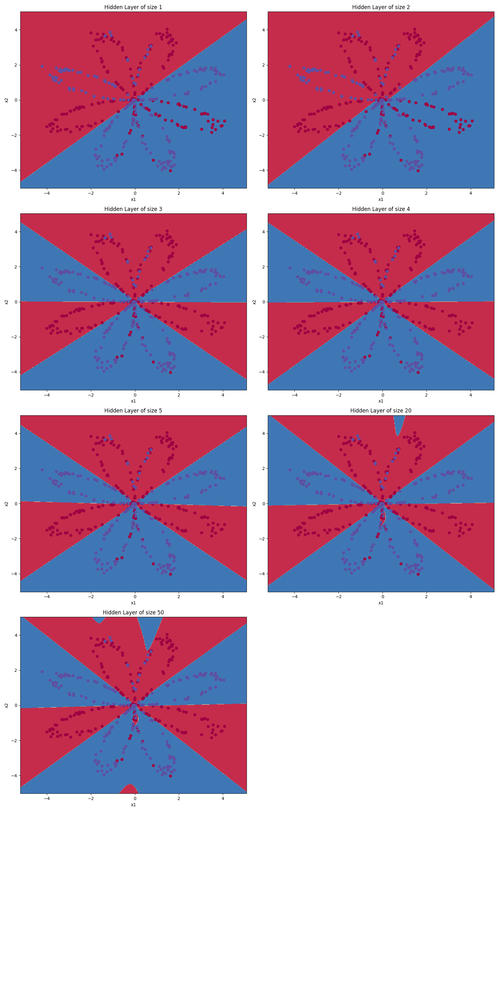
其他数据运行结果如下：
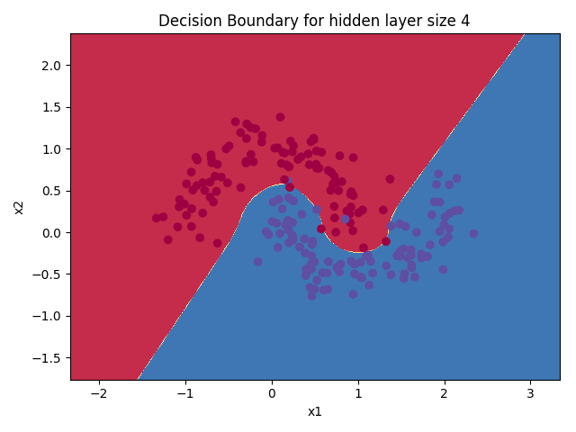
&emsp;&emsp;实现编程作业的过程中，有些向量运算一直没弄清楚，不过自己顺着推导一番之后也就弄明白了，在这里把本章的单隐层神经网络的公式推导在这里都顺一遍，并且结合代码列在下面。
##### 1. 公式推导
首先是 ```dZ2 = A2 - Y```，这里的 dZ2 实际上应该是被加和取平均的，但是由于这里用做中间变量参与 dW2 和 db2 的运算，因此写成这样，dW2 完整的推导过程如下：
$$
\begin{aligned}
dW^{[2]} &= \frac{dJ}{dA^{[2]}} * \frac{dA^{[2]}}{dZ^{[2]}} * \frac{dZ^{[2]}}{dW^{[2]}}\\
&= \frac{1}{m} * \sum_{i=1}^{m}[ \frac{A^{[2](i)}-Y^{(i)}}{(1-A^{[2](i)})*A^{[2](i)}}*A^{[2](i)}(1-A^{[2](i)})*A^{[1](i)} ] \\
&(这里所有的 * 均表示向量相乘，非 dot 非 cross)
\end{aligned}
$$
公式中 $$\frac{A^{[2](i)}-Y^{(i)}}{(1-A^{[2](i)})*A^{[2](i)}}*A^{[2](i)}(1-A^{[2](i)})$$
的维度为 $(n^{[2]}, 1)$，若写成 $A^{[2]} - Y$ 则维度为 $(n^{[2]}, m)$，若想让 $A^{[2]} - Y$ 和 $A^{[1]}$（维度为 $(n^{[1]}，m)$）运算实现完整推导过程的结果，则需要使用 $np.dot()$ 函数。体现在代码中为 ```dW2 = 1/m * np.dot(dZ2, A2.T)```，这就解释了为什么代码中 ```dZ2 = A2 - Y``` 的原因。
接下来是其他几个参数导数的完整推导步骤：
$$
\begin{aligned}
dZ^{[1]} &= \frac{dJ}{dA^{[2]}} * \frac{dA^{[2]}}{dZ^{[2]}} * \frac{dZ^{[2]}}{dA^{[1]}}*\frac{dA^{[1]}}{dZ^{[1]}}\\
&= \frac{1}{m} * \sum_{i=1}^{m}[ (A^{[2](i)} - Y^{(i)}) * W^{[2]T} * (1-A^{[1](i)^2})]
\end{aligned}
$$
&emsp;&emsp;这里 $W^{[2]T}$ 可以用矩阵的导数$\frac{\partial W^{[2]}A^{[1]}}{\partial A^{[1]}}=W^{[2]T}$，参考网址：https://blog.csdn.net/crazy_scott/article/details/80557814 去理解，W2.T 和 dZ2 之间为点乘，及其结果与 $g^{[1]'}(Z^{[1]})$ 之间的普通乘法只能用契合维度去理解了。在哔哩哔哩看本周课程的 3.10 视频时，有人提出是由于公式中原先就是 pointwise（点乘）因此这里用点乘，但我没办法理解。
&emsp;&emsp;另外对于 $dW^{[2]}$ 中 $A^{[1]T}$ 的解释也可用维度去理解。$dW^{[2]}$ 是由逻辑回归中的一个个 $w^{T}$ 堆积而成的，是一个个行向量，而 $A^{[1]}$ 是一个个列向量，因此需要转置。
##### 2. Cost function 结果
```python 
# Build a model with a n_h-dimensional hidden layer
parameters = nn_model(X, Y, n_h = 4, num_iterations = 10000, print_cost=True)
# Plot the decision boundary
plot_decision_boundary(lambda x: predict(parameters, x.T), X, Y)
plt.title("Decision Boundary for hidden layer size " + str(4))
```
我在运行上段代码后得到的结果为：
```
Cost after iteration 0: 0.693048
Cost after iteration 1000: 0.288083
Cost after iteration 2000: 0.254385
Cost after iteration 3000: 0.233864
Cost after iteration 4000: 0.226792
Cost after iteration 5000: 0.222644
Cost after iteration 6000: 0.219731
Cost after iteration 7000: 0.217504
Cost after iteration 8000: 0.219456
Cost after iteration 9000: 0.218558
```
这里与教程中所给出答案的后两项不一致，猜测是由于四舍五入导致的，最终的准确度计算与教程中一致，均为 90%
#### 深度神经网络
&emsp;&emsp;之前我们讨论了逻辑回归模型和单隐层的神经网络（双层神经网络），现在讨论具有更多层数的神经网络，也称深度神经网络。
&emsp;&emsp;相比较与单隐层神经网络，多隐层（深度）神经网络具有 2 个及 2 个以上的隐藏层，模型如下图所示：
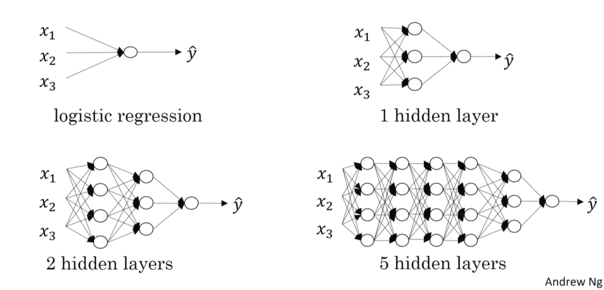
我们取一个深度神经网络模型如下图所示（图源自吴恩达 Coursera Deep Learning 教程视频）：
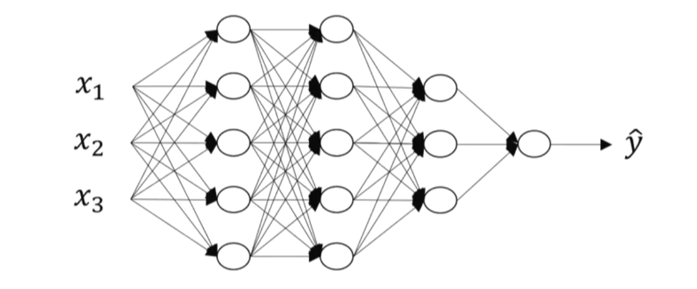

对于上述的多隐层神经网络，我们做一些符号上的约定：
1. 对于神经网络的层数，我们用字母 $L$ 表示，图中神经网络为 4 层，所以 $L=4$
2. 对于神经网络每一层的节点数，我们用 $l$ 表示层数，用 $n^{[l]}$ 表示 $l$ 层的节点数。例如第二层有 5 个节点，表示为 $n^{[2]}=5$。注：输入层为第 0 层，之后依次为 1，2，3，4 层。最后一层也可以表示为：$n^{[L]} = 1$
3. 对于各层输出函数 $a^{[l]}$ 的计算可以写作 $a^{[l]}=g^{[l]}(z^{[l]})$，对于 $z^{[l]}$ 的计算则可以写作 $z^{[l]}=z^{[l]}a^{[l]}+b^{[l]}$，输出的预测值 $\hat{y}$ 的值等于 $a^{[L]}$。
#### 深度神经网络的前向传播和反向传播计算流程
&emsp;&emsp;前向、反向传播的公式在之前均有推导过程，这里就只列出公式，不做详细的推导。（向量实现未注明 * 号的均为点乘）

1. 对于前向传播，输入 $a^{[l-1]}$，输出 $a^{[l]}$，cache（$z^{[l]}, w^{[l]}, b^{[l]}$）
$$
\begin{aligned}
z^{[l]}&=w^{[l]}a^{[l-1]}+b^{[l]}\\
a^{[l]}&= g^{[l]}(z^{[l]})
\end{aligned}
$$
向量实现为：
$$
\begin{aligned}
Z^{[l]}&=W^{[l]}A^{[l-1]}+b^{[l]}\\
A^{[l]}&= g^{[l]}(Z^{[l]})
\end{aligned}
$$
2. 对于反向传播，输入 $da^{[l]}$，输出 $da^{[l-1]}$，$dw^{[l]}$，$db^{[l]}$
$$
\begin{aligned}
dz^{[l]} &= da^{[l]}g^{[l]'}(z^{[l]})\\
da^{[l-1]} &= w^{[l]T}dz^{[l]}\\
dw^{[l]} &= dz^{[l]}a^{[l-1]T}\\
db^{[l]} & = dz^{[l]}
\end{aligned}
$$
向量实现为：
$$
\begin{aligned}
dZ^{[l]} &= dA^{[l]}g^{[l]'}(Z^{[l]})\\
dA^{[l-1]} &= W^{[l]T}dZ^{[l]}\\
dW^{[l]} &= \frac{1}{m}*dZ^{[l]}A^{[l-1]T}\\
db^{[l]} & = \frac{1}{m}*np.sum(dZ^{[l]}, axis=1, keepdim=True)
\end{aligned}
$$
前向、反向传播中，对于 $l$ 层的各参数，其维度为：
$$
\begin{aligned}
Z^{[l]} &: (n^{[l]}, m)\\
W^{[l]} &: (n^{[l]}, n^{[l-1]})\\
b^{[l]} &: (n^{[l]}, 1)\\
A^{[l]} &: (n^{[l]}, m)\\
A^{[0]} &: (n^{[0]}, m)\\
\\
dZ^{[l]} &: (n^{[l]}, m)\\
dW^{[l]} &: (n^{[l]}, n^{[l-1]})\\
db^{[l]} &: (n^{[l]}, 1)\\
dA^{[l]} &: (n^{[l]}, m)\\
\end{aligned}
$$

#### 深度神经网络的前向传播和反向传播计算框架
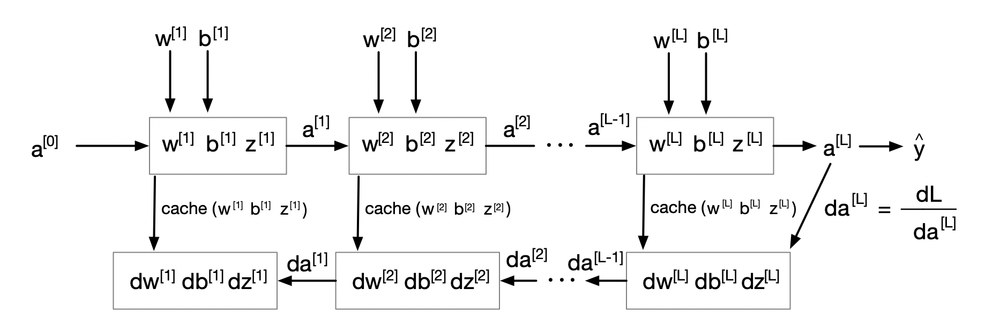
当然，图中的每一次导数计算都需要更新 $w$，$b$ 参数。
#### 关于神经网络的参数和超参数
&emsp;&emsp;神经网络中的参数有 $w$，$b$，决定这两个参数取值的参数被称为超参数。超参数包括迭代次数，学习率 $\alpha$，隐藏层数 $L$ 以及隐藏单元数 $n^{[1]}$，$n^{[2]}$...
#### 课后编程作业 3
&emsp;&emsp;这个作业的目的是构建一个深度神经网络模型，其中每个函数都是自己写的框架，没有教程提供的框架以及 relu 和 sigmoid 函数。这样有助于自己对各个模块的关系以及 python 实现细节的理解。教程在实现函数时的思路为实现局部函数，然后实现整体函数，整体函数调用局部函数。代码如下：
```python
import numpy as np
import scipy.special

def sigmoid(Z):
    '''
    :ussage: calculate sigmoid function
    :param Z: parameter
    :return: A and cache which is Z
    '''
    A = scipy.special.expit(Z)
    assert (A.shape == Z.shape)
    cache = Z
    return A, cache

def relu(Z):
    '''
    :ussage: calculate ReLU function
    :param Z: parameter
    :return: A and cache which is Z
    '''
    A = np.maximum(0, Z)
    assert (A.shape == Z.shape)
    cache = Z
    return A, cache

def sigmoid_backward(dA, cache):
    '''
    :usage: calculate backward sigmoid
    :param dA: derivative of A
    :param cache: activation_cache
    :return: derivative of Z
    '''
    Z = cache
    s = scipy.special.expit(Z)
    dZ = dA * s * (1-s)

    assert (dZ.shape == Z.shape)
    return dZ

def relu_backward(dA, cache):
    '''
    :usage: calculate derivative of relu
    :param dA: derivative of A
    :param cache: activation_cache
    :return: derivative of Z
    '''
    Z = cache
    dZ = np.array(dA, copy=True)
    dZ[Z <= 0] = 0;

    assert(dZ.shape == Z.shape)
    return dZ

def initialize_parameters_deep(layer_dims):
    '''
    :usage: initialize the parameters W and b
    :param layer_dims: stores each layer's unit number, for example: n[0]=2, n[1]=5, n[2]=4, n[3]=n[L]=1, layer_dims = (2,5,4,1)
    :return: parameters: stores all random W and b
    '''
    np.random.seed(3)
    L = len(layer_dims)
    parameters = {}

    for l in range(1, L):
        parameters["W" + str(l)] = 0.01 * np.random.randn(layer_dims[l], layer_dims[l-1])
        parameters['b' + str(l)] = np.zeros((layer_dims[l], 1))

        assert (parameters["W" + str(l)].shape == (layer_dims[l], layer_dims[l - 1]))
        assert (parameters["b" + str(l)].shape == (layer_dims[l], 1))

    return parameters

def linear_forward(A, W, b):
    '''
    :usage: use to calculate single linear function Z = WA + b
    :param A: input set
    :param W: parameter
    :param b: parameter
    :return: Z and cache(A, W, b)
    '''
    Z = np.dot(W, A) + b
    assert (Z.shape == (W.shape[0], A.shape[1]))
    cache = (A, W, b)

    return Z, cache

def linear_activation_forward(A_prev, W, b, activation):
    '''
    :usage: calculate single linear function and activation function
    :param A_prev: previous layer's input set
    :param W: parameter
    :param b: parameter bias
    :param activation:
    :return: A, cache(linear_cache, activation_cache)
    '''

    Z, linear_cache = linear_forward(A_prev, W, b)
    activation_cache = 0

    if activation == "sigmoid":
        A, activation_cache = sigmoid(Z)
    elif activation == "relu":
        A, activation_cache = relu(Z)

    assert (A.shape == (W.shape[0], A_prev.shape[1]))
    cache = (linear_cache, activation_cache)

    return A, cache

def L_model_forward(X, parameters):
    '''
    :usage: calculate forward propagation
    :param X: training set
    :param parameters: W and b
    :return: A[L], caches(linear_caches, activation_caches)
    '''
    L = len(parameters) // 2

    A = X
    caches = []
    for i in range(1, L):
        A_prev = A
        A, cache = linear_activation_forward(A_prev, parameters["W" + str(i)], parameters["b" + str(i)], "relu")
        caches.append(cache)

    AL, cache = linear_activation_forward(A, parameters["W" + str(L)], parameters["b" + str(L)], "sigmoid")
    caches.append(cache)
    assert (AL.shape == (1, X.shape[1]))
    return AL, caches

def compute_cost(AL, Y):
    '''
    :usage: compute cost
    :param AL: A[L] predict value
    :param Y: training labels
    :return: cost value
    '''
    cost = -np.mean(Y*np.log(AL) + (1-Y)*np.log(1-AL))
    np.squeeze(cost)
    assert (cost.shape == ())
    return cost

def linear_backward(dZ, cache):
    '''
    :ussage: calculate single layer linear backward
    :param dZ: derivative of Z
    :param cache: store A_prev, W, b
    :return: dA_prev, dW, db
    '''
    A_prev, W, b = cache
    m = A_prev.shape[1]
    dW = 1/m * np.dot(dZ, A_prev.T)
    db = 1/m * np.sum(dZ, axis=1, keepdims=True)
    dA_prev = np.dot(W.T, dZ)

    assert (dW.shape == W.shape)
    assert (db.shape == b.shape)
    assert (dA_prev.shape == A_prev.shape)

    return dA_prev, dW, db

def linear_activation_backward(dA, cache, activation):
    '''
    :usage: calculate single layer linear and activation backward
    :param dA: derivative of A
    :param cache: store linear_cache and activation_cache
    :param activation: type of activation function, "ReLU" or "sigmoid"
    :return: dA_prev, dW, db
    '''
    linear_cache, activation_cache = cache

    if activation == "relu":
        dZ = relu_backward(dA, activation_cache)
    elif activation == "sigmoid":
        dZ = sigmoid_backward(dA, activation_cache)

    dA_prev, dW, db = linear_backward(dZ, linear_cache)

    return dA_prev, dW, db

def L_model_backward(AL, Y, caches):
    '''
    :usage: calculate backword
    :param AL: Lth layer A value
    :param Y: training set labels
    :param caches: store linear_caches and activation_caches
    :return: parameter gradients
    '''
    L = len(caches)
    grads = {}
    dAL = -(np.divide(Y, AL) + np.divide(1-Y, 1-AL))
    current_cache = caches[L-1]
    grads["dA" + str(L - 1)], grads["dW" + str(L)], grads["db" + str(L)] = linear_activation_backward(dAL, current_cache, "sigmoid")

    for i in reversed(range(L-1)):
        current_cache = caches[i]
        dA_prev_temp, dW_temp, db_temp = linear_activation_backward(grads["dA" + str(i+1)], current_cache, "relu")
        grads["dA" + str(i)] = dA_prev_temp
        grads["dW" + str(i + 1)] = dW_temp
        grads["db" + str(i + 1)] = db_temp

    return grads

def update_parameters(parameters, grads, learning_rate):
    L = len(parameters) // 2
    for i in range(L):
        parameters["W" + str(i+1)] = parameters["W" + str(i+1)] - learning_rate * grads["dW" + str(i+1)]
        parameters["b" + str(i + 1)] = parameters["b" + str(i + 1)] - learning_rate * grads["db" + str(i + 1)]

    return parameters
```
代码中所有的 help function 我均自己实现了，由于教程中 sigmoid 本身的溢出问题（详见课后作业2），我使用了内置的 sigmoid 方法 scipy.special.expit()。
#### 课后编程作业 4
&emsp;&emsp;该编程作业的目标是将上一个编程作业的成果应用于喵脸识别。这里我没有实现教程中的两层神经网络，直接套用之前的函数，实现了多层的深度神经网络。这里要注意一个问题，上个编程作业中的 initialize_parameters_deep 函数中，教程作者在本练习中将 ```parameters["W" + str(l)] = np.random.randn(layer_dims[l], layer_dims[l - 1]) * 0.01``` 替换成了 ```parameters["W" + str(l)] = np.random.randn(layer_dims[l], layer_dims[l-1]) / np.sqrt(layer_dims[l-1])```。以下是完整代码：
```python
import time
import numpy as np
import h5py
import matplotlib.pyplot as plt
import scipy
from PIL import Image
from scipy import ndimage
# from dnn_app_utils_v3 import *


### CONSTANTS DEFINING THE MODEL ####
layers_dims = [12288, 20, 7, 5, 1] #  4-layer model


def load_data():
    train_dataset = h5py.File('datasets/train_catvnoncat.h5', "r")
    train_set_x_orig = np.array(train_dataset["train_set_x"][:])  # your train set features
    train_set_y_orig = np.array(train_dataset["train_set_y"][:])  # your train set labels

    test_dataset = h5py.File('datasets/test_catvnoncat.h5', "r")
    test_set_x_orig = np.array(test_dataset["test_set_x"][:])  # your test set features
    test_set_y_orig = np.array(test_dataset["test_set_y"][:])  # your test set labels

    classes = np.array(test_dataset["list_classes"][:])  # the list of classes

    train_set_y_orig = train_set_y_orig.reshape((1, train_set_y_orig.shape[0]))
    test_set_y_orig = test_set_y_orig.reshape((1, test_set_y_orig.shape[0]))

    return train_set_x_orig, train_set_y_orig, test_set_x_orig, test_set_y_orig, classes

def sigmoid(Z):
    '''
    :ussage: calculate sigmoid function
    :param Z: parameter
    :return: A and cache which is Z
    '''
    A = scipy.special.expit(Z)
    assert (A.shape == Z.shape)
    cache = Z
    return A, cache

def relu(Z):
    '''
    :ussage: calculate ReLU function
    :param Z: parameter
    :return: A and cache which is Z
    '''
    A = np.maximum(0, Z)
    assert (A.shape == Z.shape)
    cache = Z
    return A, cache

def sigmoid_backward(dA, cache):
    '''
    :usage: calculate backward sigmoid
    :param dA: derivative of A
    :param cache: activation_cache
    :return: derivative of Z
    '''
    Z = cache
    s = scipy.special.expit(Z)
    dZ = dA * s * (1-s)

    assert (dZ.shape == Z.shape)
    return dZ

def relu_backward(dA, cache):
    '''
    :usage: calculate derivative of relu
    :param dA: derivative of A
    :param cache: activation_cache
    :return: derivative of Z
    '''
    Z = cache
    dZ = np.array(dA, copy=True)
    dZ[Z <= 0] = 0;

    assert(dZ.shape == Z.shape)
    return dZ
#
def initialize_parameters_deep(layer_dims):
    '''
    :usage: initialize the parameters W and b
    :param layer_dims: stores each layer's unit number, for example: n[0]=2, n[1]=5, n[2]=4, n[3]=n[L]=1, layer_dims = (2,5,4,1)
    :return: parameters: stores all random W and b
    '''
    np.random.seed(1)
    L = len(layer_dims)
    parameters = {}

    for l in range(1, L):
        # parameters["W" + str(l)] = np.random.randn(layer_dims[l], layer_dims[l - 1]) * 0.01
        parameters["W" + str(l)] = np.random.randn(layer_dims[l], layer_dims[l-1]) / np.sqrt(layer_dims[l-1])
        parameters['b' + str(l)] = np.zeros((layer_dims[l], 1))

        assert (parameters["W" + str(l)].shape == (layer_dims[l], layer_dims[l - 1]))
        assert (parameters["b" + str(l)].shape == (layer_dims[l], 1))

    return parameters

def linear_forward(A, W, b):
    '''
    :usage: use to calculate single linear function Z = WA + b
    :param A: input set
    :param W: parameter
    :param b: parameter
    :return: Z and cache(A, W, b)
    '''
    # Z = np.dot(W, A) + b
    Z = W.dot(A) + b
    assert (Z.shape == (W.shape[0], A.shape[1]))
    cache = (A, W, b)

    return Z, cache

def linear_activation_forward(A_prev, W, b, activation):
    '''
    :usage: calculate single linear function and activation function
    :param A_prev: previous layer's input set
    :param W: parameter
    :param b: parameter bias
    :param activation:
    :return: A, cache(linear_cache, activation_cache)
    '''

    Z, linear_cache = linear_forward(A_prev, W, b)
    activation_cache = 0

    if activation == "sigmoid":
        A, activation_cache = sigmoid(Z)
    elif activation == "relu":
        A, activation_cache = relu(Z)

    assert (A.shape == (W.shape[0], A_prev.shape[1]))
    cache = (linear_cache, activation_cache)

    return A, cache

def L_model_forward(X, parameters):
    '''
    :usage: calculate forward propagation
    :param X: training set
    :param parameters: W and b
    :return: A[L], caches(linear_caches, activation_caches)
    '''
    L = len(parameters) // 2

    A = X
    caches = []
    for i in range(1, L):
        A_prev = A
        A, cache = linear_activation_forward(A_prev, parameters["W" + str(i)], parameters["b" + str(i)], "relu")
        caches.append(cache)

    AL, cache = linear_activation_forward(A, parameters["W" + str(L)], parameters["b" + str(L)], "sigmoid")
    caches.append(cache)
    assert (AL.shape == (1, X.shape[1]))
    return AL, caches

def compute_cost(AL, Y):
    '''
    :usage: compute cost
    :param AL: A[L] predict value
    :param Y: training labels
    :return: cost value
    '''
    m = Y.shape[1]
    cost = np.sum(-(Y*np.log(AL) + (1-Y)*np.log(1-AL))) * 1/m
    cost = np.squeeze(cost)
    assert (cost.shape == ())
    return cost

def linear_backward(dZ, cache):
    '''
    :ussage: calculate single layer linear backward
    :param dZ: derivative of Z
    :param cache: store A_prev, W, b
    :return: dA_prev, dW, db
    '''
    A_prev, W, b = cache
    m = A_prev.shape[1]
    dW = 1/m * np.dot(dZ, A_prev.T)
    db = 1/m * np.sum(dZ, axis=1, keepdims=True)
    dA_prev = np.dot(W.T, dZ)

    assert (dW.shape == W.shape)
    assert (db.shape == b.shape)
    assert (dA_prev.shape == A_prev.shape)

    return dA_prev, dW, db

def linear_activation_backward(dA, cache, activation):
    '''
    :usage: calculate single layer linear and activation backward
    :param dA: derivative of A
    :param cache: store linear_cache and activation_cache
    :param activation: type of activation function, "ReLU" or "sigmoid"
    :return: dA_prev, dW, db
    '''
    linear_cache, activation_cache = cache

    if activation == "relu":
        dZ = relu_backward(dA, activation_cache)
    elif activation == "sigmoid":
        dZ = sigmoid_backward(dA, activation_cache)

    dA_prev, dW, db = linear_backward(dZ, linear_cache)

    return dA_prev, dW, db

def L_model_backward(AL, Y, caches):
    '''
    :usage: calculate backword
    :param AL: Lth layer A value
    :param Y: training set labels
    :param caches: store linear_caches and activation_caches
    :return: parameter gradients
    '''
    grads = {}
    L = len(caches)
    # Y = Y.reshape(AL.shape)
    dAL = - (np.divide(Y, AL) - np.divide(1 - Y, 1 - AL))
    current_cache = caches[L-1]
    grads["dA" + str(L - 1)], grads["dW" + str(L)], grads["db" + str(L)] = linear_activation_backward(dAL, current_cache, "sigmoid")

    for i in reversed(range(L-1)):
        current_cache = caches[i]
        dA_prev_temp, dW_temp, db_temp = linear_activation_backward(grads["dA" + str(i+1)], current_cache, "relu")
        grads["dA" + str(i)] = dA_prev_temp
        grads["dW" + str(i + 1)] = dW_temp
        grads["db" + str(i + 1)] = db_temp

    return grads

def update_parameters(parameters, grads, learning_rate):
    L = len(parameters) // 2
    for i in range(L):
        parameters["W" + str(i+1)] = parameters["W" + str(i+1)] - learning_rate * grads["dW" + str(i+1)]
        parameters["b" + str(i + 1)] = parameters["b" + str(i + 1)] - learning_rate * grads["db" + str(i + 1)]

    return parameters

def L_layer_model(X, Y, layer_dims, learning_rate = 0.0075, num_iterations = 3000, print_cost = False):
    costs = []
    parameters = initialize_parameters_deep(layer_dims)
    for i in range(num_iterations):
        AL, caches = L_model_forward(X, parameters)
        cost = compute_cost(AL, Y)
        grads = L_model_backward(AL, Y, caches)
        parameters = update_parameters(parameters, grads, learning_rate)
        # Print the cost every 100 training example
        if print_cost and i % 100 == 0:
            print("Cost after iteration %i: %f" % (i, cost))
        if print_cost and i % 100 == 0:
            costs.append(cost)

    plt.plot(np.squeeze(costs))
    plt.ylabel('cost')
    plt.xlabel('iterations (per tens)')
    plt.title("Learning rate =" + str(learning_rate))
    plt.show()

    return parameters;


######################################################################
train_x_orig, train_y, test_x_orig, test_y, classes = load_data()

train_x_flatten = train_x_orig.reshape(train_x_orig.shape[0], -1).T   # The "-1" makes reshape flatten the remaining dimensions
test_x_flatten = test_x_orig.reshape(test_x_orig.shape[0], -1).T

# Standardize data to have feature values between 0 and 1.
train_x = train_x_flatten/255.
test_x = test_x_flatten/255.

parameters = L_layer_model(train_x, train_y, layers_dims, num_iterations = 2500, print_cost = True)
```
到此，Deep Learning 第一章的内容就全部结束了。