[toc]
### 1. Zero Shot Super Revolution 翻译
#### Abstrac
&emsp;&emsp;作者在引言中阐述了，虽然深度学习在超分辨率重建方面表现的非常好，但是这些有监督的方法需要大量的无瑕疵的，与原高分辨率图像对应的低分辨率图像。然而最近的许多先进的超分辨率算法在严格意义上并没有达到这一点。在这篇论文中，作者介绍了他们的这种 Zero Shot（零次学习）的方法，他们利用图像内部重复出现的信息，在测试阶段使用从单个图像本身抽取的信息作为样本，训练模型。用这个方法，能够处理类似于老照片，生物信息，噪点图像这样来源未知或质量不理想的图像。对于这类图像的处理，我们的方法表现的比最先进的 CNN 超分辨率方法和之前的无监督学习超分辨率方法都要好。
#### 1. Introduction
&emsp;&emsp;基于深度学习的超分辨率重建方法在性能上得到了极大提升，近期最先进的方法比之前的非深度学习超分辨率（包括有监督和无监督的）多了几个 dB。性能的巨大提升是通过深入和精心设计 CNN 而获得的，这些 CNN 使用外部数据集进行长时间（几天或几周）彻底训练得到的。然而这些外部有监督方法的极佳性能来源于符合训练条件的数据集，如果数据集不满足训练条件，那么他们的表现就非常糟糕了。比如基于 CNN 的 超分辨率重建算法就是基于大量高质量图像训练而成的，这些图像的低分辨率图像是通过预先定义的 downscaling kernel （通常使用 bicubic kernel 加抗锯齿 —— MATLAB 默认的 imresize 命令）以及预预定义的 SR scaling-factor（假定两个维度均相同的情况下，通常是 $\times2$，$\times3$ 或者 $\times4$）无瑕疵（例如传感器噪声、不理想的 PSF、图像压缩等等）处理得到的。图例 2 展示了在非理想 downscaling kernel 处理，或包含锯齿，或包含锯齿，或包含传感器噪声，或包含压缩暇疵的情况下，CNN SR 和 ZSSR 模型的表现，如下图
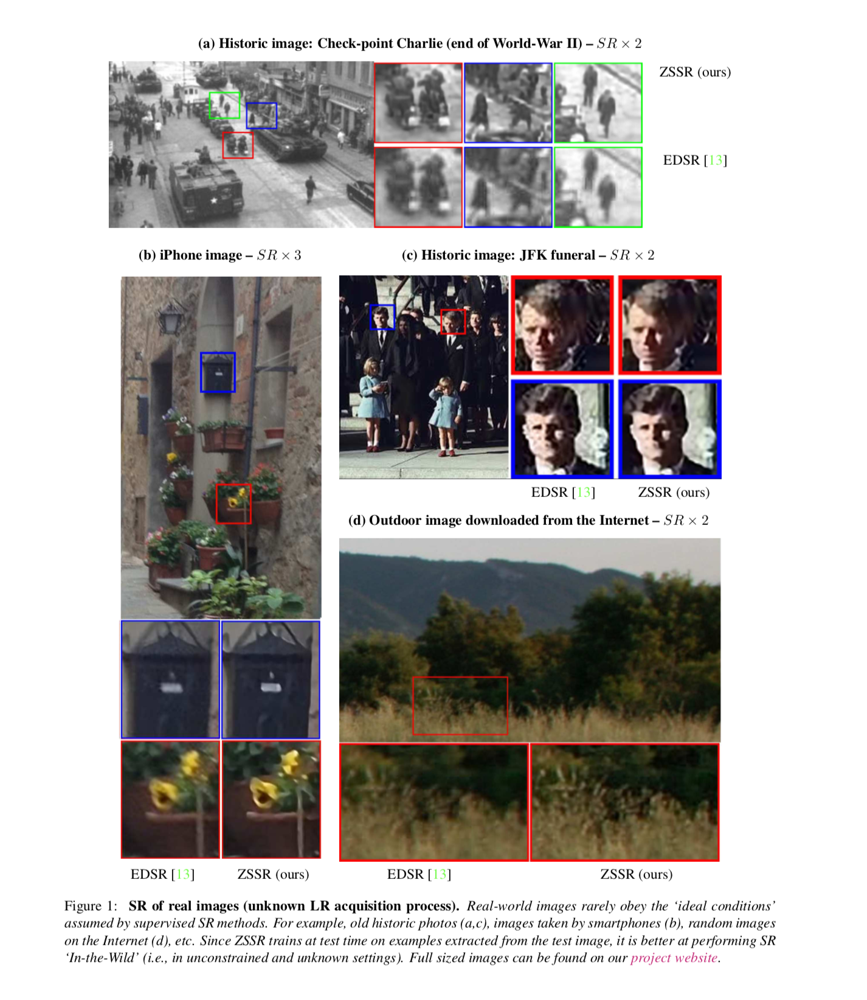
图例 1 进一步表明上述效果不是人为干预的，而是在处理现实中的低分辨率图像上经常发生的，这些图像的来源有网络、iPhone 和历史图像。在这种非理想的情况下，先进的 SR 方法得到的结果并不好。
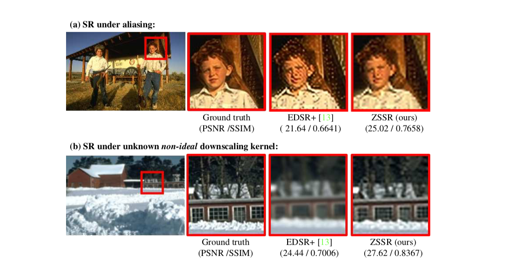
&emsp;&emsp;单个图像在各个尺度上重复出现的小图像信息是自然图像的强大属性。它构成了例如 无监督 SR，Blind-SR（downscaling kernel 未知），Blind-Deblurring（blind 去模糊 ），Blind-Dehazing（Blind 去雾）等等这些无监督图像增强方法。尽管这些无监督方法不想上述有监督方法那样受到限制，但它们需要使用预定义尺寸（通常为 5$\times$5）的小图像 patches 的欧几里得相似性，使用 K-nearest-neighbours 搜索。因此，这些方法不能推广到 LR（low resolution）中不存在的 patches，也不能推广到隐式学习相似度衡量，也不能够适应图像内部重复结构的不均匀尺寸。我们的 image-specific CNN 利用了 image-specific 的跨尺度内部信息重现的特点（原文是 power，这里不太清楚翻译成什么好），该方法不受限于限制 patch-based 方法的条件。我们用 LR 图像及其 downscaling 版本（自我监督）训练了一个 CNN 用来推断从 HR 到 LR 的关系，接着我们将这些训练过的 relations 应用到输入的 LR 图像来生成 HR 图像。这个方法大幅度的胜过了无监督的 patch-based SR 模型。
&emsp;&emsp;由于单个图像内部的视觉熵比一般的外部图像集合要小得多，因此小型的简单 CNN 能够满足这个任务。因此即使我们的神经网络是在测试阶段训练的，其运行时间也可以与最先进的有监督 CNN 在测试阶段的训练时间相媲美。有趣的是，在使用最先进的监督方法使用的基准数据集测试我们的 image-specific CNN 时，产生了令人印象深刻的结果（尽管不是最优秀的结果，我们的模型也较小且未经训练），并且在非理想图像上的处理结果大大超过了有监督的最先进的 SR。我们提供上述实验在视觉和经验上的证据。
&emsp;&emsp;文中的 “Zero-Shot” 属于来源于识别/分类领域。然而这里需要注意的是，我们的方法不像 Zero-Shot 学习或者 One-Shot，我们的方法不需要任何辅助信息或是额外的图像。我们手头可能仅仅拥有一张测试图像。除此之外，当提供了可用的额外信息（例如，使用 Nonparametric blind super-resolution 可以直接从测试集中估算 downscale kernel），我们的 image-specific CNN 能够充分利用测试时间，极大提高处理效果。本论文在以下几个方面做出贡献：
1. 这是第一个无监督的 CNN-based SR 方法
2. 该模型能够处理非理想成像条件以及广泛的图像和数据类型（即使是第一次处理）
3. 不需要与处理，占用的计算资源较少
4. 能够应用于任何大小的 SR，理论上具有任何长宽比
5. 能够适应于已知和未知的成像条件（测试阶段）
6. 对于非理想的条件，它能够提供最先进的结果，对于理想的条件，与有监督且训练好的最先进模型也有的一拼
#### 2. The Power of Internal Image Statistics
&emsp;&emsp;我们这个方法的基础是自然图像内部的数据重复性很高。比如，单个图像内部的小图像 patches（例如$5\times5$，$7\times7$） 重复了很多次。《Super-resolution from a sin- gle image》和《Internal statistics of a single natural image》两篇论文使用了数百个自然图像对上述结论进行了验证，几乎任何自然图像的小 patches 都是正确的。
&emsp;&emsp;图例 3 展示了《Super-resolution from a single image》中基于内部 patch 重现的简单单个图像 SR。
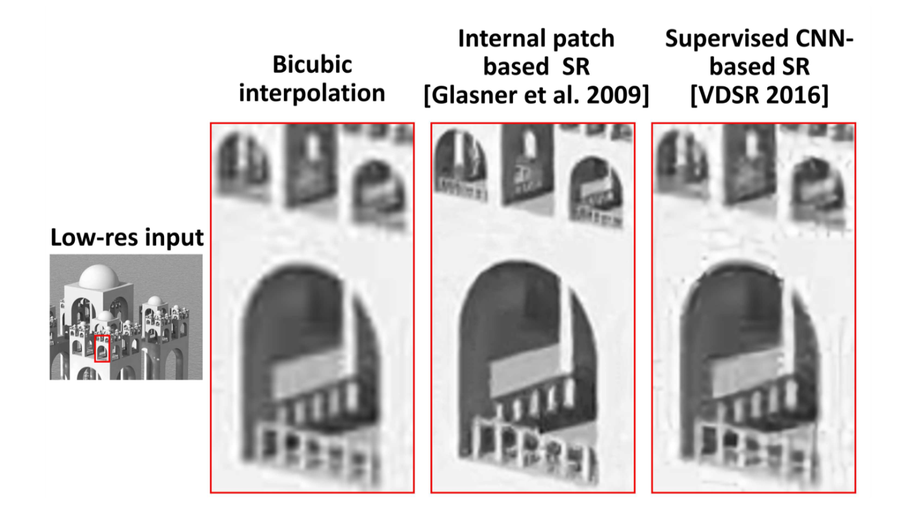
注意，它能够恢复图中小阳台的小扶手，因为在较大阳台之一图像中的其他位置发现了它们存在的证据。事实上这些小扶手存在的唯一证据在图像中不通缩放尺度的不同位置。这在任何外部数据集上是找不到的，无论这个数据集有多大。因为能够观察到，最先进的 SR 方法在依赖于外部数据库时不能够恢复 image-specific 信息。虽然在这里使用了类分形图像举例说明了强大的内部预测能力，但在任何自然图像中都能分析并表现出强大的内部预测能力。
&emsp;&emsp;有证据表明，单个图像，其 patches 的内部熵比一般自然图像合集中 patches 的外部熵要小。这进一步引起了这样的观测：内部图像数据能够提供比从通用图像集合中获取的外部统计数据更强的预测能力。在不确定性增强以及图像质量下降的条件下，上述情况尤为明显。
#### 3. Image-Specific CNN
&emsp;&emsp;我们的 image-specific CNN 结合了内部 image-specific 信息的预测能力和低熵以及神经网络的泛化能力。给定一个测试图像 $I$，在没有任何外部可用样本的情况下训练，据此我们构建了一个 image-specific CNN，旨在解决特定图像的 SR 任务。我们从测试图像本身抽取样本来训练我们的 CNN。我们是通过对 downscale LR 图像 $I$ 来获取上述样本，从而获得其本身分辨率更低的 version，$I\downarrow s$（图例 4b 的上半部分）这里的 s 表示需要的 SR 比例因子。接着，我们用训练好的 CNN 去测试图像 $I$，现在使用 $I$ 作为 LR 输入到神经网络中，用来构建 HR 输出 $I\uparrow s$（图例 4b 的下半部分）。
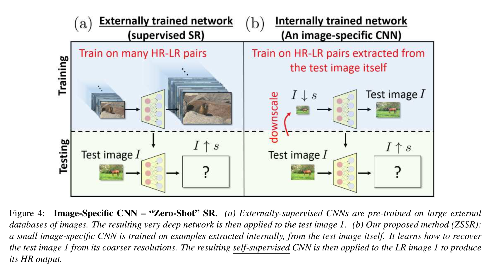
请注意训练好的 CNN 是完全卷积化的，因此适用于不同尺寸的图像。
&emsp;&emsp;由于我们的训练集只由一个样本构成，我们在输入图像 $I$ 上进行数据扩展来提取更多的 LR-HR 样本对儿来训练神经网络。这些扩展的数据通过 downscale 输入图像 $I$ 到许多分辨率更小的 versions（$I = I_0, I_1, ..., I_n$）。它们起到 HR supervision 的作用，被称作 “HR father”。每一个 HR father 都使用所需的 SR 缩放因子被 downscaled，来获得 “LR son”，这些数据构成了训练数据集。这些最后得到的训练集是由许多 image-specific LR-HR 样本对构成的，神经网络可以随机训练这些对儿。
&emsp;&emsp;我们还通过旋转每一个 LR-HR 对儿到四个角度（$0\degree，90\degree，180\degree，270\degree$），旋转后的再分别进行垂直和水平镜像。这样就得到了原先数据集 8 倍的数据量。 
&emsp;&emsp;由于缺少鲁棒性和即使 LR 图像很小也能允许使用较大的 SR 缩放因子的缘故，SR 执行缓慢。我们的算法适用于几个中间的缩放因子（$s_1, s_2, ..., s_m = s$）。在每个中间尺度 $s_i$ 上，我们将利用这个尺度 $s_i$ 生成的 SR 图像和 HR 图像及其 downscale/旋转 version（这里我个人理解为一个尺度生成一组训练集）作为新的 HR father 添加到我们逐渐扩充的训练集中。我们使用下一个缩放因子 $s_{i+1}$ downscale 这些数据（以及之前较小的 “HR 样本”）并得到一个新的 LR—HR 训练样本对。重复这个步骤直到分辨率到达 s。
##### 3.1. Architecture & Optimization
&emsp;&emsp;通过大量不同的 LR-HR 外部图像样本集来训练的有监督的 CNN 必须在其学习过的权重中找到所有可能的 LR-HR 关系中的多样性。由于这个原因，这些网络变得非常深，并且非常复杂。相对的，单张图像的 LR-HR 关系就非常的小，因此能够通过更小更简单的 image-specific 网络进行硬编码。
&emsp;&emsp;我们使用一个含有 8 层的简单全卷积网络，每一层含有 64 个通道（channels）。每一层的激活函数是 ReLU。网络输入被插值到输出尺寸。正如之前基于 CNN 的 SR 方法（《Deeply-recursive convolu- tional network for image super-resolution》、《Accurate image super- resolution using very deep convolutional networks》以及《Learning a deep convolutional network for image super-resolution》）所做的那样，我们仅仅学习被插值的 LR 和它的 HR parent 之间的残差。我们使用 $L_1$ 损失函数和 ADAM 优化器，以及值为 0.001 的学习率。我们周期性的对重构误差使用线性拟合，如果标准差比线性拟合的斜率大了一个 factor，我们就将学习率除以 10。当学习率到达 $10^{-6}$ 时就停下来。
&emsp;&emsp;注意，尽管可视范围有限，ZSSR 也有能力捕获测试图像内部信息的非本地重现。比如，当 ZSSR 被应用于图例 3 的 LR 图像时，它训练了一个CNN，在其他扶手没有出现在可视范围内时，将较低分辨率 version 中的扶手恢复到 LR 测试图像中的扶手。

当这个 CNN 被应用于测试图像本身时，由于使用了相同的 image-specific 过滤器，它能将恢复其他地方的新扶手。
&emsp;&emsp;为了加速训练阶段，使得运行时间与测试图像 $I$ 尺寸无关，我们在每次迭代中对随机选取的 father-son 样本对进行一次随机的固定大小裁剪（crop）。裁剪尺寸通常为 $128\times 128$（除非被采样的图像对比较小）。在每一次迭代中，采样一个 LR-HR 样本对的可能性被设置为非均匀的并且与 HR father 的尺寸成比例。尺寸比例（HR father 和 测试图像 $I$ 的比例）越接近 1，被采样的可能性就越大。这反映了非合成的 HR 样本比合成的 HR 样本具有更高的可信度。
&emsp;&emsp;最后，我们使用了类似于《Enhanced deep residual networks for single image super-resolution》中的几何自集成的方法（将测试图像 $I$ 通过 8 种旋转+翻转生成 8 个不同的输出，然后组合他们）。我们取这 8 个输出的中位数而不是他们的均值。我们将它与《Improving resolution by image reg- istration》和《Super-resolution from a sin- gle image》中的反投影技术结合，这导致 8 个输出图像要经过几次反投影迭代并且最终中位数图像也会通过反投影进行矫正。
&emsp;&emsp;运行时间：虽然在测试阶段就完成了训练，但是 SR$\times$2的运行时间在 Tesla V100 GPU 上只有 9s，在 K-80 上只有 54s（BSD100 上取平均数据）。这个运行时间几乎独立于图像尺寸或者相对于 SR 缩放因子 独立（这是由于在训练集中同等尺寸的 crop）。最终的测试运行时间在训练迭代方面是微不足道的。
&emsp;&emsp;对于理想的情况，我们逐步增加分辨率。例如，使用 6 个比例因子逐渐增加通常会在 PSNR 上提高约 0.2 dB，但是每个图像会增加约 1 分钟（在 V100 上）。这里就有一个运行时间和输出质量的取舍，由用户自己来决定。
&emsp;&emsp;为了进行比较，leading EDGE[《Enhanced deep residual networks for single image super-resolution》] 的测试时间和图像大小成平方增长。虽然该方法在小尺寸图像上很快，但对 800$\times$800 的图像上，五次执行时间都要比我们这个训练+测试模型慢（或者与使用 6 个中间缩放因子逐渐增加的方法所花费的时间相当）。
##### 3.2. Adapting to the Test Image
&emsp;&emsp;当从 HR 得到的 LR 图像的获取参数对所有图像固定之后（例如，同样的 downscaling kernel，高质量图像条件），当前的有监督 SR 方法的表现令人难以置信。然而在实际过程中，由于相机/传感器不同个人成像条件的原因（例如，拍摄照片时相机会发生轻微的非自愿晃动，能见度差的情况等），获取的过程往往会随着图像的变化而变化（例如，不同的镜头类型和 PSF）。这会导致不同的 downscaling kernels，不同的噪声特征以及多种压缩 artifacts 等等。人们几乎不能训练所有可能的图像采集配置/设置。此外，对于所有可能的 degradations/settings 类型，单监督的 CNN 不太可能表现的很好。为了获取好的性能，人们需要许多不同的特定监督的 SR 网络，每一个都在不同类型的 degradations/settings 上训练了几天或几周。
&emsp;&emsp;这就是 image-specific 网络的优势所在。我们的神经网络在测试阶段，能够适应手头测试图像的特定 degradations/settings。我们的神经网络能够在测试时接受来自用户输入的以下参数：
1. 所需要的 downscaling kernel（若不提供 kernel，则将 bicubic kernel 作为默认选择）
2. 所需要的 SR 缩放因子 s
3. 所需要的 gradual scale increases 数量（在速度和质量之间进行权衡）
4. 是否在 LR 和 HR 图像之间进行反投影增强（默认选择 是）
5. 是否需要为每一个从测试图像中提取出的 LR-HR 样本对儿中的 LR sons 增加 “噪声”（默认选择 否）
&emsp;&emsp;最后两个参数（取消反投影和增加噪声）允许处理低质量 LR 图像的 SR（无论噪声来源于传感器噪声，还是 JPEG 压缩 artifacts，或其他噪声）。我们发现，增加少量的高斯噪声（均值为 0 并且标准差在 ～5 灰阶）能够提升多种 degradations 的性能（高斯噪声，斑点噪声，JPEG artifacts 以及其他更多 degradations）。我们将这种现象归结于这样一个事实，image-specific 信息倾向于在各个 scales 上重复，但是噪声 artifacts 则不会。为 LR sons 添加小部分合成噪声（但不要给 HR fathers 添加）能让网络学会忽略不相关的跨尺度（cross-scale）信息（噪声），与此同时使网路学会提高相关信息（信号细节）的分辨率。
&emsp;&emsp;的确，我们的实验展示了对于低质量 LR 图像以及各种 degradation 类型来说，image-specific CNN 比最先进的 EDSR+ 在 SR 上能够取得更好的结果（详见第四节）。相似的，在非理想 downscaling kernels 的情况下，image-specific CNN 相对于最先进的方法有了显著提升（甚至没有任何噪声）。当 downscaling kernel 已知的情况下（例如，已知 PSF 的传感器），可以将其提供给我们的网络。当 downscaling 未知的情况下（这很常见），对于 kernel 的粗糙估计能够直接通过测试图像本身被计算出来。这样的 rough kernel 估计足以在非理想 kernel 上获得比 EDSR+ 多 1dB 的提升（参阅 Figs.1 和 2 以及第四节的经验评估）。
&emsp;&emsp;注意，在测试阶段为外部最先进的有监督 SR 方法提供被估计的 downscaling kernel 没有用处。它们需要用这个特定的（非参数化）downscaling kernel，在新的 LR-HR 集合对儿中完全重新训练一个新的神经网络。
#### 4. Experiments & Results
&emsp;&emsp;我们的方法（ZSSR - “Zero-Shot SR”）主要面向通过现实的（未知和变化）采集设置的真实 LR 图像。现实的 LR 图像没有 HR [ground truth](https://en.wikipedia.org/wiki/Ground_truth#Statistics_and_machine_learning)，因此需要通过视觉评估（如 Fig. 1 所示）。为了定量地评估 ZSSR 的性能，我们在多种设置上进行了几个受控实验。有趣的是，在使用先进的有监督方法训练和专门化的理想基准数据集时，ZSSR 产生了具有竞争力的结果（although not SotA，尽管我们的 CNN 比较小，并且没有经过预训练）。然而，在非理想数据集下，ZSSR 大大超过了最先进的 SR。报告中所有的数值结果都是使用了《Accurate image super- resolution using very deep convolutional networks》和《Deeply-recursive convolu- tional network for image super-resolution》的评估脚本所得出的。
##### 4.1. The ‘Ideal’ Case
&emsp;&emsp;虽然理想情况并不是 ZSSR 的目标，我们仍旧在理想 LR 图像的标准 SR 基准中测试了我们的模型。在这些基准中，通过使用 MATLAB  的 imresize 命令（一个 使用 抗锯齿 downsample 的 bicubic kernel），对 HR versions 进行 downscale 之后理想的得到了 LR image。Table 1 表明，在与根据这些条件被彻底训练的外部有监督方法相比，我们的 image-specific ZSSR 获得了具有竞争力的结果。
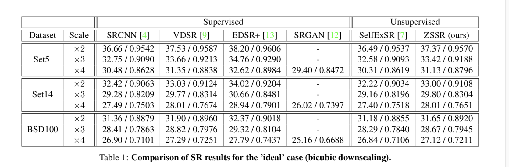
事实上，ZSSR 显然比老旧的 SRCNN 表现要好，在一些样本中的表现与 VDSR（在去年之前一直是最先进的方法）相比，有的一拼或者更胜一筹。在无监督 SR 情况下（regime），ZSSR 的表现比 leading method SelfExSR 要好很多。
&emsp;&emsp;此外，在图像带有很强的内部重复性结构的情况下，即使这些 LR 图像 是使用理想的有监督设置生成的，ZSSR 也有胜过 VDSR 的趋势，并且有时候与 EDSR+ 相比，也有这种趋势。上述的一个案例在 Fig. 5 中有所表现。
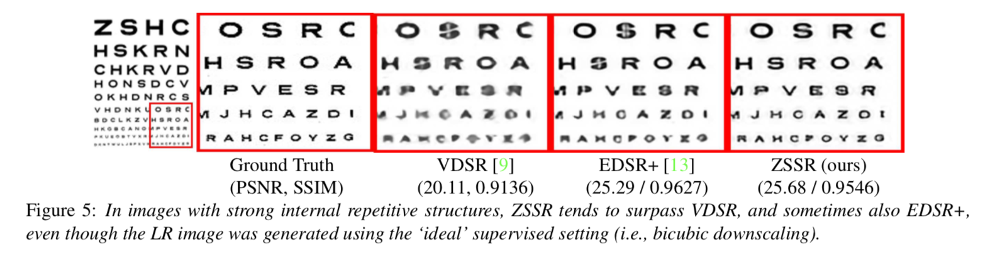
虽然这个图像并不是典型的自然图像，但是进一步的分析表明，Fig.5 所展示的内部学习性能（通过 ZSSR），不仅存在于 “分形” 图像中，也存在于普通自然图像。Fig. 6 也展示了蕾丝的例子。
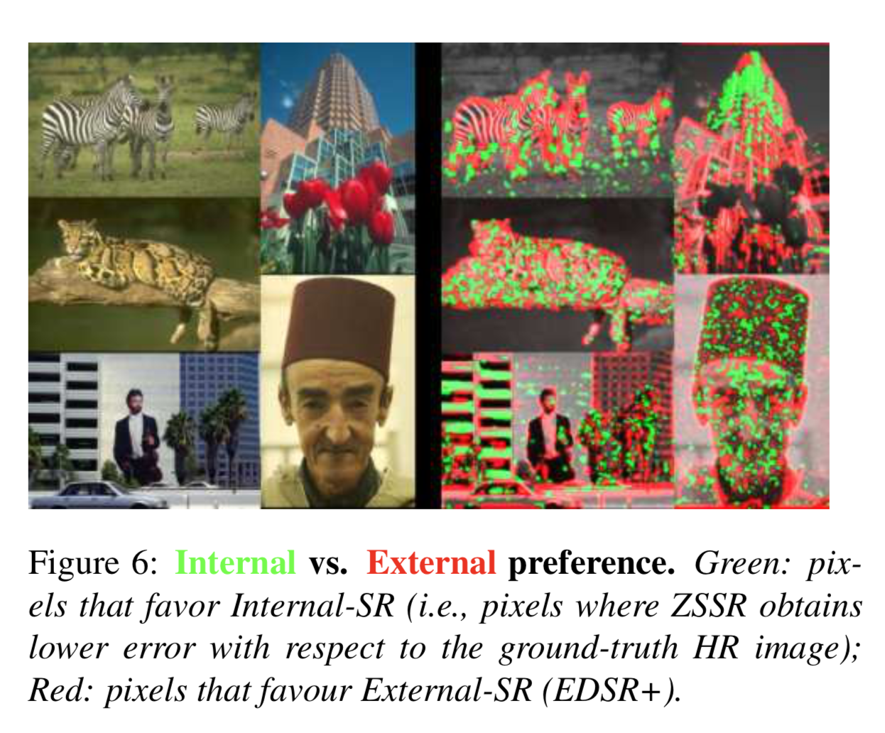
正如上图所示，图像中的一些像素（被标记为绿色的）能够利用被内部学习的数据重现（ZSSR）中获益更多，而被深度学习的外部信息则做不到这一点，而其他（用红色标记的）像素则能从被学习的外部数据中获益更多（EDSR+）。正如所期望的那样，内部方法（ZSSR）在信息高度重现的图像区域中是有很大优势的，尤其是那些特征非常小的区域（有着极低分辨率），像是楼房上的小窗户。如此小的特征可以在同样一张图像（的不同位置和尺度）中的其他地方找到更大的（高分辨率）的相同特征。这暗示着，在一个可计算的框架内，通过结合内部学习和外部学习的能力，可能存在进一步提升 SR 的潜力（即使是理想的 bicubic 案例）。这也为我们未来打算做的工作。
##### 4.2. The ‘Non-ideal’ Case
&emsp;&emsp;现实中的图像往往不能够被理想化地生成。我们对以下非理想化情况进行了实验：(i) 非理想 downscaling kernels（偏离了 bicubic kernel）以及 (ii) 低分辨率 LR images（例如，由于噪点，压缩 artifacts 等等原因导致的低分辨率），并获得了结果。在非理想条件下，image-specific ZSSR 提供了比最先进的 SR 方法更好的结果（好了 1-2 个dB）。这些大量的实验会在之后进行描述。Fig.2 展示了这样的可视化结果。

其他可视化结果和所有的图像可以在我们的[项目网站](http://www.wisdom.weizmann.ac.il/~vision/zssr/)上找到。
**(A) 非理想 downscaling kernel**：&emsp;&emsp;这个实验的目的是测试更多具有数值评估结果能力的真实模糊 kernels。为了实现这个目标，我们通过使用随机高斯 kernel downscaling HR 图像的方法，从 BSD100 中构建了一个新的数据集。对于每个图像，它downscaling kernel 的协方差矩阵 $\sum$ 被选择为每个轴上具有随机角度 $\theta$ 和随机长度 $\lambda_1,\lambda_2$：
$\lambda_1,\lambda_2$ ~ $U[0,s^2]$，$\theta$ ~ $U[0,\pi]$，$Λ=diag(\lambda_1, \lambda_2)$，$U=\left[\begin{matrix}\ cos(\theta)-sin(\theta) \\sin(\theta)cos(\theta)\end{matrix}\right]$，$\sum=UΛU^t$，这里的 s 表示 HR-LR 的 downscaling factor。因此，每一个 LR 图像能够通过不同的随机 kernel 进行下采样。Table 2 比较了我们模型与 leading 外部有监督的模型的性能。
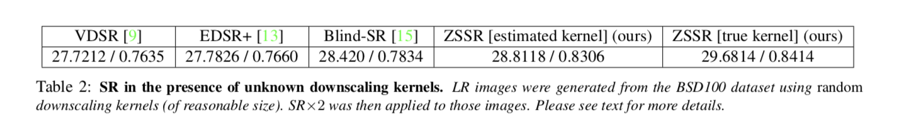
我们同时将我们模型与无监督的 Blind-SR 方法的性能惊醒了比较。采用 ZSSR 时，我们考虑了以下两种情况：(i) 未知 downscaling kernel 的更现实的情况。对于这种模式，我们使用《Nonparametric blind super-resolution [15]》直接从测试图像评估 kernel 并将其传给 ZSSR。我们使用 [15] 通过寻找非参数化 的 downscaling kernel 来估计的未知 SR kernel，这种 downscaling kernel 最大化了 LR 测试图像中跨尺度 patches 的相似度。(ii) 我们将带有正确的 downscaling kernel 的 ZSSR 用于构建 LR image。对于已知规格的传感器所获取的图像，这种情况很可能有用。
&emsp;&emsp;注意，外部监督方法不能从已知的测试图像（无论是估计的还是真实的）的模糊 kernel 获益，因为他们完全是使用特定的 kernel 来进行训练和优化的。Table 2 展示了，当提供 true kernels 时，比起最先进的方法，ZSSR 要好很多：对于未知（估计）kernels 为 +1dB，对于 true kernels 为 +2dB。

视觉上，通过最先进的 SR 方法生成的 图像非常的模糊（参阅 Fig.2 和[项目网站](http://www.wisdom.weizmann.ac.il/~vision/zssr/)）有意思的是，[15] 的无监督算法并没有使用深度学习，但同样比最先进的 SR 算法要出色。上述现象支撑了《Accurateblur models vs. image priors in single image super-resolution [18]》的分析和观察：(i)一个精确的 downscaling 模型比复杂的图像先验（image priors）更重要。(ii) 使用错误的 downscaling kernel 会导致过于平滑的 SR 结果。
&emsp;&emsp;非理想 kernel 的一个特殊例子是会导致锯齿（aliasing）的 $\delta$ kernel。最先进的方法也不能够很好的处理上述的例子（参阅 Fig. 2）

**(B) 低质量 LR 图像**：&emsp;&emsp;在这个实验中，我们测试了不同质量 degradation 类型的图像。为了测试 ZSSR 的在应对未知损坏时的鲁棒性，我们从 BSD100中挑选的每一张图像都符合三种 degradations 中随机一种：(i)高斯噪声 $[\sigma=0.05]$，(ii)斑点噪声$[\sigma = 0.05]$，(iii) JPEG压缩 [质量=45（MATLAB 标准）]。Table 3 展示了对于未知的 degradation 类型，ZSSR 是 robust 的，然而这些 degradation 类型通常会破坏有监督的 SR 算法，使 bicubic 算法优于当前的最先进的 SR 方法。
**与 SRGAN 比较**：&emsp;&emsp;SRGAN 也是为理想样本设计的。在这种情况下，SRGAN 方法往往会产生视觉上令人愉悦的幻觉，因此分数会比 ZSSR 的低。在非理想样本中，该模型获得了非常差的视觉表现（参考 Fig. 7）。
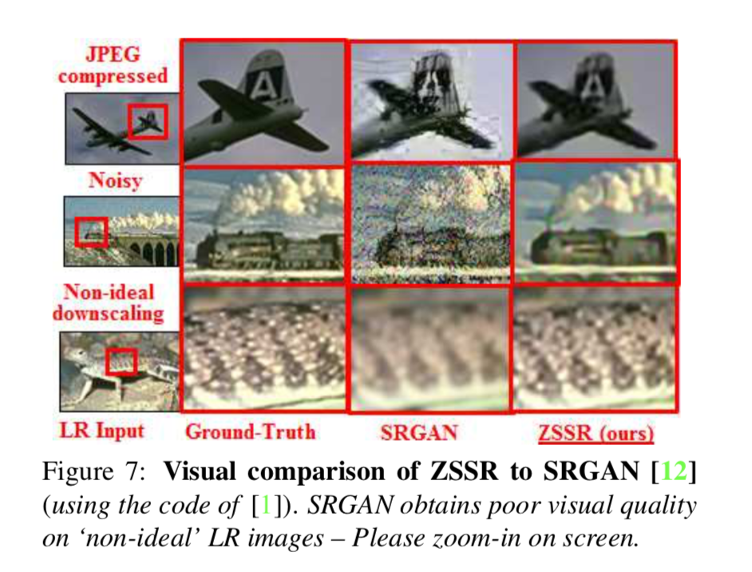
#### 5. Conclusion
&emsp;&emsp;我们介绍了 “Zero-Shot” SR，它利用了深度学习的优势，不依赖任何外部样本或预训练。它通过一个小的 image-specific CNN 来获取 SR 预测，这种 CNN 在测试阶段仅使用从 LR 测试图像中提取的内部样本来训练。它将提供对真实图像的 SR 处理，这些图像的获取过程是非理想的，未知的，以及随图像的变化而变化的（例如 image-specific 设置）。在这样一个真实世界 “非理想的” 设置下，我们的方法在质量上和数量上都远远胜于最先进的 SR 方法。据我们所知，这是第一个无监督的，基于 CNN 的 SR 算法。

### 2. 论文复现
#### 2.1 神经网络结构
&emsp;&emsp;本论文的项目地址为：https://github.com/assafshocher/ZSSR ，环境为 python 2.7，tensorflow v1.x。代码针对不同的使用情况，提供了以下几种配置：
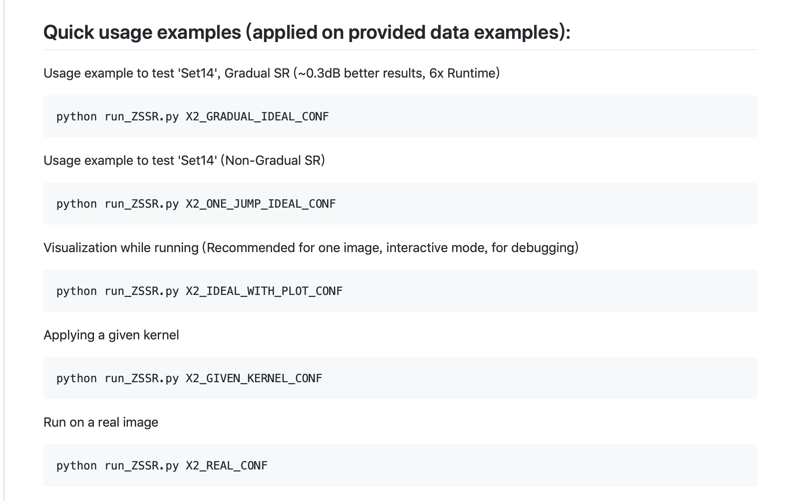
为了简便以及考虑到自身能力有限，这里只探讨 ```python run_ZSSR.py X2_REAL_CONF``` 的运行结果，且不考虑有 ground_truth 和 kernel（这里的 kernel 并非神经网络的过滤器，是源代码项目文件夹下的 kernel.mat 文件，代码中也列举出了没有改 kernel 的情况）的情况，并以此构建神经网络结构。
&emsp;&emsp;通过论文 3.1. Architecture & Optimization 中的下面这段内容
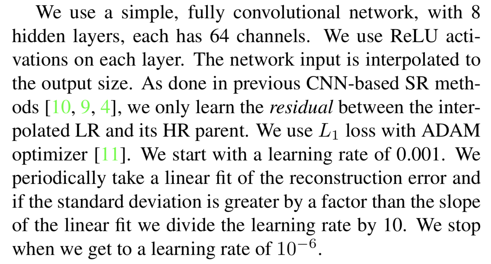
可以看出，论文中构建的卷积层由 8 个隐藏层构成，每层 64 个通道（意味着我们需要构建 64 个过滤器），每一层都对于线性输出都有一个 ReLU 都激活函数，没有池化层，整体使用 ADAM 优化器，开始的学习率为 0.001，学习到 $10^{-6}$ 为止。通过阅读源代码，能够进一步了解网络结构。
&emsp;&emsp;通过阅读在项目中的 ZSSR.py 中的 build_network() 函数，
```python
    def build_network(self, meta):
        with self.model.as_default():

            # Learning rate tensor
            self.learning_rate_t = tf.placeholder(tf.float32, name='learning_rate')

            # Input image
            self.lr_son_t = tf.placeholder(tf.float32, name='lr_son')

            # Ground truth (supervision)
            self.hr_father_t = tf.placeholder(tf.float32, name='hr_father')

            # Filters
            self.filters_t = [tf.get_variable(shape=meta.filter_shape[ind], name='filter_%d' % ind,
                                              initializer=tf.random_normal_initializer(
                                                  stddev=np.sqrt(meta.init_variance/np.prod(
                                                      meta.filter_shape[ind][0:3]))))
                              for ind in range(meta.depth)]

            # Activate filters on layers one by one (this is just building the graph, no calculation is done here)
            self.layers_t = [self.lr_son_t] + [None] * meta.depth
            for l in range(meta.depth - 1):
                self.layers_t[l + 1] = tf.nn.relu(tf.nn.conv2d(self.layers_t[l], self.filters_t[l],
                                                               [1, 1, 1, 1], "SAME", name='layer_%d' % (l + 1)))

            # Last conv layer (Separate because no ReLU here)
            l = meta.depth - 1
            self.layers_t[-1] = tf.nn.conv2d(self.layers_t[l], self.filters_t[l],
                                             [1, 1, 1, 1], "SAME", name='layer_%d' % (l + 1))

            # Output image (Add last conv layer result to input, residual learning with global skip connection)
            self.net_output_t = self.layers_t[-1] + self.conf.learn_residual * self.lr_son_t

            # Final loss (L1 loss between label and output layer)
            self.loss_t = tf.reduce_mean(tf.reshape(tf.abs(self.net_output_t - self.hr_father_t), [-1]))

            # Apply adam optimizer
            self.train_op = tf.train.AdamOptimizer(learning_rate=self.learning_rate_t).minimize(self.loss_t)
            self.init_op = tf.initialize_all_variables()
```
在下段代码中
```python
self.layers_t = [self.lr_son_t] + [None] * meta.depth
for l in range(meta.depth - 1):
    self.layers_t[l + 1] = tf.nn.relu(tf.nn.conv2d(self.layers_t[l], self.filters_t[l],
                                                    [1, 1, 1, 1], "SAME", name='layer_%d' % (l + 1)))
```
能发现，实际上卷积层的最后一层隐藏层是没有使用 ReLU 函数处理的。并且，下段代码
```python
# Output image (Add last conv layer result to input, residual learning with global skip connection)
self.net_output_t = self.layers_t[-1] + self.conf.learn_residual * self.lr_son_t
```
表明最后一层会进行 skip connection（ResNet 跳远连接），以此我确定了卷积层的模型如下图：
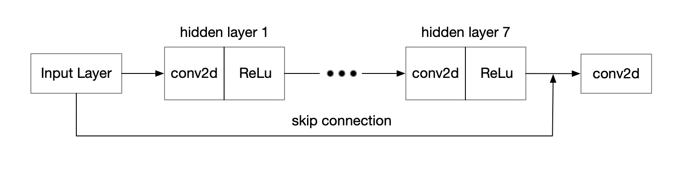
论文中关于鲁棒性的探讨以及使用的方法我没有弄明白。
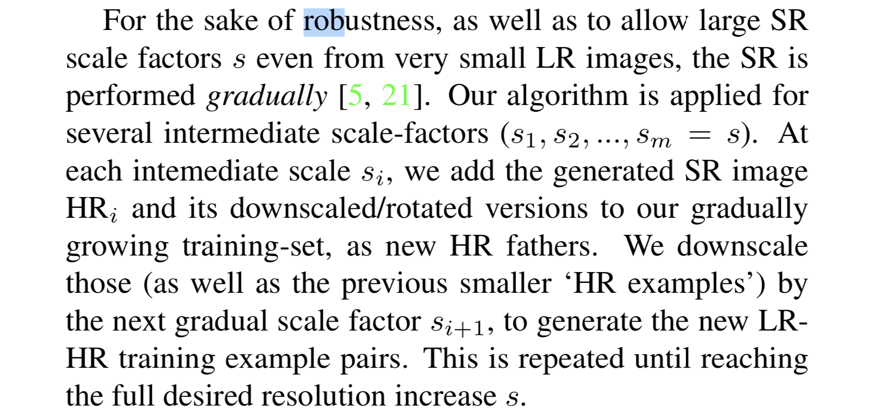
于是我去看了代码文件 ZSSR.py 中 run() 中的 train() 函数，代码如下：
```python
    def train(self):
        # main training loop
        for self.iter in xrange(self.conf.max_iters):
            # Use augmentation from original input image to create current father.
            # If other scale factors were applied before, their result is also used (hr_fathers_in)
            self.hr_father = random_augment(ims=self.hr_fathers_sources,
                                            base_scales=[1.0] + self.conf.scale_factors,
                                            leave_as_is_probability=self.conf.augment_leave_as_is_probability,
                                            no_interpolate_probability=self.conf.augment_no_interpolate_probability,
                                            min_scale=self.conf.augment_min_scale,
                                            max_scale=([1.0] + self.conf.scale_factors)[len(self.hr_fathers_sources)-1],
                                            allow_rotation=self.conf.augment_allow_rotation,
                                            scale_diff_sigma=self.conf.augment_scale_diff_sigma,
                                            shear_sigma=self.conf.augment_shear_sigma,
                                            crop_size=self.conf.crop_size)
            # Get lr-son from hr-father
            self.lr_son = self.father_to_son(self.hr_father)

            # print '&&&&&&&&&&&&&&&&&&&&&&&&&&&&&&&&&&&&'
            print self.hr_father
            new_data = np.ceil(self.hr_father*256)
            test_im = Image.fromarray(np.uint8(new_data))
            test_im.save('father.jpg')
            print ""
            print self.lr_son
            new_data = np.ceil(self.lr_son*256)
            test_im = Image.fromarray(np.uint8(new_data))
            test_im.save('son.jpg')
            # print '&&&&&&&&&&&&&&&&&&&&&&&&&&&&&&&&&&&&'


            # run network forward and back propagation, one iteration (This is the heart of the training)
            self.train_output = self.forward_backward_pass(self.lr_son, self.hr_father)

            # Display info and save weights
            if not self.iter % self.conf.display_every:
                print 'sf:', self.sf*self.base_sf, ', iteration: ', self.iter, ', loss: ', self.loss[self.iter]

            # Test network
            if self.conf.run_test and (not self.iter % self.conf.run_test_every):
                self.quick_test()

            # Consider changing learning rate or stop according to iteration number and losses slope
            self.learning_rate_policy()

            # stop when minimum learning rate was passed
            if self.learning_rate < self.conf.min_learning_rate:
                break
```
论文中的下段话
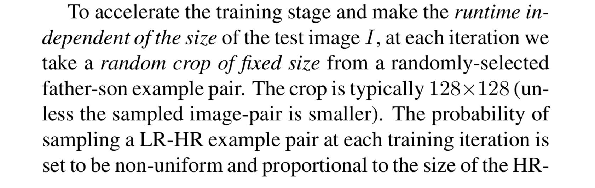
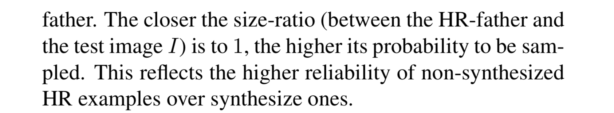
表明为了加速训练，我们会对每一个 father-son 样本对进行随机范围的裁剪，大小为 128*128，而我在使用下段代码查看 father-son 样本对的时候
```python
print '&&&&&&&&&&&&&&&&&&&&&&&&&&&&&&&&&&&&'
print self.hr_father
new_data = np.ceil(self.hr_father*256)
test_im = Image.fromarray(np.uint8(new_data))
test_im.save('father.jpg')
print ""
print self.lr_son
new_data = np.ceil(self.lr_son*256)
test_im = Image.fromarray(np.uint8(new_data))
test_im.save('son.jpg')
print '&&&&&&&&&&&&&&&&&&&&&&&&&&&&&&&&&&&&'
```
发现，father 是在原有图像的基础上进行随机裁剪，大小为 128 $\times$ 128，而 son 是在 father 的基础上缩小到 64 $\times$ 64 获得的。按照 father_to_son() -> imresize() 的过程参阅源代码会发现，作者在缩小图像的过程中，提供了不止一种缩放方法，这点可以在 imresize.py 文件中 imresize() 中的下段代码中看到
```python
method, kernel_width = {
    "cubic": (cubic, 4.0),
    "lanczos2": (lanczos2, 4.0),
    "lanczos3": (lanczos3, 6.0),
    "box": (box, 1.0),
    "linear": (linear, 2.0),
    None: (cubic, 4.0)  # set default interpolation method as cubic
}.get(kernel)
```
后来，我在编写神经网络的时候发现，由于卷积层所有的 padding 选项均为 SAME，这就导致如果输入的图像是 64$\times$64$\times$3，则输出图像必定为 64$\times$64$\times$3，后来发现在 forward_backward_pass() 代码中（如下所示）：
```python
    def forward_backward_pass(self, lr_son, hr_father):
        # First gate for the lr-son into the network is interpolation to the size of the father
        # Note: we specify both output_size and scale_factor. best explained by example: say father size is 9 and sf=2,
        # small_son size is 4. if we upscale by sf=2 we get wrong size, if we upscale to size 9 we get wrong sf.
        # The current imresize implementation supports specifying both.
        interpolated_lr_son = imresize(lr_son, self.sf, hr_father.shape, self.conf.upscale_method)

        # print '&&&&&&&&&&&&&&&&&&&&&&&&&&&&&&&&&&&&'
        # # print self.conf.augment_min_scale
        # # print type(self.lr_son)
        # new_data = np.ceil(self.lr_son*256)
        # test_im = Image.fromarray(np.uint8(new_data))
        # test_im.save('64_lr_son.jpg')
        # new_data = np.ceil(interpolated_lr_son * 256)
        # test_im = Image.fromarray(np.uint8(new_data)    )
        # test_im.save('128_lr_son.jpg')
        # print '&&&&&&&&&&&&&&&&&&&&&&&&&&&&&&&&&&&&'

        # Create feed dict
        feed_dict = {'learning_rate:0': self.learning_rate,
                     'lr_son:0': np.expand_dims(interpolated_lr_son, 0),
                     'hr_father:0': np.expand_dims(hr_father, 0)}

        # Run network
        _, self.loss[self.iter], train_output = self.sess.run([self.train_op, self.loss_t, self.net_output_t],
                                                              feed_dict)
        return np.clip(np.squeeze(train_output), 0, 1)
```
作者再一次对 lr_son 的尺寸进行了调整，我通过上述被注释代码的输出可知，作者将裁剪后，默认使用 bicubic 以及抗锯齿缩小的 crop 图像，再次进行了放大，之后传入神经网络。
&emsp;&emsp;上、下采样默认使用的是 cubic 方式。在下采样的时候，作者还会为图像进行抗锯齿处理，代码如下：
```python
# Antialiasing is only used when downscaling
antialiasing *= (scale_factor[0] < 1)
# Sort indices of dimensions according to scale of each dimension. since we are going dim by dim this is efficient
sorted_dims = np.argsort(np.array(scale_factor)).tolist()
# Iterate over dimensions to calculate local weights for resizing and resize each time in one direction
out_im = np.copy(im)
for dim in sorted_dims:
    # No point doing calculations for scale-factor 1. nothing will happen anyway
    if scale_factor[dim] == 1.0:
        continue
    # for each coordinate (along 1 dim), calculate which coordinates in the input image affect its result and the
    # weights that multiply the values there to get its result.
    weights, field_of_view = contributions(im.shape[dim], output_shape[dim], scale_factor[dim],
                                            method, kernel_width, antialiasing)
    # Use the affecting position values and the set of weights to calculate the result of resizing along this 1 dim
    out_im = resize_along_dim(out_im, dim, weights, field_of_view)
```
论文 2. The Power of Internal Image Statistics 中有下段描述：
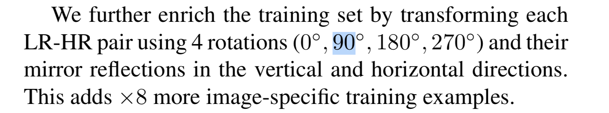
会发现作者为了扩充数据集，对原先的图像进行了四个角度的旋转，以及四个角度的垂直，水平镜像处理。ZSSR.py 中 final_test() 中的代码体现了这一点:
```python
def final_test(self):
    # Run over 8 augmentations of input - 4 rotations and mirror (geometric self ensemble)
    outputs = []
    # The weird range means we only do it once if output_flip is disabled
    # We need to check if scale factor is symmetric to all dimensions, if not we will do 180 jumps rather than 90
    for k in range(0, 1 + 7 * self.conf.output_flip, 1 + int(self.sf[0] != self.sf[1])):
        # Rotate *k degrees and mirror flip when k>=4
        test_input = np.rot90(self.input, k) if k < 4 else np.fliplr(np.rot90(self.input, k))
        print '&&&&&&&&&&&&&&&&&&&&&&&&&&&&&&&&&&&&'
        print test_input.shape
        print '&&&&&&&&&&&&&&&&&&&&&&&&&&&&&&&&&&&&'
        # Apply network on the rotated input
        tmp_output = self.forward_pass(test_input)
        # Undo the rotation for the processed output (mind the opposite order of the flip and the rotation)
        tmp_output = np.rot90(tmp_output, -k) if k < 4 else np.rot90(np.fliplr(tmp_output), -k)
        # fix SR output with back projection technique for each augmentation
        for bp_iter in range(self.conf.back_projection_iters[self.sf_ind]):
            tmp_output = back_projection(tmp_output, self.input, down_kernel=self.kernel,
                                            up_kernel=self.conf.upscale_method, sf=self.sf)
        # save outputs from all augmentations
        outputs.append(tmp_output)
    # Take the median over all 8 outputs
    almost_final_sr = np.median(outputs, 0)
    # Again back projection for the final fused result
    for bp_iter in range(self.conf.back_projection_iters[self.sf_ind]):
        almost_final_sr = back_projection(almost_final_sr, self.input, down_kernel=self.kernel,
                                            up_kernel=self.conf.upscale_method, sf=self.sf)
    # Now we can keep the final result (in grayscale case, colors still need to be added, but we don't care
    # because it is done before saving and for every other purpose we use this result)
    self.final_sr = almost_final_sr
    # Add colors to result image in case net was activated only on grayscale
    return self.final_sr
```
<font color=red>这里我没弄清楚 self.sf 代表的含义</font>，以及 for 循环中的 range 的计算方式。我在实验之前猜想是对裁剪后的样本对进行四个角度的反转，以及翻转后的垂直、水平镜像处理，为了验证这个想法，我使用
```python
print '&&&&&&&&&&&&&&&&&&&&&&&&&&&&&&&&&&&&'
print test_input.shape
print k
print '&&&&&&&&&&&&&&&&&&&&&&&&&&&&&&&&&&&&'
```

进行输出，结果如下图（并未对 real_example 中的图像进行修改，这里的图像仍旧是项目中自带的图像）：
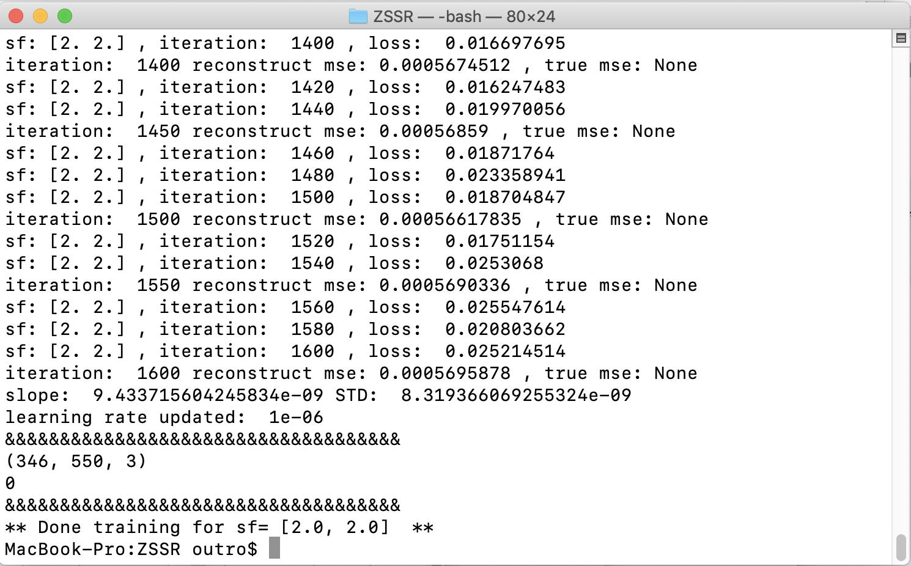
能够明显看出这里只跑了一次循环，而且针对原图做了一次（或三次）90$\degree$ 旋转，未进行镜像，<font color=red>这里仍旧不太清楚原因</font>，但在之后构建神经网络的时候我会按照论文中所说的，对随机 crop 的图像块进行旋转并镜像，用这些数据来训练神经网络，根据效果再调整策略。在执行了下行代码：
```python
tmp_output = self.forward_pass(test_input)
```
对被处理的图像进行一次前向传播之后，如下段代码所示：
```python
# Undo the rotation for the processed output (mind the opposite order of the flip and the rotation)
tmp_output = np.rot90(tmp_output, -k) if k < 4 else np.rot90(np.fliplr(tmp_output), -k)
# fix SR output with back projection technique for each augmentation
for bp_iter in range(self.conf.back_projection_iters[self.sf_ind]):
    tmp_output = back_projection(tmp_output, self.input, down_kernel=self.kernel,
                                    up_kernel=self.conf.upscale_method, sf=self.sf)
```
作者将图像还原，并使用反投影方法（例如将图像 A 放大至图像 B 的处理，反投影的思路为：处理 A 进行一次前向传播得到 B 之后，将 B 下采样处理得到 C，计算 C 和 A 之间的残差 D，然后再将残差 D 前向传播处理得到放大的残差 E，最后将 E 和 B 相加并输出，这里参考了 https://zhuanlan.zhihu.com/p/50192019 中对 DBPN 的描述）
综上，可以简单的总结出代码对数据的大致处理：
1. 读取输入图像 A，对图像随机进行 crop，得到图像 B
2. 对 B 进行 bicubic 缩小，进行抗锯齿操作之后，再次使用 bicubic 放大得到图像 C
3. 将 B 和 C 作为 input 和 label 丢进神经网络
4. 重复步骤 1～3 n 次循环，代码中的建议最低次数为 256
5. <font color=red>对输入图像 A 根据某种条件 $\beta$ 进行旋转镜像处理得到图像 D</font>
6. 将 D 丢进前向传播得到输出 E
7. <font color=red>对 E 根据某种条件 $\alpha$ 进行反投影得到输出 F</font>
8. 将 F 加入输出集合 output_set
9. <font color=red>重复步骤 5～8，循环次数为某种条件 $\theta$</font>
10. 对输出集合 output_set 取中位图像 G
11. <font color=red>再根据条件 $\alpha$ 对 G 进行反投影</font>
12. 输出被处理后的图像 G

上述被标记为红色的步骤均有不确定条件，在执行代码后，我查看了函数 final_test() 中的条件 $\alpha$（```self.conf.back_projection_iters[self.sf_ind]```） 的输出，值为 0。因此，我决定在复现的模型中使用下述步骤：
1. 读取输入图像 A，对图像随机进行 crop，得到图像 B
2. 对 B 进行 bicubic 缩小，进行抗锯齿操作之后，再次使用 bicubic 放大得到图像 C  
3. 将 B 和 C 作为 input 和 label 丢进神经网络
4. 重复步骤 1～3，n 次，代码中的建议最低次数为 256
5. <font color=blue>对输入图像 A 进行旋转镜像处理得到图像 D</font>
6. 将 D 丢进前向传播得到输出 E
7. 将 F 加入输出集合 output_set
8. <font color=blue>重复步骤 5～6，直到做完 4 次旋转及其垂直水平镜像共八次变换</font>
9. 对输出集合 output_set 取中位图像 G
10. 输出图像

&emsp;&emsp;整体框架如下图所示：
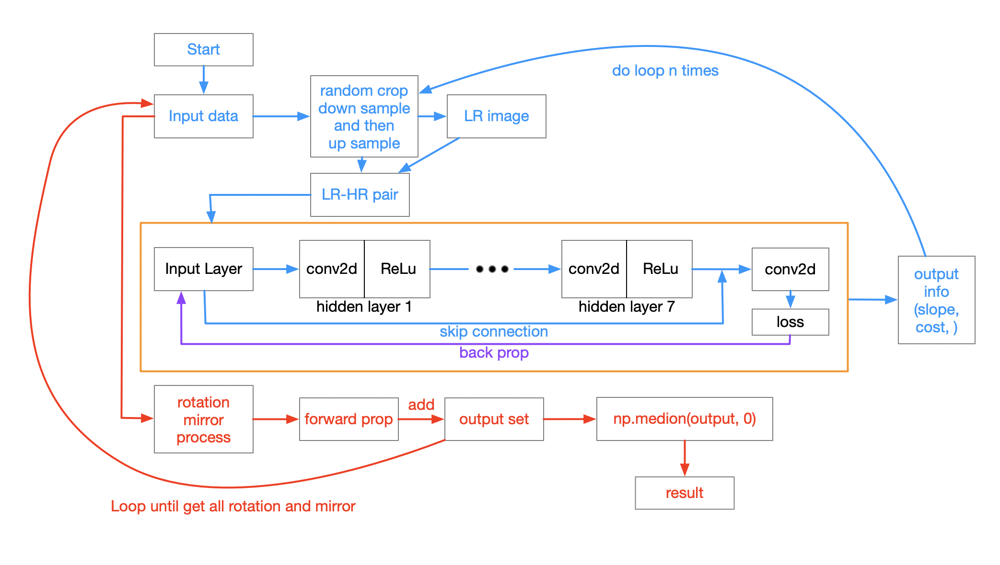

#### 2.2 代码实现及框架调整
&emsp;&emsp;有了之前的框架，我们可以实现基本的核心功能，也就是对 realistic image 的 SR 处理。
&emsp;&emsp;为了读取图像、调整图像分辨率以及对图像的随机裁剪，我创建了 utilts.py 文件，构建了下面几个函数：
```python
import sys
import os
import imageio
import scipy
import matplotlib.pyplot as plt
import numpy as np
import random
from PIL import Image
import cv2

# 用于读取图像
def load_input_image(path, is_show=False):
    print("in load_input_image() function")
    # 获取绝对路径
    fname = sys.path[0] + path
    print("\t Image path: [" + fname + "]")

    # 判断是否为图像
    if not os.path.isfile(fname):
        print("\t Open image failed, please check path")
        return -1

    # 读取图像
    image = imageio.imread(fname)
    print("\t Load success!")
    print("\t Image shape:" + str(image.shape))

    # 展示图像
    if is_show:
        plt.imshow(image)
        plt.show()
    # print()
    return image


# 对图像进行放大缩小，默认为 0.5 倍
def imresize(image, is_show = False, scale_factor = 0.5, output_shape = None):
    # print('in imresize function:')

    # 计算随机后的 LR 分辨率
    if scale_factor is not None:
        image_shape = np.array(np.array(image.shape)[:-1] * scale_factor, dtype=int)
    elif output_shape is not None:
        image_shape = output_shape[:-1]
    else:
        print("scale_factor 和 output_shape 均无效")

    # print('\t image_shape = ' + str(image_shape[::-1]))

    # 输出图像尺寸和缩放因子
    # print('\t image_shape = ' + str(image_shape))
    # print("\t scale_factor = " + str(scale_factor))

    # 获得放缩后的图像
    # cv2 的 w 和 h 与 image.shape 相反，因此使用 image_shape[::-1]) 反向
    # 使用 cv2.INTER_LANCZOS4 进行抗锯齿
    LR_image = cv2.resize(image, tuple(image_shape[::-1]), cv2.INTER_LANCZOS4)

    # 展示放缩后的图像
    if is_show:
        plt.imshow(LR_image)
        plt.show()

    # print()
    return LR_image


# 对图像进行随机裁剪
def random_crop(image, is_show = False, size = None):
    # print("in random_crop function")
    # 若图像尺寸小于输入的 crop 尺寸 或者 启用了默认 crop 尺寸，则使用默认定义的尺寸
    default_size = 0.23
    # 获取原图数据的 ndarray 类型，方便计算
    ori_shape = np.array(image.shape)
    # print("\t ori_shape = %s" % (ori_shape))

    # 确定裁剪图像尺寸
    if size is None:
        # print('size = None')
        size = ori_shape[:-1] * default_size
    else:
        # print('size is not None')
        size = size * np.array(image.shape[:-1])

    size = size.astype(np.int16)
    # print('\t size.shape = ' + str(size))

    # 随机 crop 图像左上角的位置
    random_range = ori_shape[:-1] - size
    # print('\t random_range = %s' %(random_range))
    s_w = random.sample(range(0, random_range[1]), 1)
    s_h = random.sample(range(0, random_range[0]), 1)
    # print('\t w = %s, h = %s' %(s_w, s_h))

    # 进行裁剪
    crop_image = image[s_h[0]:s_h[0]+size[0], s_w[0]:s_w[0]+size[1], :]
    # print('\t '+ str(crop_image.shape))

    if is_show:
        plt.imshow(crop_image)
        plt.show()

    # print()
    return crop_image;
```
&emsp;&emsp;之后我尝试按照之前的步骤构建方法，但是完全没有构建类对象看起来直观。因此我构建了类对象，对上述流程重新用类的方式实现。类成员变量如下：
```python
class ZSSR:
    # 实际参数
    layer_width = 64                    # 每层的过滤器数量
    nn_depth = 8                        # 神经网络的深度
    init_variance = 0.1                 # 初始化方差，用于初始化过滤器
    filter_dimensions = (               # 每个隐藏层的过滤器维度
            [[3, 3, 3, layer_width]] +
            [[3, 3, layer_width, layer_width]] * (nn_depth - 2) +
            [[3, 3, layer_width, 3]])
    learning_rate = 0.001               # 学习率
    cost = None
    iter = None
    mse = None
    hr_father_source = None             # 输入的愿图数据
    iteration = 3001
    hr_father = None                    # 被裁剪出来的原图
    lr_son = None                       # 被下采样处理的 hr_father 图像
    train_output = None                 # 一次前向反向的输出
    aim_sacle_factor = [2, 2]           # 设置对输入图像的 scale_factor
    is_flip = True                      # 确定是否需要在测试中旋转图像，扩充训练集
    # TF 参数
    learning_rate_ph = None             # 学习率
    lr_son_ph = None                    # hr 图像下采样后的 lr 图像
    hr_father_ph = None                 # crop 原图得到的 hr 图像
    cost_ph = None                      # tf 损失函数值
    train_op = None                     # tf 训练操作
    init_op = None                      # tf 初始化操作
    sess = None                         # tf session
```
&emsp;&emsp;我们按照下述步骤来实现对一个类对象的初始化：
1. 读取图像，并存储在类成员变量中
2. 构建神经网络
    - 设置 placeholder，包括输入数据、标签以及学习率
    - 设置过滤器，包含 8 层
    - 计算 7 个带激活函数的卷积层
    - 计算最后一个不带激活函数的卷积层
    - 对神经网络进行跳远连接
    - 计算成本函数
    - 使用 ADMA 算法训练神经网络
    - 初始化上述所有变量
3. 初始化 tensorflow session
    - 创建 tensorflow session 对象并控制 GPU 资源    
    - 使用 session 对象来执行初始化变量操作
    - 初始化变量

上述步骤可用下述代码实现：
```python
def __init__(self, input_image):
    # 初始化输入图像
    self.input_image = input_image if type(input_image) is not str else load_input_image(input_image) / 255.
    # 初始化 tensorflow 图
    self.model = tf.Graph()
    self.build_network()
    self.hr_father_source = self.input_image
    self.init_sess()

# 构建神经网络
def build_network(self):
    with self.model.as_default():
        # 设置 placeholder
        self.lr_son_ph = tf.placeholder(tf.float32, name='lr_son')
        self.hr_father_ph = tf.placeholder(tf.float32, name='hr_father')
        self.learning_rate_ph = tf.placeholder(tf.float32, name='learning_rate')

        # 设置每一层的过滤器
        self.filters = [tf.get_variable('filter_%s' % (i), self.filter_dimensions[i],
                                    initializer=tf.random_normal_initializer(
                                        stddev=np.sqrt(
                                            self.init_variance / np.prod(
                                                self.filter_dimensions[i][0:3]
                                            )
                                        )
                                    ))
                    for i in range(0, len(self.filter_dimensions))]
        # 计算有激活卷积
        forward_output = self.lr_son_ph
        for i in range(0, self.nn_depth - 1):
            forward_output = tf.nn.relu(
                tf.nn.conv2d(forward_output, self.filters[i], strides=[1, 1, 1, 1], padding='SAME'))
        # 计算最后一层卷积
        forward_output = tf.nn.conv2d(forward_output, self.filters[self.nn_depth - 1], strides=[1, 1, 1, 1], padding='SAME')
        # 残差神经网络
        self.net_output_t = forward_output + self.lr_son_ph
        # 计算成本函数
        self.cost_t = tf.reduce_mean(tf.reshape(tf.abs(self.net_output_t  - self.hr_father_ph), [-1]))
        # 应用 ADAM 算法训练神经网络
        self.train_op = tf.train.AdamOptimizer(learning_rate=self.learning_rate_ph).minimize(self.cost_t)
        # 对 tensoflow 的所有变量进行初始化
        self.init_op = tf.initialize_all_variables()

def init_sess(self):
    # 初始化变量
    config = tf.ConfigProto()
    # 使用allow_growth option，刚一开始分配少量的GPU容量，然后按需慢慢的增加，
    config.gpu_options.allow_growth = True
    self.sess = tf.Session(graph=self.model, config=config)
    self.sess.run(self.init_op)

    self.cost = 0
    self.iter = 0
    self.mes = 0        
```
&emsp;&emsp;之后我们为类对象编写 run() 方法，用于执行训练并输出训练结果。大致框架如下：
1. 初始化 session，操作与之前一样，这里为了确保 session 的初始化
2. 对神经网络进行训练
    - 获取输入图像的随机裁剪 HR，默认裁剪大小为原图的 0.23 倍
    - 获取裁剪图像的 LR 版本
    - 由于没有池化层，我们需要将 LR 版本进行插值放大
    - 将 HR，LR 和 Learning_rate 喂给神经网络
    - 使用 session 对象执行训练，计算成本函数以及跳远连接操作
    - 返回训练结果
    - 循环 n 次
3. 测试并输出处理结果
    - 对输入原图进行四个角度（0$\degree$， 90$\degree$，180$\degree$ 和 270$\degree$）的旋转，并获得垂直和水平上的镜像。
    - 对上述数据进行一次前向传播处理，旋转会原来的图像，并记录结果。
    - 对所有情况进行处理后计算中位数，并输出这个结果，作为处理的最终结果。
代码实现如下：
```python
    def run(self):
        self.init_sess()
        self.train()
        final = self.final_test()        
        return final

    def train(self):
        for self.iter in range(self.iteration):
            # 获取数据集合
            print("iteration: %s" %(self.iter))
            # 获取原图随机裁剪
            self.hr_father = random_crop(self.hr_father_source, is_show=False, size = 0.23)
            # 获取裁剪的 LR 版本
            self.lr_son = imresize(self.hr_father, is_show=False, scale_factor=0.5, output_shape=None)

            # 一次训练输出
            self.train_output = self.forward_backword_process(self.lr_son, self.hr_father)
            
    def forward_backword_process(self, lr_son, hr_father):
        # 获取和 hr_father 相同 shape 的 lr_son
        interpolated_lr_son = imresize(lr_son, False, None, hr_father.shape)

        feed_dict = {'lr_son:0':np.expand_dims(interpolated_lr_son, 0),
                     'hr_father:0':np.expand_dims(hr_father, 0),
                     'learning_rate:0':self.learning_rate}
                     
        _, self.cost, train_ouput = self.sess.run([self.train_op, self.cost_t, self.net_output_t], feed_dict)

        return train_ouput

    # 将原图分别旋转至 0，90，180，270 度，并取得各个角度对应的垂直水平镜像
    # 将上述图像输入到神经网络中进行训练，取所有得到的输出结果的中位数
    def final_test(self):
        output = []
        for i in range(0, 1 + 7 * self.is_flip):
            test_input = np.rot90(self.input_image, i) if i < 4 else np.fliplr(np.rot90(self.input_image, i))
            tmp_output = self.forward_process(test_input)

            tmp_output = np.rot90(tmp_output, -i) if i < 4 else np.rot90(np.fliplr(tmp_output), -i)

            output.append(tmp_output)

        # 取中位数
        final_sr = np.median(output, 0)
        return final_sr
    
    def forward_process(self, lr_son):
        interpolated_lr_son = imresize(lr_son, False, self.aim_sacle_factor)
        feed_dict = {'lr_son:0' : np.expand_dims(interpolated_lr_son, 0)}

        return np.squeeze(self.sess.run([self.net_output_t], feed_dict))
```
完整代码在同目录下的 code 文件夹下。

&emsp;&emsp;比较了**上述代码**、**源程序不带 kernels** 以及 **源程序带有 kernels** 的比较结果，结果如下：
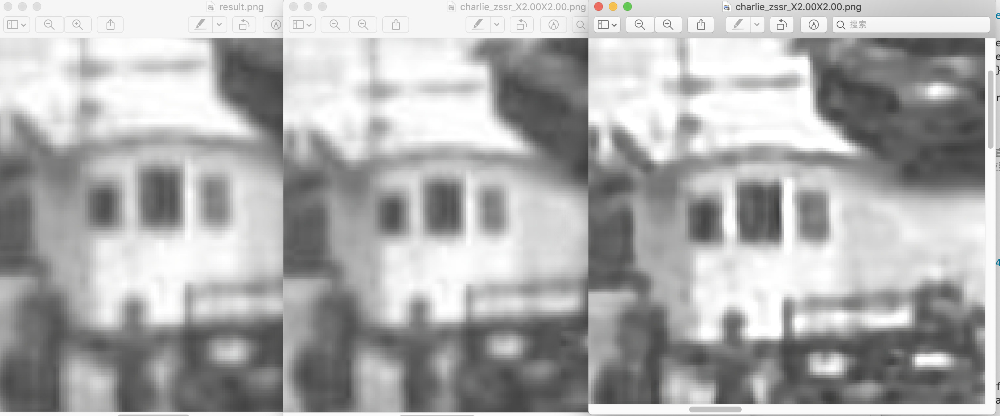
顺序分别为 **上述代码**、**源程序不带 kernels** 以及 **源程序带有 kernels**，可以发现应用了 kernels 之后的图像边缘非常清晰锐利。我们来看看源代码中的 kernel 都被用在哪儿了。
&emsp;&emsp;我们从执行代码的 run_ZSSR.py 入手，通过文件中的 main 函数能发现，在读取了 kernel 文件路径之后，我们将其传给了 run_ZSSR_single_input.py 中的 main() 函数，在这个函数中，我们又将 kernel 用于构造 ZSSR 类的对象。在 ZSSR 的构造函数中，kernel 被传给 preprocess_kernels() 函数，该函数根据路径提取出 kernel 文件中的内容并将 scale factor 和 kernel 一并传递给 kernel_shift 函数。在 kernel shift 函数中，为了使得 kernel 的 center of mass 位于 kernel 中心，源代码对其进行了位移，源代码如下：
```python
def kernel_shift(kernel, sf):
    # There are two reasons for shifting the kernel:
    # 1. Center of mass is not in the center of the kernel which creates ambiguity. There is no possible way to know
    #    the degradation process included shifting so we always assume center of mass is center of the kernel.
    # 2. We further shift kernel center so that top left result pixel corresponds to the middle of the sfXsf first
    #    pixels. Default is for odd size to be in the middle of the first pixel and for even sized kernel to be at the
    #    top left corner of the first pixel. that is why different shift size needed between odd and even size.
    # Given that these two conditions are fulfilled, we are happy and aligned, the way to test it is as follows:
    # The input image, when interpolated (regular bicubic) is exactly aligned with ground truth.

    # First calculate the current center of mass for the kernel
    current_center_of_mass = measurements.center_of_mass(kernel)

    # The second term ("+ 0.5 * ....") is for applying condition 2 from the comments above
    wanted_center_of_mass = np.array(kernel.shape) / 2 + 0.5 * (np.array(sf) - (np.array(kernel.shape) % 2))
    # Define the shift vector for the kernel shifting (x,y)
    shift_vec = wanted_center_of_mass - current_center_of_mass
    # Before applying the shift, we first pad the kernel so that nothing is lost due to the shift
    # (biggest shift among dims + 1 for safety)
    kernel = np.pad(kernel, np.int(np.ceil(np.max(np.abs(shift_vec)))) + 1, 'constant')
    # Finally shift the kernel and return
    return interpolation.shift(kernel, shift_vec)
```
 ```wanted_center_of_mass``` 变量记录了期望的位移结果，以 $9\times9$ 的全 1 矩阵为例，其原本的 center of mass 为（4, 4），经过上述代码运行后，```wanted_center_of_mass``` 为（4.5, 4.5），以 $8\times8$ 的全 1 矩阵为例，其原本的 center of mass 为（3.5, 3.5），经过上述代码运行后，```wanted_center_of_mass``` 为（5, 5）。<font color=red>这样做的原因在上述代码注释中有所体现，但是我没有看明白</font>。最后返回 ```interpolation.shift(kernel, shift_vec)```，该函数通过插值移动 center of mass。
&emsp;&emsp;将上述处理过的 kernel 赋值给 self.kernels，然后在 ZSSR.py 文件中的 run 函数中 train 函数中的 father_to_son 函数中将 self.kernel 传给 imresize() 函数，在 imresize 函数中，若 kernel 不为 None，则将 kernel 传入 numeric_kernel，代码如下：

```python
def numeric_kernel(im, kernel, scale_factor, output_shape, kernel_shift_flag):
    # See kernel_shift function to understand what this is
    if kernel_shift_flag:
        kernel = kernel_shift(kernel, scale_factor)
    # First run a correlation (convolution with flipped kernel)
    out_im = np.zeros_like(im)
    for channel in range(np.ndim(im)):
        out_im[:, :, channel] = filters.correlate(im[:, :, channel], kernel)
    # Then subsample and return
    return out_im[np.round(np.linspace(0, im.shape[0] - 1 / scale_factor[0], output_shape[0])).astype(int)[:, None],
                  np.round(np.linspace(0, im.shape[1] - 1 / scale_factor[1], output_shape[1])).astype(int), :]
```
该方法使用了 filters.correlate，在这个网址和输出结果中了解到：https://docs.scipy.org/doc/scipy-0.16.0/reference/generated/scipy.ndimage.filters.correlate.html 该方法用于进行卷积计算，默认不改变维度。从输出结果上看，这个 kernel 是一个用于模糊图像的 kernel，输出结果如下：
<table>
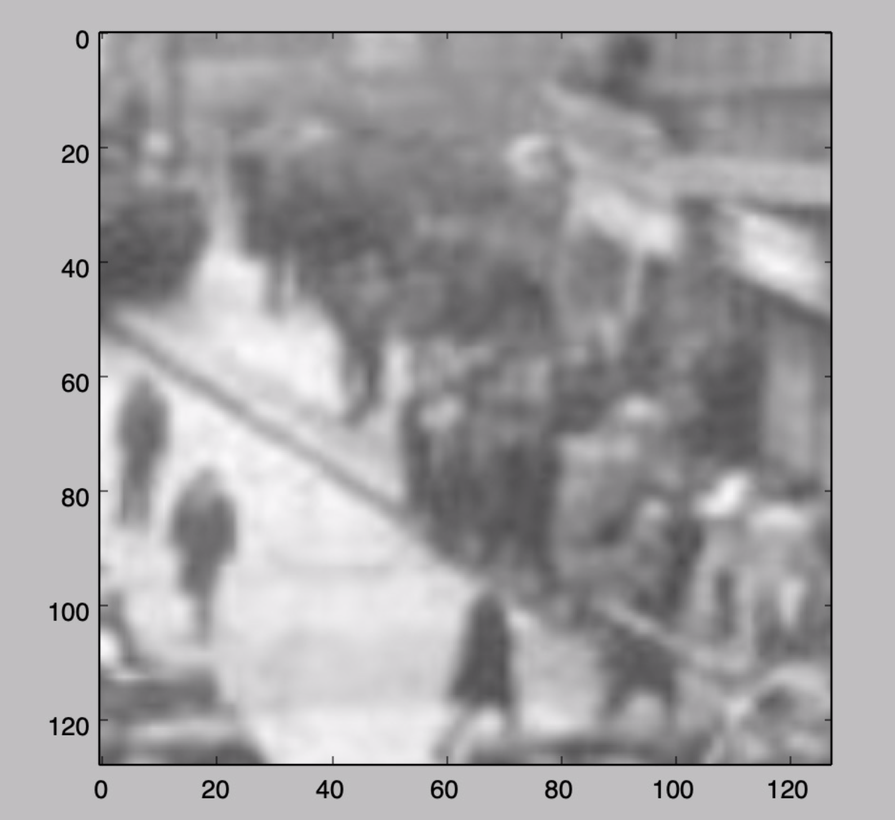
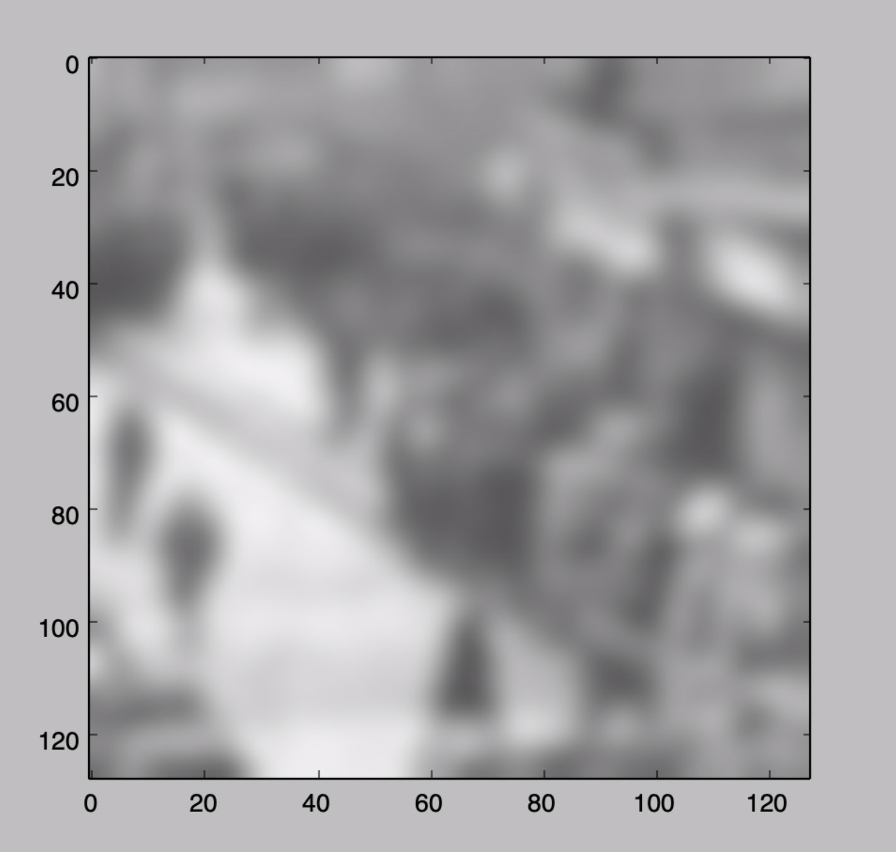
</table>

左侧为输入的 crop 图像，右侧为经过 filters.correlate 方法处理后的图像，之后，源代码返回 ```out_im[np.round(np.linspace(0, im.shape[0] - 1 / scale_factor[0], output_shape[0])).astype(int)[:, None],
                  np.round(np.linspace(0, im.shape[1] - 1 / scale_factor[1], output_shape[1])).astype(int), :]```
该处理使用等差数列，只取行列均为偶数的像素值，将分辨率缩小到原先的一半，返回该图像到 father_to_son 函数中。该函数最后返回加了高斯噪声的图像作为 lr_son，进行训练。
&emsp;&emsp;根据上述实验结果，我修改了之前的源代码，在自己编写的代码文件 utils.py 的 blur_noise_process 函数中加入了 ```np.clip(res + np.random.randn(*res.shape) * noise_std, 0, 1)```，为图像加入随机高斯噪声。
&emsp;&emsp;经过上述分析实现的代码能够带来近似于源代码的效果，如下图所示：
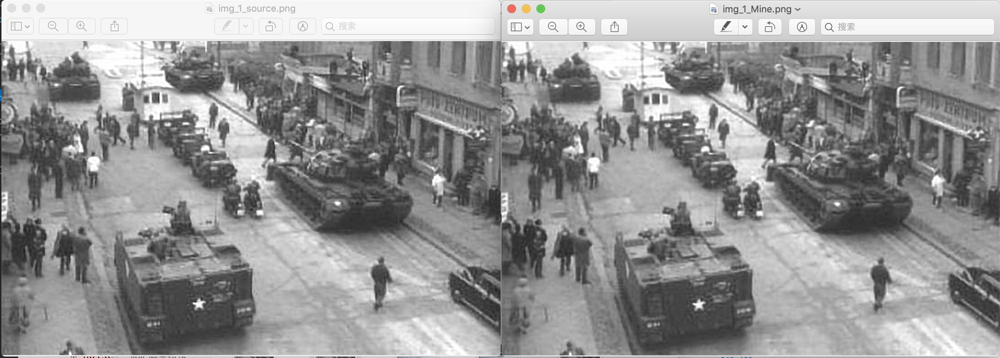
上图左侧为源代码结果，右侧为自己生成的图像结果。
&emsp;&emsp;但上述代码对于同样带 kernel 的 kernel_example 文件夹中的示例图像并不受用，与原图相比很容易看出区别（在共有参数值一致的情况下）。后来经过实验发现，我自己编写的代码中，crop 图像的尺寸一直保持一致，为愿图像的 0.23 倍，而论文源代码中 crop 图像的尺寸则是在 (0.0, 0.5) 之间的随机值，在调整至相同处理后，我编写的代码与论文中的源代码执行的结果比较近似了，如下图所示：
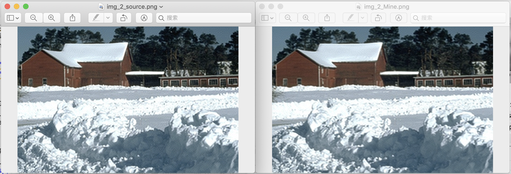
左侧为论文源代码处理结果，仔细观察可以看出窗户边缘部分比我自己编写的代码要锐利一点。
&emsp;&emsp;但是相同配置下（高斯噪声为 (0, 0.0125)），直线之前的 real_example 中的图例时，不仅效率低下（6000s+），并且最终的图像过于锐利，如下图所示：
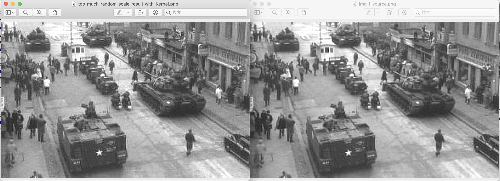
左图为自己编写源代码输出的图像，可以看出比右侧论文源代码处理的图像要显得杂乱，不平滑。
&emsp;&emsp;论文作者在 GitHub 的 issues 中给出了源代码文件中附加的 .mat 的 kernel 文件的来源，如下图：
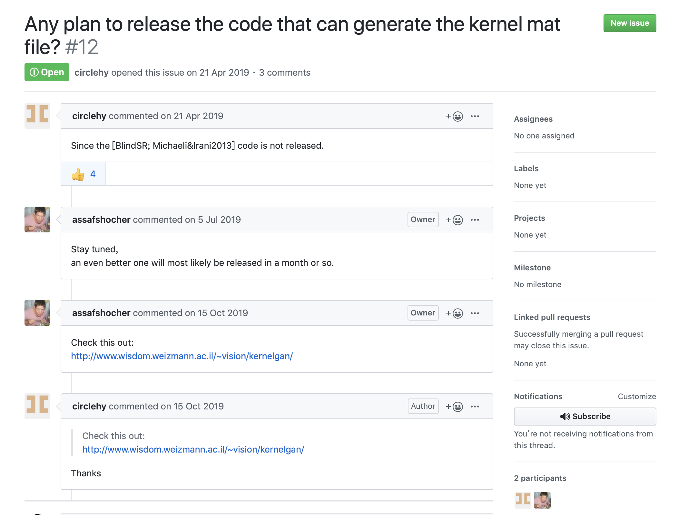
文章地址为：http://www.wisdom.weizmann.ac.il/~vision/kernelgan/
该文章的源代码不支持 CPU 运行，在使用 real_example 文件夹下的图片获取 kernel 时，与 ZSSR 源代码给出 kernel 不一致，并且运行效果不如 ZSSR。
&emsp;&emsp;文章最后的复现效果在本文件夹下的 code 目录中。