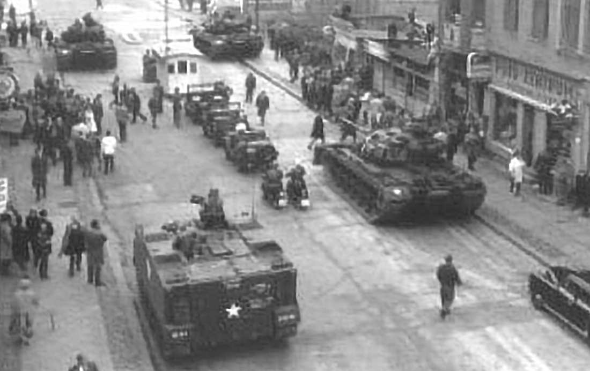
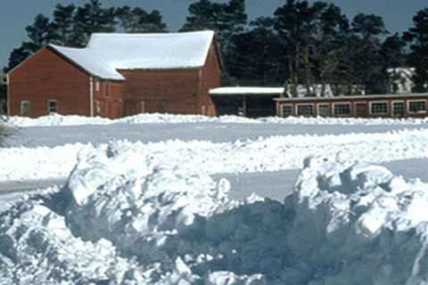

&emsp;&emsp;应导师要求，在仅了解完卷积神经网络基础之后，直接开始阅读 Zero-Shot Super Revolution 这篇论文，大概是我进度太慢了，不过直接从无监督学习方法入手会更快一点，这里感谢导师的提醒让我的确少走了弯路。关于此论文的笔记请参阅 Note.pdf，关于本论文的代码请参阅 code 文件夹。论文终稿还没有确定，因此这里不放出论文了。
### 代码功能以及时间效率
&emsp;&emsp;因本人水平有限，本论文仅复现了 ZSSR 中 real-image 和 kernel-image 的相关代码，效果与 ZSSR 接近但还是略微逊色于原先的效果。两种类型的图像处理时间在 400s 和 500s 左右，均适用 CPU 处理。
### 代码编写、运行环境
&emsp;&emsp;我是在自己的 MacBook Pro 2017 15-inch 上完成的本论文代码编写，CPU 为 i7-7700HQ，编译器为 PyCharm，TensorFlow 环境为 1.15.2，使用 Python 3。本论文将学习率作为超参数进行调整，在保留 ZSSR 论文必要的功能下略去了 ZSSR 论文中的部分代码。
### 与 ZSSR 论文结果对比
&emsp;&emsp;两种情况均进行 2 倍分辨率放大
#### 1. real-image 情况：
本论文代码运行结果：

ZSSR 代码运行结果：

#### 2. kernel-image 情况：
本论文代码运行结果：

ZSSR 代码运行结果：

### 代码运行
&emsp;&emsp;执行 code 文件夹下的 ZSSR.py 文件，修改 
```python
situation = 'REAL_IMAGE'    # 可调整参数为：'REAL_IMAGE' 和 'KERNEL_IMAGE'
```
的值可以运行论文中提到的两种处理
1. real-image 情况：
situation = 'REAL_IMAGE' 
2. kernel-image 情况：
situation = 'KERNEL_IMAGE' 